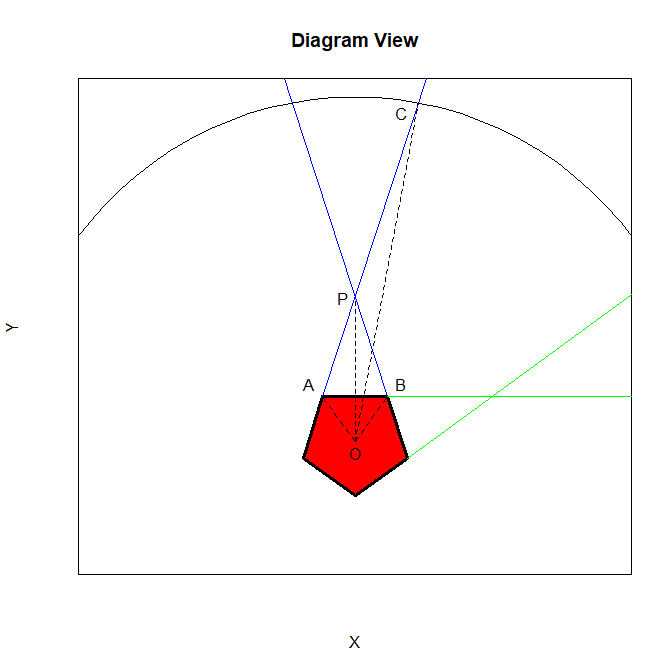

```{r setup, include=FALSE}
knitr::opts_chunk$set(echo = TRUE)
```

# Bent Brain Ticklers, Winter 2004


## Problem 1

    Find the largest integer such that
    each pair of consecutive digits is a
    different prime.

    -- Penguin Dictionary of Curious
    and Interesting Numbers

Solution:

    Max value string = 619,737,131,179 (12 digits)

    Corresponding to primes: 61-19-97-73-37-71-13-31-11-17-79

FWIW: the solution in the next volume says "A little trial and
error quickly shows ..." in order to get the optimal sequence!!!
The rest of the analysis is the same but I created a monster tree
and it was not trivial in the least!

Note: the 21 two digit primes are

    11 13 17 19
    23 29
    31 37
    41 43 47
    53 59
    61 67
    71 73 79
    83 89
    97

Since no two digit prime ends in an even number or a 5, many
of the primes can only occur at the very start of the number.
These include:

    23 29
    41 43 47
    53 59
    61 67
    83 89

The following primes can occur later in the number as well.

    11 13 17 19
    31 37
    71 73 79
    97

Additional observations about the later digits:

    A 9 must be followed by a 7

    The sequence will always terminate on a 19 or a 79 so you can not have both
    in the same sequence.

    11 must be followed by 3, 7, or 9
    13 must be followed by 1, or 7
    17 must be followed by 1, 3, or 9
    19 must be followed by 7
    31 must be followed by 1, 3, 7, or 9
    37 must be followed by 1, 3, or 9
    71 must be followed by 1, 3, 7, or 9
    73 must be followed by 1, or 7
    79 must be followed by 7
    97 must be followed by 1, 3, or 9

Assume the largest number is made up of one of the first
group followed by a chain from the second group.

We should be able to build a tree from this.  Start with an
assumed first number and build the options.  If we have a
maximal length sequence it will have maximal value.  If we
start it with the largest value then it will also have the
maximum value for a fixed length sequence:


    11 13 17 19
    31 37
    71 73 79
    97

The longest chains are the ones shown below.  Each of them consumes
all but one of the prime numbers.  The sequence will always terminate
on a 19 or a 79 so you can not have both in the same sequence.  In
this analysis all the maximum length chains end in 79 so 19 is still
available as a prefix.

    97-71-11-13-31-17-73-37-79  
    97-71-11-13-37-73-31-17-79
    97-71-11-17-73-31-13-17-79
    97-71-13-31-11-17-73-37-79
    97-71-13-37-73-31-11-17-79
    97-71-17-73-31-11-13-37-79
    97-73-31-11-13-37-71-17-79
    97-73-31-11-17-71-13-37-79
    97-73-31-13-37-71-11-17-79
    97-73-31-17-71-11-13-37-79
    97-73-37-71-11-13-31-17-79
    97-73-37-71-13-31-11-17-79

Corresponding to the following digit strings.  The last string
has the largest numerical value:

    9711317379  
    9711373179
    9711731379
    9713117379
    9713731179
    9717311379
    9731137179
    9731171379
    9731371179
    9731711379
    9737113179
    9737131179

These all terminate but could have a prefix.  Since 19 is not used we
can use it as a prefix:

    19-remaining prime string

Finally - we can prepend a number in front of the 19 from the group
that can only start the sequence.  This prime must end in 1.
The largest is 61.  Putting this all together:

    Max value string = 619,737,131,179 (12 digits)

    Corresponding to primes: 61-19-97-73-37-71-13-31-11-17-79

The full tree is shown below:

                                 +-73-+-37-+-79
                            +-17-+-79
                       +-31-+-19
                       |              +-17-+-79
                       |    +-73-+-31-+-19
                  +-13-+-37-+-79
                  |                   +-17-+-79
                  |              +-13-+-19
                  |         +-31-+-19
                  |         |
                  |    +-73-+-37-+-79
             +-11-+-17-+-79
             |    +-19
             |                   +-73-+-37-+-79
             |              +-17-+-79
             |         +-11-+-19
             |         |
             |         |    +-73-+-37-+-79
             |         +-17-+-79
             |    +-31-+-19
             |    |                   +-17-+-79
             |    |              +-11-+-19
             |    |              |
             |    |              +-17-+-79
             |    |    +-73-+-31-+-19
        +-71-+-13-+-37-+-79
        |    |                   +-13-+-37-+-79
        |    |              +-11-+-19
        |    |              |    +-11-+-19
        |    |              |
        |    |              +-13-+-19
        |    |              |
        |    |         +-31-+-19
        |    |         |
        |    |    +-73-+-37-+-79
        |    +-17-+-79
        |    +-19
        |                             +-17-+-79
        |                        +-71-+-19
        |              +-13-+-37-+-79
        |              |
        |              |         +-13-+-37-+-79
        |              |    +-71-+-19
        |              +-17-+-79
        |         +-11-+-19
        |         |                   +-17-+-79
        |         |              +-11-+-19
        |         |              |
        |         |              +-17-+-79
        |         |         +-71-+-19
        |    +-31-+-13-+-37-+-79
        |    |    |              +-13-+-37-+-79
        |    |    |         +-11-+-19
        |    |    |         |
        |    |    |         +-13-+-37-+-79
        |    |    |    +-71-+-19
        |    |    +-17-+-79
        |    |    +-19
        |    |                        +-17-+-79
        |    |              +-13-+-31-+-19
        |    |              +-17-+-79
        |    |         +-11-+-19
        |    |         |
        |    |         |              +-17-+-79
        |    |         |         +-11-+-19
        |    |         |         |
        |    |         |         +-17-+-79
        |    |         +-13-+-31-+-19
        |    |         +-17-+-79
        |    |    +-71-+-19
    97 -+-73-+-37-+-79
        +-79


## Problem 2

    Solve the following cryptic
    multiplication, which is also correct
    in Spanish. Please don't use a
    computer on this one!

    DOS * DOS = CUATRO

    -- Alfredo J. Peralta, MA B'54

Solution:  done in the cryptic arithmetic notebook

    DOS    = 564
    CUATRO = 318096


## Problem 3

    Consider a series of five real
    numbers, such that n[i + 1]/n[i] = Q for i =
    1, 2, 3, or 4. For what values of Q do
    the sum of the first three terms in
    the series equal the sum of the last
    two terms?

    -- Craig K. Galer, MI A'77

Solution:

    n[i+1] = Q * n[i]

    Let first term be n0 then the next four terms are:

    n[1] = n0
    n[2] = n0*Q
    n[3] = n0*Q**2
    n[4] = n0*Q**3
    n[5] = n0*Q**4

    Want: n0*(1+Q+Q**2) = n0*(Q**3+Q**4)

    n0 cancels out and we are left with:

    1+Q+Q**2 = Q**3*(1+Q)

    This is a quartic with four roots.  If we restrict Q to be
    real (?) then:

    Q = 1.17872417610522, -1.51287639686409

    BTW: the complex roots are:

    Q = -0.332923889620564 +/- 0.670769076539605*I


## Problem 4

    Place 16 non-zero digits in the
    squares of a 4 x 4 grid such that each
    row, from left to right, and each
    column, from top to bottom, is a
    perfect square. The square numbers
    do not all have to be different from
    each other.

    -- Richard I. Hess, CA B'62

Solution:  I am curious if I can find this with Monte-Carlo???

    Quick answer   -- no in 1e6 trials.
    Slower answer  -- no in 1e7 trials (5.2 minutes)
    Slowest answer -- ... let's think about this

Maybe this isn't such a good idea.  The only 4 digit squares are
the ones from 32^2 to 99^2.  Of these, many of the squares contain
zeros (not allowed in this problem) so there are only 44 possible
four digit values.  Picking one are random from the range 1111 to 9999
is only a probability of 44/9^4 ~ 0.67%.  Just getting all four rows
to meet this (randomly) would be about 2 in a billion chance.  Even
picking 1e7 random grids there is only about a 2% chance of success.

Need a more methodical way of picking these digits.

The target values are shown below:

    1156 1225 1296 1369
    1444 1521 1681 1764
    1849 1936 2116 2916
    3136 3249 3364 3481
    3721 3844 3969 4225
    4356 4489 4624 4761
    5184 5329 5476 5625
    5776 5929 6241 6561
    6724 6889 7225 7396
    7569 7744 7921 8281
    8464 8649 8836 9216

I could just use these 44 candidates and try all possible grids.
This is a total of 44^4 = 3748096 grids.

I did that and there were no solutions found!  Oops - typo.
Ran it again and got only one solution:

    2 1 1 6
    1 2 2 5
    1 2 9 6
    6 5 6 1

The run-time was a bit long (1.62 minutes).  After pruning the
final column to the only three possibilities gets the run time
down to 6.9 seconds.

For more details:

We can prune the search a bit further.  That is what they did
in the Bent solution and it (eerily) mimics my solution.

The digit counts are given below.  There is some variation
but all the digit values have significant representation:

     1  2  3  4  5  6  7  8  9
    26 21 15 26 15 28 13 14 18

As a function of position the counts vary considerably:

         position
    digit  1  2  3  4
        1 10  4  3  9
        2  2  8 11  -
        3  7  5  3  -
        4  5  5  7  9
        5  6  3  2  4
        6  4  4  8 12
        7  5  6  2  -
        8  4  4  6  -
        9  1  5  2 10

The last position never contains a 2,3,7, or 8.

Note that the right-most column is composed of the final
digit of each of the rows.  The bottom-most row is the final
digit of the columns.  These edge rows/columns must
include only digits 1,4,5,6, or 9.  There are only three
possibilities:

    1156
    1444
    6561

Since no two of these have the same final digit they can not
occur in the same grid (the lower right corner must match).  There
are three possibilities:

    . . . 1   Grid 1
    . . . 1
    . . . 5
    1 1 5 6

    . . . 1   Grid 2
    . . . 4
    . . . 4
    1 4 4 4

    . . . 6   Grid 3
    . . . 5
    . . . 6
    6 5 6 1


Manually searching all possibilities yields the only feasible
solution from Grid 3:

    2 1 1 6
    1 2 2 5
    1 2 9 6
    6 5 6 1

FWIW the manual search took a long time.  It was not the quick
search suggested in the Bent solution!

The row/column that ends in 5 must be one of: 

    1225
    4225
    5625
    7225

The only feasible entry in the top grid is 4225 which then
requires 6241 but then there are no solutions.

    6 2 4 1
    2 . 2 1 --> No feasible solution
    4 2 2 5
    1 1 5 6

The other two grids are harder to eliminate.  I can't find
any unique rows.  Grid 3 has the same end in 5 condition.
In this case, however, it affects the second digit in the other
direction and that does not eliminate much.

Look at grid 2: (Conclusion is no feasible grid)

    . . . 1
    . . . 4
    . . . 4
    1 4 4 4

    Possibilities
    Row 1     :  1521 1681 3481 3721 4761 6241 6561 7921 8281
    Row 2 and 3: 1444 1764 3364 3844 4624 5184 6724 7744 8464

    Let's try some possibilties for row 1 and see what is feasible

    Row 1 = 1521 -> column 3 must be 2..4 which is NOT FEASIBLE

        1 5 2 1
        . . . 4
        . . . 4
        1 4 4 4

    Row 1 = 1681 -> column 3 must be 8464, column 2 must be 6724

        1 6 8 1
        7 7 4 4
        . 2 6 4 -> NOT FEASIBLE
        1 4 4 4

    Row 1 = 3481

        3 4 8 1
        . 6 4 4 -> NOT FEASIBLE
        . 2 6 4
        1 4 4 4

    Row 1 = 3721

        3 7 2 1 -> NOT FEASIBLE (col 3)
        . . . 4
        . . . 4
        1 4 4 4

    Row 1 = 4761

        4 7 6 1 -> NOT FEASIBLE (cols force invalid rows)
        7 7 7 4
        6 4 2 4
        1 4 4 4

    Row 1 = 6241

        6 2 4 1 -> NOT FEASIBLE (col 2)
        . . . 4
        . . . 4
        1 4 4 4

    Row 1 = 6561

        6 5 6 1 -> NOT FEASIBLE (row 2)
        . 1 7 4
        . 8 2 4
        1 4 4 4

    Row 1 = 7921

        7 9 2 1
        9 . . 4 -> NOT FEASIBLE
        2 . . 4
        1 4 4 4

    Row 1 = 8281

        8 2 8 1
        2 . 4 4 -> NOT FEASIBLE
        8 . 6 4
        1 4 4 4

Look at grid 3
    
    . . . 6
    . . . 5
    . . . 6
    6 5 6 1

    Possibilities:

    Row 1/3: 1156 1296 1936 2116 2916 3136 4356 5476 5776 7396 8836 9216
    Row 2  : 1225 4225 5625 7225

    Let us try the possibilities for Row 2 and see if they are feasible

    Row 2 = 1225

        . . . 6
        1 2 2 5
        . . . 6
        6 5 6 1

            Column 1: 1156 2116 3136
            Column 2: 1225 4225 7225
            Column 3: 1296 9216

        Column 3 = 1296 (FEASIBLE)

            . . 1 6
            1 2 2 5
            . . 9 6
            6 5 6 1

                Row 1: 2116 2916 9216
                Row 3: 1296 7396

                Row 3 = 1296 --> FEASIBLE *****

                2 1 1 6
                1 2 2 5
                1 2 9 6
                6 5 6 1

                Row 3 = 7396 --> NOT FEASIBLE (col 1 or col 2)

                . . 1 6
                1 2 2 5
                7 3 9 6
                6 5 6 1


        Column 3 = 9216 (NOT FEASIBLE)

            . . 9 6
            1 2 2 5
            . . 1 6
            6 5 6 1

                Row 1: 1296 7396
                Row 3: 2116 2916 9216

                Row 1 = 1296 -> NOT FEASIBLE (col 2)

                1 2 9 6
                1 2 2 5
                . . 1 6
                6 5 6 1

                Row 1 = 7396 -> NOT FEASIBLE (col 1 or col 2)

                7 3 9 6
                1 2 2 5
                . . 1 6
                6 5 6 1


    Row 2 = 4225

        5 . . 6 -> NOT FEASIBLE (col 2)
        4 2 2 5
        7 3 9 6
        6 5 6 1

    Row 2 = 5625

        . . . 6 -> NOT FEASIBLE (col 1)
        5 6 2 5
        . . . 6
        6 5 6 1

    Row 2 = 7225

        5 . . 6 -> NOT FEASIBLE (col 2)
        7 2 2 5
        7 3 9 6
        6 5 6 1

## Problem 5

    Assume the Pentagon building,
    near Washington, DC, is situated on
    a flat plane with no restrictions in
    visibility. If you are situated at a
    random point at ground level exactly
    6 km from the center of the Pentagon,
    what is the probability that you
    can see three sides of the building?
    Assume the length of a side of the
    Pentagon is 281 m.

    -- Paul A. Sabatino, NY M'83

Solution:

Need to draw a picture.

    The internal angles of a regular pentagon = 108 degrees.
    The angles for n-gon are 180-360/n

    I won't even pretend to draw this in ascii art.



    Question: where does the observer need to be in order to
    see three sides???

    Orient the pentagon so the observer is far away and centered
    on one of the faces.  The faces on either side project rays
    that intersect.  Inside the point of intersection it is never
    possible to see three faces at the same time.  At the point
    of intersection the observer is just able to see three sides
    for one point at five locations about the circle.  Outside the
    intersection the area/angle gets larger.  As the observation
    radius extends to infinity the regions where three sides are
    visible approach 1/2 of the total circle.

    For the given problem:

    The pentagon can be inscribed in a circle with 5 equal angles
    of 360/5 = 72 degrees.  The internal angles are 180-72 = 108 deg.
    From the problem description we know the length of each side
    is 281 m.  The radius of the circle that circumscribes the pentagon
    is then:

        r1 = radius of circle at vertices of pentagon
        r1 = distance OA
        L = distance AB = 281 m (length of one side of the pentagon)
        theta = 72 degrees = angle AOB or BAP or ABP

    The line segment OP bisects the side of the pentagon (AB) and
    the angle theta.  So:

        L/2 / r1 = sin(theta/2) --> r1 = (L/2)/sin(theta/2)
                                       = 239.03 m

    The distance from the origin to the point of intersection of the
    two rays:

        P = distance to origin
          = r1 * cos(theta/2) + L/2 * tan(theta)
          = (L/2) * cos(theta/2)/sin(theta/2) + (L/2) * tan(theta)
          = (L/2) * (tan(theta) + 1/tan(theta/2))
          = 2.227 * L
          = 625.796m

    The triangle formed by the center of the circle, point P, and
    the intersection of the viewing circle and the ray tangent to
    the edge of the pentagon (triangle OPC) can be calculated from:

        alpha = angle(OPC)
        beta  = angle(PCO)
        delta = angle(POC)

        sin(alpha)/r2 = sin(beta)/P

        alpha = angle OPC
              = 180 - angle(APO)
              = 180-(90-theta) = 90+theta = 162 degrees
        r2 = viewing distance = 6000 m (given)
        P = calculated above
        beta = angle PCO
            = very small angle between tangent ray and radius of
            the large viewing circle.

        sin(beta) = (P/r2)*sin(alpha)
             beta = 1.847 degrees

    The central half-angle (delta = angle POC)is then:

        delta = 180-(alpha+beta)
              = 180-(162 + 1.847)
              = 16.153 degrees

    Full angle for this set of faces is:

        2*delta = 32.306 degrees

    This repeats every 72 degrees (1/5 of a circle):

        Pr = 2*delta/72 = 32.306/72 = 0.4487

## Bonus

    Craps is played with a pair
    of standard dice. If a player first rolls
    a 2, 3, or 12, he loses. And, if he first
    rolls a 7 or 11, he wins. Otherwise, he
    continues rolling until he matches
    the original number, in which case he
    wins, or he rolls a 7, in which case he
    loses. Assume an unethical gambler
    can load one face of one die so the
    probability of that face coming up is
    1/3 while the probability of any of the
    other faces coming up is reduced to
    2/15. Which face should he load to
    maximize his probability of winning?
    And, what is that probability
    expressed as a rational number?

    -- Howard G. McIlvried III, PA Gamma'53

Solution:

    Load the side with the 5.
    P(win) = 780223/1506960 ~ 0.5177463

    Other possibilities:

    Rational probability = n1/n2 ~ r

    n     n1      n2         r
    1  19883   43056 0.4617939
    2 729991 1506960 0.4844130
    3  33101   65520 0.5052045
    4  33101   65520 0.5052045
    5 780223 1506960 0.5177463 <-- Maximum probability
    6 106591  215280 0.4951273

    Monte-Carlo verification (100K/1000K trials)

         Prob(num_trials)
    n    Prob (1e5) Prob(1e6)
    ----------------------------------------------
    0    0.49352    0.493618  <-- fair dice
    1    0.46469    0.461486
    2    0.48749    0.484259
    3    0.50745    0.505757
    4    0.50484    0.504833
    5    0.51616    0.517319  <-- best loaded face
    6    0.49662    0.494768


    Note that for comparison with fair dice the
    probability of winning is:

    Roll = 7  --> 1/6
    Roll = 11 --> 1/18
    Roll = 4  --> 1/12; make the point = (1/12)/(1/12+1/6) = 1/3
    Roll = 5  --> 1/9;  2/5
    Roll = 6  --> 5/36; 5/11
    Roll = 8  --> 5/36; 5/11
    Roll = 9  --> 1/9;  2/5
    Roll = 10 --> 1/12; 1/3

    Pr winning a point = Pr roll point first time * Pr win the point =
        1/12 * 1/3 +
        1/9  * 2/5 +
        5/36 * 5/11 +
        5/36 * 5/11 +
        1/9  * 2/5 +
        1/12 * 1/3
    = 1/36 + 2/45 + 25/396 + 25/396 + 2/45 + 1/36
    = 134/495 ~ 0.270707...

    Pr winning = 1/6 + 1/18 + 134/495
        = 244/495
        ~ 0.4929293

    Note that the gambler only improved his odds of
    winning by about 5%.  This is probably an enormous
    edge but it still seems like a small number to me.

    Calculations with rational numbers (using gmp)
    can be performed with the following.  See
    calc_odds.R

    calc_odds = function(n) {
        #
        # sum of two die
        ddd=outer(1:6,1:6,"+")
        # Probability on fair die
        p1=rep(as.bigq(1,6),6)
        # Probability on loaded die
        p2=rep(as.bigq(2,15),6); p2[n]=as.bigq(1,3)
        #
        # Probability of rolling a particular combination
        zzz=rep(as.bigq(0),12)
        for (i in 2:12) { zzz[i] = sum((ddd==i)*outer(p1,p2,"*"))}
        # Win requires a 7 or 11 or making a point
        # Making a point depends on Pr(point) versus Pr(point or 7)
        points=c(4,5,6,8,9,10)
        # Probability of rolling a point
        p_point=zzz[points]
        # Probability of winning a point versus getting a 7
        p_win_point=zzz[points]/(zzz[points]+zzz[7])
        # Total probability of winning any of the 6 points
        p_win_any_point=sum(p_point*p_win_point)
        Pr=zzz[7]+zzz[11]+p_win_any_point
    }


## Computer Bonus

    Let us define a
    maxdigital number as a 10-digit
    number with no leading zero that
    contains the digits 0 through 9 each
    exactly once. The largest such
    number is 9,876,543,210, which is
    obviously divisible by 2 and 5. When
    we perform these divisions, we get
    two other maxdigital numbers,
    4,938,271,605 and 1,975,308,642. It is
    easy to find the largest maxdigital
    numbers which are 4 and 8 times
    other maxdigital numbers. But what
    are the largest maxdigital numbers
    which are exactly 3, 6, 7, and 9 times
    other maxdigital numbers?

    -- Colin Singleton in New Scientist

Solution:

    Let us try looking for the 9 times
    solution first and then check for 3, 6, and 7.

    The smallest maxdigital number is 1023456789.
    The largest is 9876543210.  After dividing this
    by 9 we get 1097393690.  These two values define
    a search range of 73936902 possible numbers that
    we need to consider.

    We will search from the high to the low until we
    find a maxdigital number.  If that number multiplied
    by 9 is also maxdigital then we have found a solution.
    We can do this for each of the requested multipliers.
    The solutions are found rather quickly with the
    multiplier of 7 dominating the solution time:

    n=3291768054, 3*n = 9875304162
    n=1645839027, 6*n = 9875034162
    n=1409632875, 7*n = 9867430125
    n=1097368245, 9*n = 9876314205

    See the file maxdigital.R

    Should probably put a terminating count on n so it doesn't
    loop forever, but if a solution is found this will terminate.

    maxdigital = function(n) {
        return(length(unique(strsplit(as.character(n),'')[[1]])) == 10)
    }

    divisor=3
    n = round(9876543210 / divisor)
    while(T) {
        if (maxdigital(n)) {
            if (maxdigital(divisor*n)) { print(n); print(divisor*n); break }
        }
        n=n-1
    }

