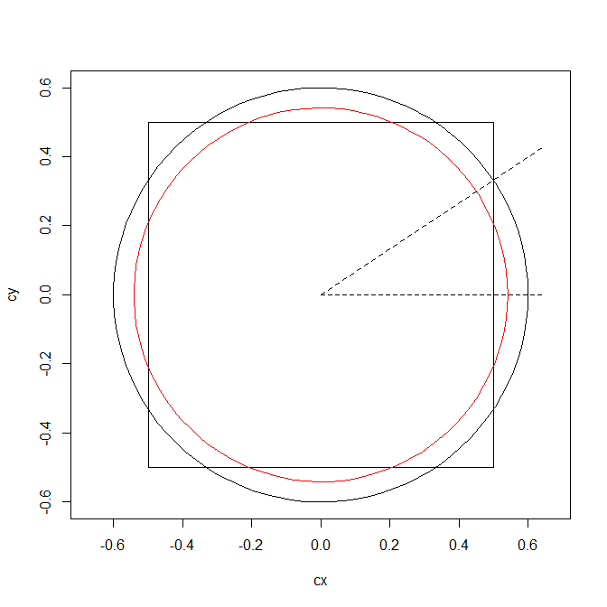

```{r setup, include=FALSE}
knitr::opts_chunk$set(echo = TRUE)
```

# Bent Brain Ticklers, Summer 2004


## Problem 1

    Reproduce the multiplication
    problem shown below with all of the
    missing digits properly inserted.

            * * 7 *
              * 7 *
          ---------
          * * * * *
        * * * 2 *
        8 * 5 *
        -----------
        * * * * * *

    -- Mathematical Puzzles for
    Beginners & Enthusiasts
    by Geoffrey Mott-Smith

Solution: solved in cryptic arithmetic notebook

            1 4 7 5
              6 7 7
          ---------
          1 0 3 2 5
        1 0 3 2 5
        8 8 5 0
        -----------
        9 9 8 5 7 5


## Problem 2

    At the post office in Stamptopia,
    one can buy any denomination of
    stamp from 1 cent to 1 dollar inclusive. Three
    couples came to buy stamps. All the
    stamps bought by each individual
    were of the same denomination. The
    number each purchased equaled the
    value of one of the stamps he or she
    bought. Paul bought 17 more stamps
    than Sue, and Quentin bought 7 more
    stamps than Tess. Each husband
    spent 45 cents more than his wife.
    Who is married to whom? (The
    names of the other two people
    involved are Ron and Ursula).

    -- You are a Mathematician
    by David Wells

Solution:

    The spousal pairs and stamp purchases are:

        R=7, T=2
        Q=9, S=6
        P=23, U=22

Details:

    P = Paul
    S = Sue
    Q = Quentin
    T = Tess
    R = Ron
    U = Ursula

    Given:

        P = S+17
        Q = T+7
 
        H*H = W*W+45

            Where H = husband stamp count/denomination
                  W = wife stamp count/denomination

    What are the integer solutions to:

        a**2 = b**2 + 45?

    The only solutions are: (7,2), (9,6), (23,22)
    These are the total for the husband/wife pairs.
    We can conclude:

        P,Q,R = permutation of 7,9,23
        S,T,U = permutation of 2,6,22

        The only difference of 17 is P=23, S=6
        The only difference of 7  is Q=9,  T=2
        By elimination:              R=7,  U=22

    The spousal pairs are then:

        R=7, T=2
        Q=9, S=6
        P=23, U=22


## Problem 3

    Consider a square with unit sides.
    Now draw a circle with radius r and
    center coincident with the center of
    the square. What value of r will
    minimize the area included in either
    the square or the circle but not
    common to both?

    -- Southwest Missouri State
    University Dept. of Mathematics

Solution:  I am not sure I understand this problem.
    I think they want to minimize the combined
    area that is not common to the circle and square.
    For example, if the radius of the circle is large
    enough to completely cover the square then the area
    is the area outside the square but inside the circle.

        Area = pi*r**2 - 1, r>=sqrt(2)/2

        Minimum area = pi/2-1 ~ 0.5708

    If the circle is small enough to fit inside the square
    then we want the area inside the square but outside
    the circle.

        Area = 1 - pi*r**2, r<1/2

        Minimum area for max r = 1-pi/4 = 0.2146

    In between these levels:  1/2 <= r <= sqrt(2)/2
    The corners of the square will stick out beyond the circle
    and the circle will extend beyond the edges of the square.
    The circle will intesect the square at 8 locations (4 in
    the degenerate limiting case).  The angle between the x-axis
    and the first intersection in a CCW direction is:

        alpha = acos(1/(2*r))

    The area of the circle that extends beyond the square is:

        pi*r**2 * (2*alpha)/(2*pi) - (1/2)*(1/2)*r*sin(alpha)*2

    This repeats 4 times (on each side of the square).

    The area of the square that extends outside the circle:

        beta = pi/4-alpha

        2*(1/2)*sqrt(2)/2*r*sin(beta) - pi*r**2 * (2*beta)/(2*pi)

    This repeats in each corner of the square.

    Adding it all together:

        Area = 4*(r**2*alpha) - 2*r*sin(alpha) +
               2*sqrt(2)*r*sin(beta) - 4*r**2*beta

        alpha = acos(1/(2*r))
        beta  = pi/4-alpha

    I could not solve this symbolically.  I used optim() in R to
    minimize the area:

        r = 0.5411961
        Min area = 0.1715729

    I added this to the drawing as the red circle.




## Problem 4

    When a certain radar installation
    detects an approaching plane, it
    sends out a signal. If the plane
    responds with the correct code, no
    action is taken. If, however, a correct
    response is not received, a missile is
    launched. To ensure that friendly
    aircraft are not destroyed, the radar
    site sends its signal on five channels.
    If correct replies are received on at
    least three of these, no action is
    taken. If p is the probability that a
    channel fails, for whatever reason,
    what is the value of p so that there is
    only one chance in a million of firing
    on a friendly aircraft? Assume p is
    the same for all channels.

    -- Adapted from
    Duelling Idiots and other
    Probability Puzzlers
    by Paul J. Nahin

Solution:  We will have a failure if any
    combination of 3, 4, or 5 channels fails.
    This probability is:

    Pr = C(5,3)*p^3*(1-p)^2 +
         C(5,4)*p^4*(1-p)   +
         C(5,5)*p^5
       = 10*p^3*(1-p)^2 + 5*p^4*(1-p) + p^5
       = p^3 * (6*p^2 - 15*p + 10)

    Want Pr <= 1e-6

    Can't solve symbolically - so go numeric.

    p = 0.004652418

Let's look at reliability instead of failure and see if we
get the same solution.  The same probability equation works
as above if we consider p = reliability and then require
Pr >= 1-1e-6.  Solving this numerically:

    p = 0.9953476 which is the required reliability = 1-p from above.


## Problem 5

    After an operation to remove his
    cancerous thyroid, John swallowed a
    radioactive sodium-iodide solution
    containing 150 millicuries of iodine-
    131 to destroy any remaining thyroid
    cells. Immediately thereafter (at 10
    a.m.), a Geiger counter showed a
    radiation level of 190 millirems. John
    cannot be released from isolation
    until his radiation level is 5 millirems
    or less. Radiation is reduced by two
    mechanisms: radioactive decay and
    excretion in bodily fluids. Typical half
    -retention time for patients is
    between 0.75 and 1.0 days, and the
    half life of iodine-131 is 8.05 days. If
    only one Geiger counter measurement
    is made each day (at 10 a.m.),
    what is the range of release dates
    John was initially told? John's actual
    half-retention time was 0.84 days.
    What was his release date, and what
    was the Geiger counter reading at 10
    a.m. on that day?

    -- Ronald L. Hartman, LA A'55

Solution:

    Half life is an exponential decay.  We can use
    exponentials or just use fractional powers:

    For half-retention minimum (0.75):

        R = 190*(1/2)^(n/0.75)*(1/2)^(n/8.05)
          = 190*((1/2)^(1/0.75)*(1/2)^(1/8.05))^n
          = 190 * 0.3641092 ^ n

    R < 5 --> n = log(5/190)/log(0.3641092) = 3.6 days

    For half-retention maximum (1.0):

        R = 190*((1/2)^(1/1.00)*(1/2)^(1/8.05))^n
          = 190 * 0.4587488 ^ n

    R < 5 --> n = log(5/190)/log(0.4587488) = 4.67 days

    For actual half-retention (0.84):

          = 190*((1/2)^(1/0.84)*(1/2)^(1/8.05))^n
          = 190 * 0.4020091 ^ n

    R < 5 --> n = log(5/190)/log(0.4020091) = 3.992 days

    He was told his release would be 4 or 5 days.  The
    actual release was 4 days and his reading was almost
    exactly 5 millirems at discharge (about 4.96).


## Bonus

    Assume the hands of an
    accurate analog twelve-hour clock
    coincide at 12:00. When will the hour,
    minute, and second hands most
    nearly trisect the clock's face, that is,
    have angles as close to 120 degrees
    between pairs of hands as possible?
    In other words, if the three angles
    are A, B, and C, find when, during a
    twelve-hour period, the function |A -
    120| + |B - 120| + |C - 120| is a
    minimum, where |x| means the
    absolute value of x.

    -- G.R. Williams

Solution:  to start with we will ignore the second hand and note that
in order to trisect the face the minute hand must lead/lag the hour
hand by 1/3 of a circle.  We can calculate these times and then check
to see the position of the second hand.

Intuitively, the best should be somewhere near 8 or 4 o'clock.  The second
hand will be at the same position as the minute hand so it will have to
move 1/3 minute to be approximately correct.

    m = angle of the minute hand = 360*(t/60) = 6*t
    h = angle of the hour hand   = 30*H + (360/12)*(t/60) = h0 + t/2

    t = time after the start of the hour (in minutes)
    30*H = angle for hour hand at start of hour = H

Want: minute hand 120 degrees ahead of the hour hand

    m = h+120
    6*t = 30*H + t/2 + 120
    11/2 * t = 30*H + 120
    t = 30*2/11 * H + 120*2/11
      = (60*H + 240)/11

Want: minute hand 120 degrees behind the hour hand

    m = h-120
    6*t = 30*H + t/2 - 120
    11/2 * t = 30*H - 120
    t = 30*2/11 * H - 120*2/11
      = (60*H - 240)/11

    For the minute hand leading the hour hand

              m         h        s         t
    1  130.9091  10.90909 294.5455  21.81818
    2  163.6364  43.63636 458.1818  27.27273
    3  196.3636  76.36364 261.8182  32.72727
    4  229.0909 109.09091 425.4545  38.18182
    5  261.8182 141.81818 589.0909  43.63636
    6  294.5455 174.54545 392.7273  49.09091
    7  327.2727 207.27273 556.3636  54.54545
    8  360.0000 240.00000 360.0000  60.00000
    9  392.7273 272.72727 523.6364  65.45455 <- closest to -120,+120
    10 425.4545 305.45455 687.2727  70.90909
    11 458.1818 338.18182 490.9091  76.36364
    12 490.9091 370.90909 654.5455  81.81818

    Time = 8:00 + 65.4545 = 9:05:27.27


         m2        h2        s2                 t2
     1  -130.90909 -10.90909  65.45455  -21.818182
     2   -98.18182  21.81818 229.09091  -16.363636
     3   -65.45455  54.54545  32.72727  -10.909091
     4   -32.72727  87.27273 196.36364   -5.454545 <- closest to +120,-120
     5     0.00000 120.00000   0.00000    0.000000
     6    32.72727 152.72727 163.63636    5.454545
     7    65.45455 185.45455 327.27273   10.909091
     8    98.18182 218.18182 130.90909   16.363636
     9   130.90909 250.90909 294.54545   21.818182
     10  163.63636 283.63636 458.18182   27.272727
     11  196.36364 316.36364 261.81818   32.727273
     12  229.09091 349.09091 425.45455   38.181818

    Time = 3:00 - 5.4545 = 2:54:27.27

    Their solution is slightly different:  2:54:34.55 and 9:05:25.45

    They did the following:

    theta_h = 30*(h+m/60+s/3600)
    theta_m = 6*(m+s/60)
    theta_s = 6s

    A=theta_h-theta_m = 30*h-11*m/2-11*s/120
    B=theta_m-theta_s = 6*m-59*s/10
    C=theta_h-theta_s = 30*h+m/2-719*s/120

    Look for times when A=120 degrees and then see for which of these
    times B and C are closest to 120 (there are 24 such times).  They
    claim that the times given are the best solutions.

## Computer Bonus

    A weak prime is
    a prime such than when any of its
    digits is replaced (one at a time) by
    any different digit, the resulting
    integer is no longer prime. The
    smallest weak prime is 294,001. Find
    the next smallest weak prime.

    -- The Prime Puzzles & Problems
    Connection

Solution:

    Wow -- this seems hard.  Turns out I had memory issue in python.
    After restarting python the code ran fine.

    I took a very direct approach using Sympy

    Convert the number to a string of digits
    Replace each digit by all other possibilities and check primality

    I started the search at 294001 and verified my code flags
    this as a weak prime whereas the next prime (294013) is
    not a weak prime.

    Starting search at 2:

    Weak prime =  294001 <-- confirmed as first weak prime
    Weak prime =  505447 <-- requested solution
    Weak prime =  584141
    Weak prime =  604171
    Weak prime =  971767
    Weak prime =  1062599
    Weak prime =  1282529
    Weak prime =  1524181
    Weak prime =  2017963
    Weak prime =  2474431
    Weak prime =  2690201
    Weak prime =  3085553
    Weak prime =  3326489
    ...

