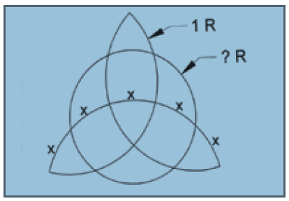

```{r setup, include=FALSE}
knitr::opts_chunk$set(echo = TRUE)
```

# Bent Brain Ticklers, Winter 2007


## Problem 1

    A population of amoebae starts
    with one amoeba. If there is a
    75 percent probability that an
    amoeba will survive and split
    to create two amoebae and a 25
    percent probability that it will not
    survive and if all the amoebae in
    future generations have the same
    probability of survival, what is the
    probability that this population of
    amoebae will go on forever? All
    splits occur at the same time. And,
    at this time, each amoeba split
    or death is independent from the
    others' outcomes.

    -- Classic Mathemagic
    by R. Blum, A. Hart-Davis,
    B. Longe, and D. Niederman

Solution:

    So - probability of die off = 1/3
    Probability of living forever = 2/3

    Consider Gen 1:
    
    P=0.75 Reproduce --> P=2
    P=0.25 Die off

    Gen 2 (occurs 75% of the time)
    
    First amoeba: P=0.75 reproduce
                  p=0.25 die off
    Second amoeba: P=0.75 reproduce
                   p=0.25 die off
                   
    Probability that both die off = (1/4)^2
    
    Gen 3: Probability that they all die off = (1/4)^3
    
    etc.
    
    In general, P(die off in Gen n) = (1/4)^n
    
    Total Pr(die off) = sum((1/4)^n,n,1,infintiy)
       = 1/3
       
    So - probability of die off = 1/3, Probability of living=2/3


## Problem 2

    What is the largest prime, p, less
    than 1,000 for which N = p^3 + 2p^2 +
    p has exactly 42 positive integral
    factors? Remember that both 1 and
    N are factors of N.

    -- Mathematics Teacher

Solution:

    Given a number exppressed as prime factors: n = a^b * c^d * ...
    The number of factors is (b+1)*(d+1)*...

    p^3 + 2p^2 + p = p * (p^2+2*p+1) = p*(p+1)*(p+1)
    
    Since p is prime we know it has 2 factors = (1,p)
    We also know that the number of factors in the product
    
    p*(p+1)*(p+1) = 2*N = 42 --> N = 21 = 3*7 = (2+1)*(6+1)
    
    We need to get the prime factors of (p+1)^2.  There must be 2 of
    one value and 6 of another.  Each of p+1 must have two distinct
    prime factors, one with multiplicity=1 and one with multiplicity=3.
    
    
    There are 7 primes that have this property:
    
    823 631 487 151 103  53  23
    
    The largest is 823


## Problem 3

    Solve the following cryptic
    multiplication problem. This can be
    solved without computer assistance.

    LYNDON * B = JOHNSON

    Each letter stands for a different
    digit, and there are no leading
    zeros.

    -- The Numerology of Dr. Matrix
    by Martin Gardner

Solution: solved in cryptic arithmetic notebook (yes - using computer!)

    > x_lyndon[k]
    [1] 570140
    > x_b[k]
    [1] 6
    > x_johnson[k]
    [1] 3420840


## Problem 4

    On a popular television show,
    Charmed, the figure shown below
    appears on its Book of Shadows.



    As seen, the figure has three
    intersecting arcs in a symmetrical
    pattern and an inner circle joining
    them together. The figure is
    constructed so that each of the
    five arcs marked x are of the same
    distance. If the radius of each
    of the three intersecting arcs is
    1, then what is the radius of the
    inner circle? Express your answer
    accurate to four significant figures.

    -- Dennis R. Dettman, NY N'77

Solution:

    The radius = 0.7155181

    I think we need to find the radius of the circle
    that circumscribes the three points where the arcs
    meet.  Given that radius we know the center locations
    and radii of the arcs so we can calculate the length
    of the center arc segment (x) and confirm the arc
    segments on either side are 2x.  Once this radius has
    been found it should be easy to find the distance to
    the center.


    Assume the circumscribed circle has radius R.  The
    circle that generates the arc with the 5 x symbols
    is located at x=0, y=-R.  The equation of the circle
    is then:
    
        x^2 + (y+R)^2 = 1
        
    The other two arcs intersect with this circle.  The
    arc from the left is centered at x=R*cos(150)= -sqrt(3)*R/2,
    y=R*sin(150) = R*/2.  This circle has an
    equation of:
    
        (x+sqrt(3)*R/2)^2 + (y-R/2)^2 = 1
        
    The arc from the right is centered at x= +sqrt(3)*R/2 and the
    same y value.  This equation is then:
    
        (x-sqrt(3)*R/2)^2 + (y-R/2)^2 = 1
        
        If we find the intersection of the first two we can
    find the right end of the center-most arc segment = x.

        y = x/sqrt(3)

    Since this is on the arc we know:
    
        x^2 + (y+R)^2 = 1
        x^2 + (x/sqrt(3)+R)^2 = 1
        
    Solving for x:
    
        x1 = sqrt(3)*(-R + sqrt(-3*R^2 + 4))/4
        x2 = -sqrt(3)*(R + sqrt(-3*R**2 + 4))/4

    Where the first line is the intersection at the right end of the
    arc in the center of the figure and x2 is the intersection in
    the extreme lower left corner of the figure.

    Given the solution for the center X location (x1) we can calculate the
    angle for the bottom circle.  The half angle is:
    
        theta1 = asin(x1)
        
    The second intersection should subtend an angle 5 times as large but
    in the opposite direction.
    
        theta2 = asin(x2) ~ -5*theta1
        
    We want to minimize the difference.
    

```{r}
foo = function(r) {

    x1 = sqrt(3)*(-r + sqrt(-3*r^2 + 4))/4
    x2 = -sqrt(3)*(r + sqrt(-3*r**2 + 4))/4
    
    theta1 = asin(x1)
    theta2 = asin(x2)
    
    # The difference between x2 and x3 should be minimized
    return(abs(theta2+5*theta1))
}


r_outer=optim(0.9,foo,method="Brent",lower=0.01,upper=0.99)

r=r_outer$par
x1 = sqrt(3)*(-r + sqrt(-3*r^2 + 4))/4
x2 = -sqrt(3)*(r + sqrt(-3*r**2 + 4))/4
    
theta1 = asin(x1)

# Point on the unknown circle R
# The angles are made by a unit circle
x = sin(3*theta1)
y = -r+1*cos(3*theta1)

# Distance to center of the logo
d=sqrt(x^2+y^2)

d
```

```{r}
r=0.8164966
plot(c(-1.5,1.5),c(-1.5,1.5),type='n',asp=1)
theta=seq(0,2*pi,length=100)
# polygon(r*cos(theta),r*sin(theta),lty='dashed')

polygon(sqrt(3)*r/2+cos(theta),r/2+sin(theta),border='red')
polygon(-sqrt(3)*r/2+cos(theta),r/2+sin(theta),border='red')
polygon(cos(theta),-r+sin(theta),border='red')

r2=0.7155181
polygon(r2*cos(theta),r2*sin(theta),border='blue',lty='solid',lwd=3)

```


## Problem 5

    I have written down three
    different three-digit integers,
    no leading zeros, each of which
    contains at least one digit 3. For
    each number, three of the following
    statements are true, and three are
    false. (a) The number is prime. (b)
    The number is a cube of an integer.
    (c) The middle digit is the average
    of the other two digits. (d) The
    unit's digit differs from the ten's
    digit by 3. (e) The number has a
    two-digit prime factor, the digits of
    which differ by 3 or whose sum is a
    cube. (f) The number is a triangular
    number, that is, of the form
    n(n + 1)/2, which generates the
    sequence 1, 3, 6, 10, and so on.
    What are the three numbers?

    -- Adrian Somerfield
    in New Scientist

Solution:

    To get three TRUE statements need to pick:
    
        136 -> TRUE statement d,e,f; FALSE a,b,c
        630 -> TRUE statement c,d,f; FALSE a,b,e
        369 -> TRUE statement c,d,e; FALSE a,b,f


    Some of the statements can never be true at the same time.  In particular,
    several statements preclude a 3 digit prime number.
    
    FALSE (a) the number is a prime
    
    FALSE (b) the number is the cube of an integer (e.g. contradicts a,c,e,f)
            Only candidates are 125, 216, 343, 512, 729
            
    (c) middle digit is average of the other two (contradicts a,b)
            If triangular then must be: 210 630 666 741
            
    (d) Unit's digit differs from the ten's by 3
            If triangular then must be: 136 325 496 630 703 741 903

    (e) number has two digit prime factor (contradicts a,b), the digits
            of which differ by 3 or whose sum is a cube
            if triangular --> 820, 861 (max prime factor = 41)
            if triangular --> 136 153 561 595 (max prime factor sum = cube)
            
    (f) number is triangular (contradicts a,b)
            Candidates:
            105 120 136 153 171
            190 210 231 253 276
            300 325 351 378 406
            435 465 496 528 561
            595 630 666 703 741
            780 820 861 903 946
            990
    
    Since the number can never be prime and have three true statements we
    conclude that the number is never prime.
    
    Since the number can never be a cube and have three true statements we
    conclude that the number is not a cube.
    
    To get enough TRUE statements the number must be triangular from the pool:
    
    136 153             561 595                 820 861     -> statement e
    136         325 496         630     703 741         903 -> statement d
            210                 630 666     741             -> statement c
    

    To get three TRUE statements need to pick:
    
        136 -> TRUE statement d,e,f; FALSE a,b,c
        630 -> TRUE statement c,d,f; FALSE a,b,e
        741 -> TRUE statement c,d,f; FALSE a,b,e
 
    Unfortunately, the last number does not contain a 3 so it can not be correct.
    
    Need to find 3 digit number that must satisfy c,d,e
    
        middle digit is mean of other two
        units digit is different from tens by 3
        two digit prime factor with digits differ by 3 or sum is cube
    
    Candidates:
    
        d1*100 + d2*10 + d3  --> d2 = (d1+d3)/2
                                 d1 = d2 +/- 3
                                 
        two digit prime factor is 17 or 41

    The only value that satistfies this is 369      

## Bonus

    Place seven points, each
    at a different position, on a plane
    so that, if you choose any three of
    them, at least two will be exactly
    1 cm apart.

    -- Classic Mathemagic
    by R. Blum, A. Hart-Davis,
    B. Longe, and D. Niederman

Solution:

    Put one point at the center of a circle
    The other six should be equally distributed
    around the circumference of the circle.  All
    of these points are equidistant.

    The Bent solution is two overlapping rhombuses
    but I like my answer better.


## Computer Bonus

    For TAU^(.BETA) = PI, find TAU
    and BETA that give PI closest
    to an integer. Note the decimal
    point before BETA. Same rules
    as Problem No. 3. This one needs
    computer help!

    -- Don A. Dechman, TX A'57

Solution:  solved in the cryptic arithmetic notebook

           t a u b e p i
    593221 9 7 2 1 5 0 3
    > x_tau[k,]
    [1] 972
    > x_beta[k,]
    [1] 1597
    > x_pi[k,]
    [1] 3
    
OOOps -- leading zero is not allowed.  Need to check this again.
After eliminating the rows where t,p == 0

    > a[which.min(a$err),]
           t a u b e p i        y pi          err
    402907 6 5 9 4 3 1 7 16.99979 17 0.0002128598


    tau ^ (.beta) = 16.99979
