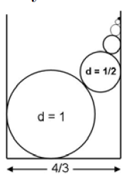

```{r setup, include=FALSE}
knitr::opts_chunk$set(echo = TRUE)
```

# Bent Brain Ticklers, Fall 2007


## Problem 1

    There are nine suspects in a crime.
    When questioned, each answered as
    follows:

    JOHN: "Elvis is guilty."
    GEORGE: "It was not Elvis."
    RINGO: "I did it."
    PAUL: "It was either Ringo or Tommy."
    ELVIS: "George isn't telling the truth."
    FABIAN: "Ringo is guilty."
    CHUBBY: "It was not Ringo."
    TOMMY: "It was neither Ringo nor I."
    RICKY: "Tommy is telling the
    truth, and it wasn't Elvis
    either."

    Only three of the nine suspects are
    telling the truth. That being so, who
    committed the crime?

    -- Technology Review

Solution:

    Tommy committed the crime.

    Two of the true statements come from contradictory pairs:
    
    Either John or George is telling the truth, not both
    Either Fabian or Chubby is telling the truth, not both

    We need to find the third true statement:
    
    Assume Ringo is guilty - then this means George, Ringo,
    Paul, and Fabian told the truth.  This is too many truths!
    Conclude: Ringo is not guilty.

    Updating the statements with the known result:
    
      JOHN: "Elvis is guilty."
      GEORGE: "It was not Elvis."
    F RINGO: "I did it."
      PAUL: "It was either Ringo or Tommy."
      ELVIS: "George isn't telling the truth."
    F FABIAN: "Ringo is guilty."
    T CHUBBY: "It was not Ringo."
      TOMMY: "It was neither Ringo nor I."
      RICKY: "Tommy is telling the truth, and it wasn't Elvis either."

    Assume Elvis is telling the truth - this means he is guilty.  This
    means John, Paul, Elvis and Tommy are telling the truth.  Too many
    truths!  Conclude: Elvis is not telling the truth.
    
    F JOHN: "Elvis is guilty."
    T GEORGE: "It was not Elvis."
    F RINGO: "I did it."
      PAUL: "It was either Ringo or Tommy."
    F ELVIS: "George isn't telling the truth."
    F FABIAN: "Ringo is guilty."
    T CHUBBY: "It was not Ringo."
      TOMMY: "It was neither Ringo nor I."
      RICKY: "Tommy is telling the truth, and it wasn't Elvis either."
    
    If Tommy is guilty then this works

    F JOHN: "Elvis is guilty."
    T GEORGE: "It was not Elvis."
    F RINGO: "I did it."
    T PAUL: "It was either Ringo or Tommy."
    F ELVIS: "George isn't telling the truth."
    F FABIAN: "Ringo is guilty."
    T CHUBBY: "It was not Ringo."
    F TOMMY: "It was neither Ringo nor I."
    F RICKY: "Tommy is telling the truth, and it wasn't Elvis either."

    Conclude: Tommy did it.


## Problem 2

    The long line of entrants for the
    marathon was told to number themselves
    from one upwards using the
    large supply of sticky-backed digits
    provided. All was going well, and I
    observed that my number was an
    even, three-digit, perfect square. The
    next person added one to my number,
    selected the appropriate digits,
    but then, unfortunately, stuck them
    on his back in the wrong order. The
    next person added one to that incorrect
    three-digit number, selected the
    appropriate digits, but then again
    stuck them on his back in the wrong
    order. The person after that added
    one to that incorrect three-digit number,
    selected the appropriate digits,
    but then stuck them on his back in
    the wrong order, and so it continued.
    Oddly, every third runner after me
    had a number which was a perfect
    square. I only realized that something
    was wrong when I overtook a runner
    with the same number as mine. What
    was my number?

    -- Susan Denham in New
    Scientist

TODO


## Problem 3

    An infinite number of cylinders are
    stacked in a trough
    as shown in the figure.
    If the diameters
    of the cylinders are
    1, 1/2, 1/4, 1/8, etc.,
    and the width of the
    trough is 4/3, then
    what is the height of
    the stack?

    -- Technology Review




Solution:

    For the bottom-most two circles the line connecting
    the two centers is the hypotenuse of a right triangle with
    length = 1/2+1/4 = 3/4.  The base of the triangle is
    defined by the width of the trough minus the radii of the
    other two circles:
    
        base = 4/3 - 1/2 - 1/4 = (16-6-3)/12 = 7/12
        
    The height between the center of the two circles is then:
    
        sqrt((3/4)^2 - (7/12)^2) = sqrt(2)/3
        
    The total elevation of the center of the second circle is:
    
        1/2 + sqrt(2)/3
        
    The remaining circles are all flush with the right side of
    the trough.  Starting with the second circle, we can identify
    a right triangle with the hypotenuse joining the centers of
    circle n with circle n+1.  The length of the hypotenuse is
    just the sum of the radii = r + r/2 = 3/2*r.  The length of
    the base is the difference in the radii = r - r/2 = 1/2*r.
    The height of the triangle is then:
    
        sqrt((3/2*r)^2 - (1/2*r)^2) = r/2 * sqrt(8) = r*sqrt(2)
        
    Given that r=1/4 for the first circle, we can sum these heights
    as (in sympy syntax):
    
        summation(sqrt(2)*(1/2)**r, (r,2,oo)) = sqrt(2)/2
        
    The total height is:
    
        1/2 + sqrt(2)/3 + sqrt(2)/2 ~ 1/2 + sqrt(2)*5/6
        
        ~ 1.678511


## Problem 4

    Select three points at random from
    within a triangle. What is the expected
    distance of the nearest one from
    the base?

    -- John W. Langhaar, PA A '33

Solution:

    In general: E = h/(2*n+1) where n=number of points
    In this case: E = h/7

    This duplicates some of the calculations from previous Bent
    issues for a cone and a sphere.  Following the same logic
    we can create a differential strip across the triangle and
    calculate the probability that the point is in this strip.
    The probability that both of the other points are further
    away from the base requires a second probability (raised to
    the 2 power).  Finally, the pdf needs to be integrated over
    the full height of the triangle and then multiplied by 3 since
    there are three points that might be lowest:
    
    w = width of base of triangle
    h = height of triangle
    y = height above the base (varies from 0 to h)
    
    For a differential strip at a height of y:
    
           (w*(h-y)/h) * dy
    pdf1 = ----------------
              1/2 * w * h
    
    The probability that the other two points are above this
    height:
    
         [ 1/2*(w*(h-y)/h)*(h-y) ] 2
    pr = [ --------------------- ]
         [        1/2*w*h        ]

    Note that if there were N points then this would be to the N-1
    power.
    
    Multiplying these probabilities by y (first moment) and integrating
    for y = 0 to h:
    
    E_one_point = integrate(y*pdf1*pr,(y,0,h)) = h/21
    
    This is true for each of the three points so the total expectation:
    
    E = h/7
    
    Note that if there were N points then this woul be times N.
    

## Problem 5

    Your company makes long thin
    widgets of length L where L^2 is an
    integer. Each widget is shipped in
    a box having integral dimensions in
    length L, width W, and height H.
    The widget can be packed into the
    box in any one of three ways: 1) it
    can be packed parallel to any edge,
    but its length must equal the length
    of the box in that dimension, 2) it can
    be packed against any side of the
    box, but its length must equal the
    length of the diagonal along that side
    of the box, and 3) it can be packed
    into the box along the body diagonal,
    but its length must equal that of
    the box body diagonal. You discover
    that there are at least some widgets
    (for example, L^2 = 23) that cannot fit
    into any box using the above rules.
    Find all the values of L^2 representing
    widgets that cannot be packed
    into boxes using the above rules.
    Express your answer in terms of integers
    and variables that have only
    integral values.

    -- John L. Bradshaw, PA A '82

TODO


## Bonus

    On one of the holes of a golf
    course, the elevation of the tee is
    40 feet higher than the elevation of
    the green. The horizontal distance
    between the tee and the cup is 250
    yards. For an initial velocity of 232.5
    ft/sec, at what angles could the ball be
    hit if the golfer wants the ball to land
    on the green 35 feet in front of the
    cup? Assume there is no wind and no
    spin on the ball. The ball has a diameter
    of 1.65 inches and a weight of 1.62
    ounces. Assume the drag coefficient,
    CD, is 0.25. Air resistance is given by
    rho_a*C_D*A*v^2/2, where rho_a = 0.075 lb/ft^3
    is the density of air, A is the cross sectional
    area of the ball, and v is its velocity.
    Use 32.088 ft/sec^2 for the acceleration
    due to gravity.

    -- Adapted from Towing Icebergs,
    Falling Dominoes, and Other
    Adventures in Applied Mathematics
    by Robert B. Banks

Solution:

    Seems like a pretty normal shooting problem.
    Need everything in the correct units.
    I think we need things in feet.
    
    1. Initial velocity determined by angle
        vx0 = v0*cos(theta)
        vy0 = v0*sin(theta)
    2. Differential equations for x and y:
        Force_x =  m*ax = -air_resistance
        Force_y =  m*ay = gravity - air_resistance
    3. Final y value = -40, calculate x
    4. Adjust angle to get x = 250 yards

    Once the differential equation solver is working
    I can probably do this with trial and error.
    Otherwise - I can use optim to solve this.
    
    Using optim() with dt=0.001 reveals:
    
    theta1 = 38.2365
    theta2 = 34.95804
    
    
```{r}
theta = 22.65*pi/180    # Assumed firing angle
v0 = 232.5           # Initial velocity in ft/sec
x_target = 250*3-35  # Target x value
y_target = -40       # Given y value
d = 1.65/12          # Ball diameter in ft
w = 1.62             # Ball weight in ounces
CD = 0.25            # Air resistance coefficient
# CD = 0.00            # No Air resistance coefficient
rho_a = 0.075        # Density of air in lb/ft^3
g = 32.088           # gravity if ft/s^2

A = pi*(d/2)^2       # Cross sectional area of ball in ft^2
m = w/16             # mass in lbs???  slugs???


# Warning = lots of ugly globals here

golf = function(v0, theta) {
    # Just going to solve with forward Euler for now
    # Should probably use a real solver once I think this makes sense.
    # but, I will just accept this for now.
    vx0 = v0*cos(theta)
    vy0 = v0*sin(theta)

    xxx=c()
    yyy=c()
    vxxx=c()
    vyyy=c()
    dt=0.001   # Time step for the simulation
    x=0
    y=0
    vx=vx0
    vy=vy0
    while (y>y_target) {
        ###
        ### NO NO NO NO NO !!!
        ###
        ### Initial solution orthogonalized the air resistance!
        ###
        ### Since the air resistance is nonlinear we can not consider the
        ### x and y components separately.  Must calculate the effect of
        ### air resistance using the full velocity and then partition into
        ### x and y components.
        vtotal = sqrt(vx^2 + vy^2)
        ftotal = rho_a*CD*A*vtotal^2/2
        ###
        ### How do we partition it?  Depends on the angle of flight = dy/dx.
        ### We can approximate this as tan(alpha) = dy/dt / dx/dt = vy/vx
        ### Once we have alpha we can calculate fx = f*cos(alpha) and
        ### fy as f*sin(alpha)
        ###
        alpha = atan(vy/vx)
        air_x = ftotal*cos(alpha)
        air_y = ftotal*sin(alpha)
        
        f_x = -air_x
        f_y = -m*g - air_y

        a_x = f_x/m
        a_y = f_y/m
        vx_new = vx + dt*a_x
        vy_new = vy + dt*a_y
        x_new = x + dt*vx
        y_new = y + dt*vy
        x=x_new; vx=vx_new
        y=y_new; vy=vy_new
        xxx=c(xxx,x)
        yyy=c(yyy,y)
        vxxx=c(vxxx,vx)
        vyyy=c(vyyy,vy)
    }
    zzz=list(xxx,yyy)
    return(zzz)
}

foo = function(x) {
    zzz=golf(v0,x[1]*pi/180)
    return(abs(max(zzz[[1]])-x_target))
}

# xxx=optim(30,foo,method="Brent",lower=25,upper=36)
# xxx

if (T) {
    zzz1=golf(v0,34.95804*pi/180)   # Low trajectory
    zzz2=golf(v0,38.2365*pi/180)    # High trajectory
    
    plot(zzz2[[1]],zzz2[[2]],xlab='Distance',ylab='Height')
    points(zzz1[[1]],zzz1[[2]],col='blue')
    abline(h=y_target,col='red')
    abline(v=x_target,col='red')
    grid()
}
```


## Computer Bonus

    A Smith number
    is a composite number, the sum of
    whose digits equals the sum of the
    digits of all its prime factors. The
    smallest Smith number is 4 = 2x2.
    The sum of the digits of 4 is 4, and the
    sum of digits of its prime factors is 2
    + 2 = 4. Another example is 6,036 =
    2x2x3x503; 6,036 has a digit sum of 15,
    and the sum of the digits of its prime
    factors is also 15. How many Smith
    numbers are there between 2 and
    10,000?

    -- Patrick Costello & Kathy Lewis in
    Mathematics Magazine (June 2002)

Solution: seems like a candidate for exhaustive search

```{r}
library(gmp)

sum_digits = function(n) {
    return(sum(as.integer(strsplit(as.character(n),"")[[1]])))
}

zzz=c()
for (i in 2:10000) {
    s1=sum_digits(i)
    s2=sum(sapply(as.numeric(factorize(i)),sum_digits))
    if (s1==s2 & isprime(i)==0) {
        zzz=c(zzz,i)
        # print(paste0("Smith number = ",i,collapse=""))
    }
}
print(paste0("Number of Smith Numbers = ",length(zzz)))
```

The number of Smith numbers from 2-10000 (inclusive) is 376.

