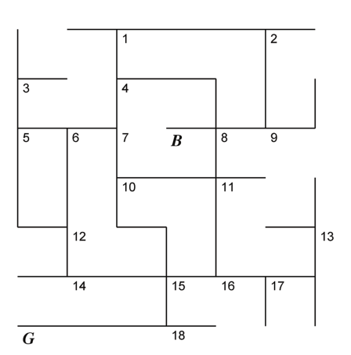

```{r setup, include=FALSE}
knitr::opts_chunk$set(echo = TRUE)
```

# Bent Brain Ticklers, Fall 2014

This set of problems was horrible.  Nothing fun.

## Problem 1

    With the usual rules: Base ten, no leading
    zeros, different letters are different
    digits, same letter is same digit through-
    out, solve the following cryptic addition
    problem (which can be solved without computer
    help).

        P I E R R E
    + E L L I O T T
      -------------
      T R U D E A U

-- Richard I. Hess, CA B'62

Solution: done in the cryptic arithmetic notebook

      PIERRE + ELLIOTT = TRUDEAU

    a=make_crypt_df('pierreelliotttrudeau')
    k=(make_num(a,'pierre')+make_num(a,'elliott')==make_num(a,'trudeau'))
    k=k&(a$p!=0)&(a$e!=0)&(a$t!=0)
    sum(k)
    [1] 1
    a[k,]
           p i e r l o t u d a
    868143 2 4 6 1 8 5 7 3 0 9


## Problem 2

    Gerald, Harold, Ian, John and
    Karl have long been members of
    the Christmas Compensation Club
    - open only to those less than 100
    who suffer the severe loss which re-
    sults from having one's birthday on
    Christmas day. Last Christmas Karl
    was older than Ian by three times as
    much as he was older than Harold,
    and John was 10% younger than
    Harold and 20% older than Ian. Ger-
    ald is older than Karl by the same
    amount that John is older than Ian.
    Find their ages.

    -- Brain Puzzler's Delight
    by E.R. Emmet

Solution:

    K-I = 3*(K-H)
    J=9/10*H
    J=12/10*I
    G-K = J-I = 2/10*I = 2/12*J

    H=10/9*J
    I=10/12*J
    G-K = 2/12*J
    so
    K-(10/12*J) = 3*(K-10/9*J)
    (30/9-10/12)*J = 2K
    (15/9-5/12)*J=K
    5/4*J=K
    and:
    G-K = 2/12*J so G=(5/4+2/12)*J = 17/12*J = 51/36*J
    
    In summary:
    G=51/36*J
    K=45/36*J
    I=10/12*J=30/36*J
    H=10/9*J=40/36*J
    All values are integers < 100
    
    Solutions:
    
        j   g   k   i   h
    ----------------------
    [1] 36  51  45  30  40 <-- solution
    [1] 72 102  90  60  80 <-- Gerald kicked out of club


## Problem 3

    Our next contestant is Thomas
    Chalk, a retired schoolmaster from
    Oxbridge. Good evening, Mr. Chalk,
    your subject is Ruritanian royalty.
    The house of Kohlenbuttel gave
    Ruritania seven kings, the crown
    descending directly from father to
    son on each occasion. Your task, Mr.
    Chalk, is to say how many of these
    seven statements are true:
    1. King Dachs was not the grandson
    of King Fruhling.
    2. King Adolf was not the great-
    grandson of King Gunther.
    3. King Eiche was a descendant of
    King Dachs.
    4. King Gunther was not the great-
    great-grandson of King Carolus.
    5. King Bohnen was not the great-
    great-great-great-grandson of King
    Eiche.
    6. King Gunther was the son or
    grandson of the first Kohlenbuttel
    king.
    7. King Dachs was not the first
    Kohlenbuttel king.
    Well, Mr. Chalk? You said two?
    That is correct. What is the order of
    the kings?

    -- A Tantalizer by Martin Hollis
    in New Scientist

TODO

    meh
    

## Problem 4

    A federal marshal arrived at the
    jail of a lonely outpost to pick up a
    prisoner, only to discover five na-
    ked men locked in the cell. They all
    claimed to be either the sheriff or
    one of his deputies. The prisoners
    had lured in the guards and over-
    powered them, but the sheriff man-
    aged to throw the keys through the
    window so that no one could escape.
    The prisoners then threw out all of
    their clothes, so now the five naked
    men all stood there claiming to be of-
    ficers. Fortunately, the marshal re-
    alized that the officers only told the
    truth and that the prisoners always
    lied. "Which of you are officers?" he
    asked.
    "I am, for one," said the first man,
    who was the biggest.
    "He'd say that in any case," said
    the second.
    "Three of us are," said the third,
    who was the smallest. His right arm
    was in a sling.
    "That's a lie," said the fourth.
    "The biggest fellow says he's an
    officer," said the fifth, "but it's hard
    for you to tell if he's lying or not."
    After a few minutes the marshal
    opened the cell and told the officers
    to step out. Whom did he let out?

    -- Unknown

TODO

    meh
    

## Problem 5

    The State of Confusion is a 6x6
    kilometer square (all roads are an
    integral number of km and all inter-
    sections are at right angles) that has
    ten towns:
    A. Aberdeen F. Fairbanks
    B. Bryce G. Gainesville
    C. Cabot H. Hawi
    D. Detroit I. Ironton
    E. Eagle J. Jackson
    To assist strangers visiting Confu-
    sion, ten highway signs have been
    erected:
    K. Cabot - 5; Aberdeen - 6
    L. Fairbanks - 2; Eagle - 4
    M. Fairbanks - 3; Detroit - 7
    N. Detroit - 6; Bryce - 6
    O. Cabot - 3; Ironton - 4
    P. Bryce - 1; Hawi - 6
    Q. Eagle - 2; Hawi - 7
    R. Ironton - 3; Jackson - 4
    S. Aberdeen - 1; Gainesville - 7
    T. Jackson - 3; Gainesville - 6



    The accompanying figure is a
    map of Confusion. There are 20 grid
    points on the map, indicated by num-
    bered points, 10 of these grid points
    are occupied by towns and 10 by
    highway signs. Unfortunately, the
    copy of the map has gotten wet and
    some of the ink has rubbed off, and
    only two of the towns are shown (the
    capital, Bryce, and the university,
    Gainesville). Where are the other 8
    towns located? Towns and highway
    signs are all an exact number of
    km from each other with distances
    measured along the vertical and
    horizontal road segments (not as
    the crow flies). The distance on each
    sign is the shortest distance to the
    given town. Present your answer as
    8 number/letter pairs, representing
    the grid point and the town located
    there.

-- Games magazine

TODO

    meh
    

## Bonus

    Using at most fourteen
    1-ohm resistors, show us a network
    that has a resistance of pi ohms, ac-
    curate to seven significant digits.
    You should consider series, parallel,
    delta, wye, and bridge connections.

    --Hubert W. Hagadorn, PA E'59

TODO


## Double Bonus

    In Euclid's proof of
    the Pythagorean theorem: ABC is
    a right triangle; B is a right angle;
    ABDE, BCFG, and ACHK are the
    squares on the sides. Let Z be the
    point where EC and AF meet. Show
    that BZ is (or is not) parallel to AK.

    -- Puzzle Corner
    in Technology Review

TODO


