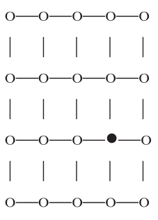

```{r setup, include=FALSE}
knitr::opts_chunk$set(echo = TRUE)
```

# Bent Brain Ticklers, Fall 2015


## Problem 1

    Arthur, Basil, Clarence, Dud-
    ley and Earl are married, but not
    respectively, to Alice, Barbara,
    Clarissa, Dorothy and Eve. The
    hometowns of the five men are,
    not respectively, Andover, Bristol,
    Chippenham, Delhi and Ealing; and,
    their youthful ambitions were, again
    not respectively, to have become an
    Architect, a Barber, a Chemist, a
    Dentist and an Engineer.
    For each man his name, the name
    of his wife, his hometown and his
    youthful ambition all begin with dif-
    ferent letters.
    The five ladies make remarks
    (which are unfortunately not all
    true) as follows:
    Alice: The would-be Dentist is
    married to Barbara.
    Barbara: The man who wanted
    to become an Engineer is not Doro-
    thy's husband. The man who was
    born in Bristol has always wanted to
    be a Dentist.
    Clarissa: The man who was born
    in Andover is married to Barbara.
    Dorothy: The would-be Barber is
    not my husband.
    Eve: The man who was born in
    Andover is not Basil. The man who
    was born in Chippenham wanted to
    become an Engineer.
    It is interesting to notice that, in
    these remarks, when the subject of
    the sentence is a man whose name
    begins with a letter which comes
    alphabetically before the initial let-
    ter of the speaker, the sentence is
    true; if the initial letter of the sub-
    ject's name comes after the initial
    letter of the speaker's name, the
    sentence is false. In no case is the
    initial letter of the subject's name
    the same as the initial letter of the
    speaker's name. Find, for each man,
    the name of his wife, his hometown
    and his youthful ambition. That is,
    fill in the following matrix, using
    initial letters.

        Husband   | A | B | C | D | E |
        Wife      |   |   |   |   |   |
        Hometown  |   |   |   |   |   |
        Ambition  |   |   |   |   |   |

    -- Brain Puzzler's Delight
    by E.R. Emmet

TODO

    meh


## Problem 2

    Peter Pickle has drawn up this
    handy map of the 20 pubs in his
    town. On crawling nights he starts
    with a pint at the
    Swan and then
    moves off along
    the lines stopping
    at each pub he
    passes. He follows
    a formula on step-
    ping out of the
    Swan: A, B, C, B,
    A, B, A, D, D, A,
    D, A, B, C, and finally B. A, B, C,
    and D stand for north, south, east,
    and west, but not necessarily in that
    order. The final B brings him to the
    Bull, the black dot on the map, for
    the first and only time. (He may visit
    each of the other pubs more than
    once.) Where is the Swan (relative
    to the Bull)?

    -- Tantalizer by Martin Hollis
    in New Scientist



TODO

    meh


## Problem 3

    Find the greatest integer that
    can be formed in exactly 9 differ-
    ent ways and no more, by adding
    together a positive integral multiple
    of 7 and a positive integral multiple
    of 5.

    -- George Chrystal

TODO

    I don't even understand the problem statement.
    

## Problem 4

    A "near-square" is a rectangle
    of N x (N+1) units, and the prob-
    lem is to fill it completely with as
    few "squarelets" -- that is, smaller
    integral-sided squares -- as possible.
    For a 4 x 5 near-square, you cannot
    do better than 5 squarelets (one 4x4
    + four 1x1). With how few square-
    lets can you fill: a) an 18 x 19 near-
    square? b) a 22 x 23 near-square?
    (Please enclose a rough sketch of
    each or a clear written depiction).

    -- An Enigma by Stephen Ainley
    in New Scientist

TODO

    I wonder if there is a systematic way of
    solving this or if it is just trial and
    error?  Clearly there is an upper bound
    set by using the largest possible square
    of NxN and then using N squares of 1x1.
    This yields a value of N+1.  That is
    actually the minimal solution for their
    example of a 4x5 (one 4x4 and 4 1x1 = 5).
    
    For the case of 18x19 we could use squares
    of the following sizes:
    
    18x18 + 18 of 1x1 = 19 squares
    17x17 + 17 of 1x1 + 18 of 1x1 = 36 squares
    16x16 + 6 of 3x3 + 8 of 2x2 + 3 of 1x1 = 18 squares
    15x15 + 4 of 4x4 + 2 of 2x2 + 5 of 3x3 = 12 squares
    14x14 + 3 of 5x5 + 3 of 4x4 + 2 of 2x2 + 4x5 = 14 squares
    13x13 + 3 of 6x6 + 2 of 5x5 + 1 of 3x3 + 1 of 2x2 + 2 of 1x1 = 10 squares
    10x10 + 2 of 9x9 + 1 of 8x8 + 4 of 2x2 = 8 squares
    etc.
    
    This is very hard to visualize -- need a computer
    program to show it or paper.  I could try ASCII art but
    the aspect ratio is a bit deceiving.
    
    The best I could find in quick search is sketched below:
    
     1   2  3  4  5  6  7  8  9 10 11 12 13 14 15 16 17 18 19
    +--+--+--+--+--+--+--+--+--+--+--+--+--+--+--+--+--+--+--+
    |  |  |  |  |  |  |  |  |  |  x  |  |  |  |  |  |  |  |  | 1
    +--+--+--+--+--+--+--+--+--+--+--+--+--+--+--+--+--+--+--+
    |  |  |  |  |  |  |  |  |  |  x  |  |  |  |  |  |  |  |  | 2
    +--+--+--+--+--+--+--+--+--+--+--+--+--+--+--+--+--+--+--+
    |  |  |  |  |  |  |  |  |  |  x  |  |  |  |  |  |  |  |  | 3
    +--+--+--+--+--+--+--+--+--+--+--+--+--+--+--+--+--+--+--+
    |  |  |  |  |  |  |  |  |  |  x  |  |  |  |  |  |  |  |  | 4
    +--+--+--+--+--+--+--+--+--+--+--+--+--+--+--+--+--+--+--+
    |  |  |  |  |  |  |  |  |  |  x  |  |  |  |  |  |  |  |  | 5
    +--+--+--+--+--+--+--+--+--+--+--+--+--+--+--+--+--+--+--+
    |  |  |  |  |  |  |  |  |  |  x  |  |  |  |  |  |  |  |  | 6
    +--+--+--+--+--+--+--+--+--+--+--+--+--+--+--+--+--+--+--+
    |  |  |  |  |  |  |  |  |  |  x  |  |  |  |  |  |  |  |  | 7
    +--+--+--+--+--+--+--+--+--+--+--+--+--+--+--+--+--+--+--+
    |  |  |  |  |  |  |  |  |  |  x  |  |  |  |  |  |  |  |  | 8
    +--+--+--+--+--+--+--+--+--+--+--+--+--+--+--+--+--+--+--+
    |  |  |  |  |  |  |  |  |  |  x  |  |  |  |  |  |  |  |  | 9
    +--+--+--+--+--+--+--+--+--+--+xx+xx+xx+xx+xx+xx+xx+xx+xx+
    |  |  |  |  |  |  |  |  |  |  x  |  |  |  |  |  |  |  |  | 10
    +xx+xx+xx+xx+xx+xx+xx+xx+xx+xx+--+--+--+--+--+--+--+--+--+
    |  |  |  |  |  |  |  |  x  |  x  |  |  |  |  |  |  |  |  | 11
    +--+--+--+--+--+--+--+--+--+--+--+--+--+--+--+--+--+--+--+
    |  |  |  |  |  |  |  |  x  |  x  |  |  |  |  |  |  |  |  | 12
    +--+--+--+--+--+--+--+--+xx+xx+--+--+--+--+--+--+--+--+--+
    |  |  |  |  |  |  |  |  x  |  x  |  |  |  |  |  |  |  |  | 13
    +--+--+--+--+--+--+--+--+--+--+--+--+--+--+--+--+--+--+--+
    |  |  |  |  |  |  |  |  x  |  x  |  |  |  |  |  |  |  |  | 14
    +--+--+--+--+--+--+--+--+xx+xx+--+--+--+--+--+--+--+--+--+
    |  |  |  |  |  |  |  |  x  |  x  |  |  |  |  |  |  |  |  | 15
    +--+--+--+--+--+--+--+--+--+--+--+--+--+--+--+--+--+--+--+
    |  |  |  |  |  |  |  |  x  |  x  |  |  |  |  |  |  |  |  | 16
    +--+--+--+--+--+--+--+--+xx+xx+--+--+--+--+--+--+--+--+--+
    |  |  |  |  |  |  |  |  x  |  x  |  |  |  |  |  |  |  |  | 17
    +--+--+--+--+--+--+--+--+--+--+--+--+--+--+--+--+--+--+--+
    |  |  |  |  |  |  |  |  x  |  x  |  |  |  |  |  |  |  |  | 18
    +--+--+--+--+--+--+--+--+--+--+--+--+--+--+--+--+--+--+--+
    
    The Bent found a solution with only 7 -- I skipped over 11x11
    but that was the anchor.
    
    For the 22x23 grid the solution is 8.
    
    As I suspected the only solution method is trial and error.
    
    I hate trial and error.


## Problem 5

    Please solve this cryptic addition
    with no leading zeros, different let-
    ters are different digits, and same
    letter is same digit.

            TWELVE
            TWELVE
              NINE
              NINE
              NINE
              NINE
              FIVE
            + FIVE
           -------
           SEVENTY

    -- Journal of Recreational
    Mathematics

Solution: from cryptic arithmetic notebook

    Cryptic addition:

       TWELVE
       TWELVE
         NINE
         NINE
         NINE
         NINE
         FIVE
         FIVE
       ------
      SEVENTY

    a=make_crypt_df('twelveninefiveseventy')
    x_twelve=make_num(a,'twelve')
    x_nine=make_num(a,'nine')
    x_five=make_num(a,'five')
    x_seventy=make_num(a,'seventy')
    k=(x_twelve+x_twelve+x_nine*4+x_five+x_five == x_seventy)
    sum(k)
    [1] 1
    a[k,]
            t w e l v n i f s y
    2147267 5 9 2 0 3 8 4 7 1 6

    x_twelve[k,]  == 592032
    x_nine[k,]    == 8482
    x_five[k,]    == 7432
    x_seventy[k,] == 1232856


## Bonus

    In how many ways can N
    people be seated at a round table so
    that no person sits next (unordered)
    to the same pair of neighbors twice?
    Also, show us how to do it for seven
    (numbered 1 to 7) people. For each
    seating, place the lower number of
    the pair next to 1 on 1's left, start
    and end with person 1 and go clock-
    wise around the table (as an eight
    digit number). Order the resulting
    numbers smallest to largest. So, the
    first two seatings would be 12345671
    and 12435761.

    -- Henry E. Dudeney

TODO

    yuck.  I would do exhaustive search for
    the case of 7 but it would be tedious.


## Double Bonus

    Assuming the sudden onset of a steady
    vertical rain-fall, will a very overweight
    person (in a swimsuit) remain drier (get less
    water on them) by walking or run- ning a
    given distance to shelter? You may treat the
    person as a sphere. No trick answers please.

    -- The Chicken from Minsk by Y. B.
    Chernyak and Robert M. Rose

TODO

    Basic result after peeking: you should run.
    They don't have a great solution.
    
    Essentially they show the wetness is proportional
    to the square root of the speed but the time
    exposed to the rain is inversely proportional.
    
    They argue that since it is not linear, the
    faster you go the "less wet" you get.


