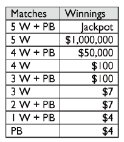

```{r setup, include=FALSE}
knitr::opts_chunk$set(echo = TRUE)
```

# Bent Brain Ticklers, Spring 2017


## Problem 1

    At summer camp, John has just returned to his
    tent with two 10-liter containers full of
    water, when two of his friends show up, each
    asking for 2 liters of water. Al has a
    4-liter pail, and Fay has a 5-liter pail. No
    other containers are available. How can John
    give Al and Fay each exactly 2 liters of
    water in their pails without spilling any
    water? On each transfer, one of the
    containers must be completely filled or
    totally emptied. Present your answer as a
    table with four columns labeled 10a, 10b, 5,
    and 4. The first line in the table will be 10
    10 0 0, the initial situation. The following
    rows will be the situation after a transfer
    has occurred. For example, if John's first
    move was to fill the 4-liter pail from the
    first 10-liter container, the second line of
    the table would be 6 10 0 4. We want the
    shortest sequence.

    -- Mathematical Puzzles of
    Sam Loyd, Volume Two,
    edited by Martin Gardner

Solution:

    Trial and error appears to be the solution method.
    I remember there was some kind of back-tracking solver
    available in Python (?) that might be interesting for
    this but I will try manually first.
    
    Eventually looked at the Bent solution
    
    10a  10b  5    4
    ----------------
    10   10   0    0
     5   10   5    0
     5   10   1    4
     9   10   1    0  <- I was correct to here
     9   10   0    1  <- missed this critical swap
     4   10   5    1
     4   10   2    4
     8   10   2    0
     8    6   2    4
    10    6   2    2

    Note that when a pair is only partially full the contents can be
    interpreted as a negative number.  For example, when the pail with
    a capacitity of 4 is only holding a value of 1 then it can subtract
    3 units from another container.  In other words, the contents is
    like the number -3.  Marking this explicitly yields:
    
    10a       10b      5        4
    ------------------------------
    10 (  )   10 (  )  0 (-5)   0 (-4)
     5 (-5)   10 (  )  5 ( 0)   0 (-4)
     5 (-5)   10 (  )  1 (-4)   4 ( 0)
     9 (-1)   10 (  )  1 (-4)   0 (-4)
     9 (-1)   10 (  )  0 (-5)   1 (-3)   <-- Key swap here
     4 (-6)   10 (  )  5 ( 0)   1 (-3)
     4 (-6)   10 (  )  2 (-3)   4 ( 0)
     8 (-2)   10 (  )  2 (-3)   0 (-4)
     8 (-2)    6 (-4)  2 (-3)   4 ( 0)
    10 (  )    6 (-4)  2 (-3)   2 (-2)

    Still don't see an obvious way to do this.


## Problem 2

    The first four triangular numbers are 1, 3,
    6, and 10. Triangular numbers are numbers
    generated by the formula, n(n + 1)/2, where n
    is a positive integer. If you take a
    triangular number of dots, they can be
    arranged in a triangle, similar to the ten
    pins in a bowling alley. ONE, THREE, SIX, and
    TEN are each a triangular number. What are
    their values? The usual rules for cryptics
    apply.

    -- Richard England
    in New Scientist

Solution:  missed in the cryptic arithmetic notebook

    is_triangular=function(n) {
        m=trunc((sqrt(8*n+1)-1)/2)
        return(n == (m*(m+1))/2)
    }

    a=make_crypt_df('onethreesixten')
    x_one=make_num(a,'one')
    x_three=make_num(a,'three')
    x_six=make_num(a,'six')
    x_ten=make_num(a,'ten')
    k=a[,'o']!=0 & a[,'t']!=0 & a[,'s']!=0
    k=k & is_triangular(x_one)
    k=k & is_triangular(x_three)
    k=k & is_triangular(x_six)
    k=k & is_triangular(x_ten)
    a[k,]
    x_one[k,]
    x_three[k]
    x_six[k]
    x_ten[k]
    
    > a[k,]
            o n e t h r s i x
    1588797 4 3 5 1 7 9 8 2 0
    > x_one[k]
    [1] 435
    > x_three[k]
    [1] 17955
    > x_six[k]
    [1] 820
    > x_ten[k]
    [1] 153


## Problem 3

    A manufacturer of paving blocks makes all
    sizes of rectangular blocks that have the
    following properties: the length, width, and
    thickness are each an integral number of cm,
    and the sum of the lengths of the 12 edges of
    the block is equal to two thirds the block's
    volume. What sizes does the manufacturer
    produce? Present your answer as a series of
    three integers in parentheses, such as (L, W,
    T) with L >= W >= T.

    -- Puzzle Corner
    by Allan Gottlieb
    in Technology Review

Solution: exhaustive search

    Constraint: L,W,T are integers
    Constraint: L >= W >= T
    Constraint: 6*(L+W+T) = L*W*T

    Arbitrarily sweep up to L=100.
    Also tried 1000 with no change in result.
    
```{r}

for (T in 1:100) {
    for (W in T:100) {
        for (L in W:100) {
            if (6*(L+W+T) == L*W*T) {
                print(c(T,W,L))
            }
        }
    }
}

```

Very limited set of blocks:

    T    W   L
    -----------
    1    7   48
    1    8   27
    1    9   20
    1   12   13
    2    4   18
    2    6    8
    3    3   12
    3    4    7

    I don't know how to prove this is all the possible integer
    solutions.
    
    They solved it algebraically and then asserted there were no
    more solutions.


## Problem 4

    A, B, C, and D represent four different
    digits that can be combined to yield 24
    different four-digit integers.  These 24
    integers have the following properties:

        4 are primes
        7 are the products of two different
        odd primes
        1 is the square of a prime
        8 are divisible by 2 but not by 4
        2 are divisible by 4 but not by 8
        1 is divisible by 8 but not by 16
        1 is divisible by 16

    What are the values of A, B, C, and D?

    -- Classic Puzzles
    by Gyles Brandreth

Solution:  exhaustive search

```{r}
library(gtools)
library(gmp)

check_solution = function(x, debugmode=FALSE) {
    # make the 24 permutations
    b=permutations(4,4,x)
    n=b[,1]*1000+b[,2]*100+b[,3]*10+b[,4]
    # check the constraints
    c1=c(); c2=c(); c3=c(); c4=c()
    c5=c(); c6=c(); c7=c()
    for (i in n) {
        # c1 = number is a prime
        if (isprime(i)) { c1=append(c1,i) }
        # c2 = two different odd prime factors
        # c3 = two identical primes
        m=as.numeric(factorize(i))
        if (length(m)==2) {
            if (length(unique(m)) == 1) {
                c3=append(c3,i)
            } else {
                if ((m[1]%%2 == 1) & (m[2]%%2 == 1)) {
                    c2=append(c2,i)
                }
            }
            
        }
        # c4 = divisible by 2 but not by 4
        if (sum(m==2) == 1) {
            c4=append(c4,i)
        }
        # c5 = divisible by 4 but not by 8
        if (sum(m==2) == 2) {
            c5=append(c5,i)
        }
        # c6 = divisible by 8 but not by 16
        if (sum(m==2) == 3) {
            c6=append(c6,i)
        }
        # c7 = divisible by 16
        if (sum(m==2) == 4) {
            c7=append(c7,i)
        }
    }
    if (debugmode) {
        print("Desired lengths: 4,7,1,8,2,1,1")
        print(c1)
        print(c2)
        print(c3)
        print(c4)
        print(c5)
        print(c6)
        print(c7)
    }
    
    if (length(c1)==4) {
        if (length(c2) == 7) {
            if (length(c3) == 1) {
                if (length(c4) == 8) {
                    if (length(c5) == 2) {
                        if (length(c6) == 1) {
                            if (length(c7) == 1) {
                                return(TRUE)
                            }
                        }
                    }
                }
            }
        }
    }
    return(FALSE)
}

a=combinations(10,4)

k=apply(a,1,check_solution)

a[k,]


```

The solution set is:

    a, b, c, d = 1, 3, 4, 8

    Primes:                 1483 4813 4831 8431
    distinct odd factors:   1843 3841 4183 4381 8143 8341 8413
    Prime-squared:          3481
    Divisible by 2, not 4:  1438 1834 3418 3814 4138 4318 8134 8314
    Divisible by 4, not 8:  1348 3148
    Divisible by 8, not 16: 1384
    Divisible by 16:        3184

    Solving this was embarassingly difficult since I had some logic
    errors that resulted in double counting of the values inside
    the check_solution routine.


## Problem 5

    A standard die is tossed repeatedly
    until the total of the numbers
    thrown exceeds 12. What is the most
    likely final total?

    -- Book of Curious and
    Interesting Puzzles by
    David Wells

Solution:

    I think I solved this in the past.  It makes sense
    but the answer is 13.  The smallest total is slightly
    more likely than any other.  There may be an
    analytical approach but I will use Monte-Carlo.
    
```{r}
ntrials=100000

n=c()
set.seed(2020)
for (trial in 1:ntrials) {
    m=0
    while (T) {
        m=m+sample(6,1)
        if (m>12) {
            n=append(n,m)
            break
        }
    }
}
table(n)/ntrials

```

    The solutions are given below for various seeds.
    
    Seed        13      14      15      16      17      18 
    ?      0.28100 0.23636 0.19208 0.14504 0.09702 0.04850 
    42     0.27910 0.23641 0.19085 0.14696 0.09744 0.04924 
    1      0.27841 0.23744 0.19173 0.14569 0.09927 0.04746 
    123    0.27820 0.23720 0.19334 0.14505 0.09765 0.04856
    2020   0.27635 0.23861 0.19203 0.14662 0.09770 0.04869 

We could also try exhaustive search.

The Bent does not give a probability.  They only note that P(13) is the
most common and a logic argument as to why.


## Bonus

    In the Power Ball lottery, five balls are
    drawn from among 69 white balls, numbered 1
    to 69, and one Power Ball is drawn from among
    26 red balls, numbered 1 to 26. If a player's
    ticket matches all five white balls and the
    Power Ball, he wins the jackpot, but there
    are eight other ways to win, as shown in the
    table. Tickets cost $2, but there is the
    power play option for an additional $1. At
    the end of the regular drawing, a power play
    number is drawn (from 42 balls, 24 of which
    are 2's, 13 are 3's, 3 are 4's, and 2 are
    5's); and, if the player has paid the extra
    dollar, his winnings (except the jackpot,
    which isn't affected, and the $1,000,000
    prize, which only goes to $2,000,000,
    regardless of the power play number) are
    multiplied by the power play number. How big
    must the jackpot be for the game to be fair
    for a $3 ticket, i.e., for the expected value
    of the player's winnings to equal $3?  Ignore
    taxes, the fact that the money is given as an
    annuity, and the possibility of multiple
    winners.




    -- A Mathematician at the
    Ballpark, by Ken Ross

TODO

    This seems complicated.  I peeked the Bent solution.
    Basic idea is to calculate the number of each combination:
    
    Case   Combinations
           White            PB
           Correct Wrong    Correct Wrong                  Result
    -------------------------------------------------------------
    5W+PB  C(5,5)*C(64,0) * C(1,1)*C(25,0) =         1    Jackpot
    5W     C(5,5)*C(64,0) * C(25,1)*C(1,0) =        25    1000000
    4W+PB  C(5,4)*C(64,1) * C(1,1)*C(25,0) =       320      50000
    4W     C(5,4)*C(64,1) * C(25,1)*C(1,0) =      8000        100
    3W+PB  C(5,3)*C(64,2) * C(1,1)*C(25,0) =     20160        100
    3W     C(5,3)*C(64,2) * C(25,1)*C(1,0) =    504000          7
    2W+PB  C(5,2)*C(64,3) * C(1,1)*C(25,0) =    416640          7
    2W     C(5,2)*C(64,3) * C(25,1)*C(1,0) =  10416000          0
    1W+PB  C(5,1)*C(64,4) * C(1,1)*C(25,0) =   3176880          4
    1W     C(5,1)*C(64,4) * C(25,1)*C(1,0) =  79422000          0
    PB     C(5,0)*C(64,5) * C(1,1)*C(25,0) =   7624512          4
    Bust   C(5,0)*C(64,5) * C(25,1)*C(1,0) = 190612800          0

    The expected payout for the power play is:
    
    J : no change
    1000000 : always multiplied by 2 (maximum amount)
    Others  : Average mutiplier = (24*2 + 13*3 + 3*4 + 2*5)/42 = 109/42
    
    Total payout:
    
        J + 2*25*1000000 + 109/42*(
            320*50000+
            8000*100 +
            20160*100+
            504000*7 +
            416640*7 +
            3176880*4+
            7624512*4)
        J + 50e6 + 109/42*()
        J + 227685696
        
    Total revenue: C(69,5)*choose(26,1)*3 = 876604014
    
    For a fair game we want payout = revenue so
    
    J = 876604014 - 227685696
    
    J = 648918318
    
This gets way more complicated when we allow for ties and other stuff.

Question: how hard is this to find via Monte-Carlo?  I recently read an article
about the error bands on Monte-Carlo being absolute rather than relative which
makes it nearly impossible to simulate lottery results with Monte-Carlo.

I wonder if that is true if I allow "enough" trials.  I won't worry about the
jackpot since that is what we are trying to calculate.  Just trying to get the
rest of the payouts -- e.g. the 227685696 value

Let us try:

```{r}
ntrials = 10000000

set.seed(123456)

# The winning values -- kept constant
w_win=sample(69,5)
pb_win=sample(26,1)

total=0
prize=rep(0,8)
for (trial in 1:ntrials) {
    w=sample(69,5)
    pb=sample(26,1)
    powerplay=sample(c(2,3,4,5),1,prob=c(24,13,3,2)/42)
    payout=0
    # Calculate payout
    if (pb==pb_win) {
        # if (sum(w %in% w_win) == 5) { payout=jackpot } ignore this case
        if (sum(w %in% w_win) == 4) { payout = 50000; prize[1]=prize[1]+1 }
        if (sum(w %in% w_win) == 3) { payout =   100; prize[2]=prize[2]+1 }
        if (sum(w %in% w_win) == 2) { payout =     7; prize[3]=prize[3]+1 }
        if (sum(w %in% w_win) == 1) { payout =     4; prize[4]=prize[4]+1 }
        if (sum(w %in% w_win) == 0) { payout =     4; prize[5]=prize[5]+1 }
    } else {
        if (sum(w %in% w_win) == 5) { payout=1000000; prize[6]=prize[6]+1 }
        if (sum(w %in% w_win) == 4) { payout =   100; prize[7]=prize[7]+1 }
        if (sum(w %in% w_win) == 3) { payout =     7; prize[8]=prize[8]+1 }
    }
    payout=min(powerplay*payout,2000000)
    total=total+payout
}

print(total)
print(ntrials)
print(total/ntrials)

print("Jackpot required for fair game:")
print((3-total/ntrials)*choose(69,5)*choose(26,1))
print("Prize count:")
print(prize)
```

For a random starting point, 10e6 trials:

    > print(total)
    [1] 8405970
    > print(ntrials)
    [1] 1e+07
    > print(total/ntrials)
    [1] 0.840597
    > 
    > print("Jackpot required for fair game:")
    [1] "Jackpot required for fair game:"
    > print((3-total/ntrials)*choose(69,5)*choose(26,1))
    [1] 630980446

With a seed of 42:

    > print(total)
    [1] 5689538
    > print(ntrials)
    [1] 1e+07
    > print(total/ntrials)
    [1] 0.5689538
    > 
    > print("Jackpot required for fair game:")
    [1] "Jackpot required for fair game:"
    > print((3-total/ntrials)*choose(69,5)*choose(26,1))
    [1] 710354952

With a seed of 123:

    > print(total)
    [1] 9214644
    > print(ntrials)
    [1] 1e+07
    > print(total/ntrials)
    [1] 0.9214644
    > 
    > print("Jackpot required for fair game:")
    [1] "Jackpot required for fair game:"
    > print((3-total/ntrials)*choose(69,5)*choose(26,1))
    [1] 607350883

With a seed of 2020:

    > print(total)
    [1] 9160940
    > print(ntrials)
    [1] 1e+07
    > print(total/ntrials)
    [1] 0.916094
    > 
    > print("Jackpot required for fair game:")
    [1] "Jackpot required for fair game:"
    > print((3-total/ntrials)*choose(69,5)*choose(26,1))
    [1] 608920121

With a seed of 1:

    > print(total)
    [1] 6213223
    > print(ntrials)
    [1] 1e+07
    > print(total/ntrials)
    [1] 0.6213223
    > 
    > print("Jackpot required for fair game:")
    [1] "Jackpot required for fair game:"
    > print((3-total/ntrials)*choose(69,5)*choose(26,1))
    [1] 695052807

With a seed of 123456:

    > print(total)
    [1] 13314364
    > print(ntrials)
    [1] 1e+07
    > print(total/ntrials)
    [1] 1.331436
    > 
    > print("Jackpot required for fair game:")
    [1] "Jackpot required for fair game:"
    > print((3-total/ntrials)*choose(69,5)*choose(26,1))
    [1] 487556516

    Prize Distribution:
    
     50K   100      7      4      4    1e6    100      7     Seed
     ------------------------------------------------------------
     10    694  14264 108497 260507      0    279  17383        1
      7    640  14345 108525 260459      0    261  17175       42
      5    691  14119 108784 260945      2    279  17303      123
      4    679  14204 108991 260661      2    285  17146     2020
      5    718  14208 109086 259969      4    283  17222   123456

    Clearly the variation in the projected jackpot is driven by the number
    of times the 1e6 prize occurs.  The summary of the 5 runs of 10e6 trials is:
    
         Min.   1st Qu.    Median      Mean   3rd Qu.      Max. 
    487556516 607743192 619950284 623369288 679034717 710354952     

    Compared to the analytical result of 648918318.
    
    This is really not that far off.  This is within 5% of the correct total.


## Double Bonus

    Starting with a standard double-six set of
    dominos, arrange the 28 dominos into the
    perimeter of a square, such that the pip
    values on each of the four sides of the
    square sum to the same value. At each corner
    of the square, there is a 90 degree turn, so that
    each side is 7 1/2 dominos long. The usual rules
    apply; that is, where two dominos meet, the
    ends must match (have the same number of
    pips). Place the double value dominos
    lengthwise, not crosswise. Present your
    answer as four strings of 7 1/2 dominos each,
    starting at the upper left corner and
    proceeding clockwise around the square. For
    example, the top edge might be:
    0-3|3-3|3-5|5-5|5-0|0-2|2-4|4 (sum = 44), and
    the right edge might be:
    4-6|6-2|2-2|2-1|1-5|5-4|4-0|0 (sum = 44).
    There are multiple answers, and any valid
    solution will be accepted.

    -- Howard G. McIlvried III, PA G'53

TODO

    Some people don't do windows.
    
    I don't do dominos!
    
    I really should figure this out some day.


