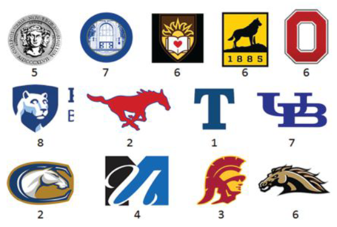

```{r setup, include=FALSE}
knitr::opts_chunk$set(echo = TRUE)
```

# Bent Brain Ticklers, Winter 2018


## Problem 1

    Hey baby, it's cold outside! What
    is the solution to the following winter-
    themed cryptarithm?

        SLEET + SNOW = FROSTY

    Each different letter stands for a
    different digit, and each different digit is
    always represented by the same letter; no
    leading zeros are allowed. Standard rules
    apply.

    -- Jeffrey R. Stribling, CA A'92

Solution: from the cryptic arithmetic notebook

    Cryptic addition:

      SLEET + SNOW = FROSTY

    a=make_crypt_df('sleetsnowfrosty')
    k=(make_num(a,'sleet')+make_num(a,'snow')==make_num(a,'frosty'))
    k=k&(a$s!=0)&(a$f!=0)
    sum(k)
    [1] 1
    a[k,]
            s l e t n o w f r y
    3615471 9 8 5 2 3 7 4 1 0 6


## Problem 2

    A high school shop class decides to make
    dollhouse furniture for a Toys for Tots
    drive. Each of the five students made only
    one kind of toy. Altogether, the students
    made 30 toys, but each made a different
    number greater than two. Gail made one more
    than the student who wore lilac and one less
    than the student who made desks. Hal made
    chairs.  Irene made five toys. The student
    who wore mauve made the end tables. The
    student wearing navy made only one third as
    many toys as Jill. Kyle wore orange; one
    student wore purple; and one student made
    beds. There were more floor lamps than any
    other toy. Match names, colors worn, and toys
    made.

    -- Read Magazine

TODO

    meh


## Problem 3

    Provide an exact expression of a
    nontrivial, continuous, real-valued
    function f(x) with f(0) = 1 possessing
    continuous derivatives of all orders,
    and satisfying the infinite-order differential
    equation f = f' + 2f'' + 3f'''
    + 4f'''' + ...

    -- Adapted from Technology Review

TODO

    I read the solution and ... ok but not sure
    I really care.


## Problem 4

    Construct n equally spaced points on the
    circumference of a unit circle and label the
    points from 1 to n. Now, construct chords
    from point 1 to all the other points (a total
    of n-1 chords). What is the product of the
    lengths of these chords? That is, what is the
    value of P = product(L_i,i,2,n) where Li is
    the length of the chord from point 1 to point i.

    -- The Call of the Primes
        by Owen O'Shea

TODO

    Apparently the answer is n.  Might be fun to work
    on this but I looked at their answer.


## Problem 5

    The monk's abbey has 13 rooms: 12 cells for
    the monks and one chapel as denoted by the
    letters A through M in the diagram. Brother
    Adrian, in cell A, desires to visit the
    chapel, M, for compline. But he belongs to a
    stern and silent order, which keeps movement
    and contact to a minimum.  No monk may ever
    enter an occupied room or stop in a corridor.
    Only one monk may be in movement at any time.
    Luckily the order is a bit below strength at
    present, and there are only Adrian, Bernard,
    Crispin, Ethelbert, Francis, Hadrian,
    Imogius, Keith, and Leo, each in the cell of
    his initial. Call it one move even when a
    monk legally moves through more than one cell
    at a time. In how few moves can Adrian get to
    the chapel and each other monk return to his
    own cell? Provide a list of moves as a string
    of letters representing the order in which
    the monks move.

        K - L - - - A
        |   |       |
        |   M       B
        |           |
        I - J   D - C
        |     G     |
        |     |     |
        H --- F --- E

-- Martin Hollis in New Scientist

TODO

    meh


## Bonus

    In a game of blackjack (Twenty-one) using a
    single ordinary deck of 52 cards, you hold
    fifteen (points). The dealer has a nine
    showing. Looking around the table at your
    compatriots' hands, and remembering cards
    which have already been played, you remark on
    the odd coincidence that there is one of each
    rank (ace through king) still unaccounted
    for. Play has made its way to you, and, not
    wanting to take the risk of drawing a card,
    you decide to stand pat and pass the action
    over to the dealer. In blackjack, the dealer
    must draw until her hand totals at least 17
    at which point she must stop; the dealer
    loses if her point total exceeds 21. Face
    cards equal 10 points and an ace can take on
    a value of either 1 or 11 points as decided
    by the cardholder. What is the exact
    probability that you win the hand?

    -- Adapted from Problem Solving Through
    Recreational Mathematics by Bonnie Averbach
    and Orin Chein

TODO

    The Bent does this in closed form by considering
    20 different probabilities and then summing them.
    
    I am sorry, but that is stupid.  I would do Monte-Carlo
    and accept the error.


## Double Bonus

    Here is a different type of puzzle for you to
    consider, made possible by several TBP
    chapters as illustrated here. As
    contributions from each school were
    anonymous, it seems reasonable to acknowledge
    the school mascots for helping me out. Alas,
    in my haste to rush this into The Bent, I've
    failed to recognize one individual.  Who did
    I forget? It may seem Greek to you at first,
    but stick with it and you can sort it out!
    
    -- Jeffrey R. Stribling, CA A'92




TODO

    The answer is just nuts.

    You need to order these by the Greek letter for the
    TBP chapter at each school and then pick the letter
    corresponding to the number uner the logo.  This spells
    out:
    
    HAS A SLIDE RULE
    
    And, as everyone knows, the only slide rule toting mascot
    is the one for Missouri Beta: Joe Miner.
