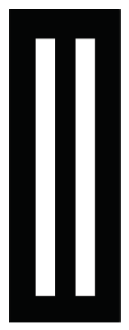

```{r setup, include=FALSE}
knitr::opts_chunk$set(echo = TRUE)
```

# Bent Brain Ticklers, Winter 2020


## Problem 1

    Former Brain Ticklers' judge Don A. Dechman
    (TX A'57) astutely pointed out that our
    illustrious head judge Howard G. McIlvried
    III (PA G'53) has just celebrated an amazing
    sixty years supporting this column.  In
    commemoration of this event, I thought I
    would throw together some accolades for him.
    Find a unique solution to the following
    cryptarithm:

        PROPS + KUDOS = HOWARD

    Not one to miss an opportunity, Howard
    replied, "it has been a 

        LABOR + OF + LOVE + FOR + OVER = 60 + YEARS,

    and they have been prime YEARS."

    Solve the two cryptics individually.
    Standard rules apply: each different letter
    stands for a different digit, and each
    different digit is always represented by the
    same letter; no leading zeros are allowed.

    -- J.R. Stribling, CA A'92 and
       H.G. McIlvried III, PA Gamma 53

Solution:

    Standard cryptic arithmetic tools + gmp for is_prime()

```{r}
source('rgc_lib.R')
library(gmp)

# First problem: PROPS + KUDOS = HOWARD
a=make_crypt_df('propskudoshoward')
x_props=make_num(a,'props')
x_kudos=make_num(a,'kudos')
x_howard=make_num(a,'howard')

k=(x_props+x_kudos == x_howard) & (a['p'] != 0) & (a['k'] != 0) & (a['h'] != 0)

print(as.matrix(a[k,]))
print(paste0("props  = ",x_props[k,],collapse=""))
print(paste0("kudos  = ",x_kudos[k,],collapse=""))
print(paste0("howard = ",x_howard[k,],collapse=""))

```

    First Problem: props+kudos=howard

            p r o s k u d h w a
    2192228 6 0 3 9 7 4 8 1 5 2
    
    [1] "props  = 60369"
    [1] "kudos  = 74839"
    [1] "howard = 135208"

```{r}
# Second problem = LABOR + OF + LOVE + FOR + OVER = 60 + YEARS
# YEARS = prime

a=make_crypt_df('laborofloveforoveryears')
x_labor = make_num(a,'labor')
x_of    = make_num(a,'of')
x_love  = make_num(a,'love')
x_for   = make_num(a,'for')
x_over  = make_num(a,'over')
x_years = make_num(a,'years')

k = (x_labor+x_of+x_love+x_for+x_over == 60+x_years)
k = k & (a['l']!=0) & (a['o']!=0) & (a['f']!=0) & (a['y']!=0)
k = k & (sapply(x_years[,1],function(x) {isprime(x)==2}))

print(as.matrix(a[k,]))
print(paste0('labor = ',x_labor[k,],collapse=""))
print(paste0('of    = ',x_of[k,],collapse=""))
print(paste0('love  = ',x_love[k,],collapse=""))
print(paste0('for   = ',x_for[k,],collapse=""))
print(paste0('over  = ',x_over[k,],collapse=""))
print(paste0('years = ',x_years[k,],collapse=""))

```

    Second Problem: labor + of + love + for + over = 60 + years
    prime years

           l a b o r f v e y s
    915627 2 5 7 6 8 1 0 4 3 9
    [1] "labor = 25768"
    [1] "of    = 61"
    [1] "love  = 2604"
    [1] "for   = 168"
    [1] "over  = 6048"
    [1] "years = 34589"


## Problem 2

    Adam, Brad, Chet, Doug, and Evan went abroad
    with their respective wives on vacation last
    summer to five different destinations. Three
    of the pairs ventured into Asia with trips to
    Agra, Bali, or Doha, while the other two
    couples traveled to Europe and visited either
    Cork or Elba. I knew the names of the five
    wives were Anne, Beth, Cate, Dawn, and Emma,
    but the only information I had about who was
    married to whom was that for each pair the
    names of the husband, the wife, and last
    year's holiday location all began with
    different letters.  In an attempt to discover
    more details, I had some conversation with
    three of the ladies. Beth told me she was not
    married to Adam and she had heard from Evan
    that Chet went to Doha last year. Dawn,
    however, firmly informed me that Chet went to
    Elba and Beth went to Doha. "Unlike some
    people I could mention," she added darkly,
    but rather irrelevantly, "Adam always tells
    the truth." Cate said when her husband was
    asked whether Emma was married to Chet he
    replied "No." She went on to tell me that
    Doug went to Bali.  Given that a reliable
    source divulged to me the curious fact that
    of each of these married couples, one member
    always told the truth and the other never
    did, deduce the name of each man's wife and
    where they all went for their vacations.

    -- Brain Puzzler's Delight
        by E.R. Emmet

TODO

    meh


## Problem 3

    For a spherical Earth in a circular orbit
    around the sun with the Earth axis tilted at
    an angle of 23 degrees, find an exact
    trigonometric expression to give the solar
    noon latitude as a function of time t in an
    Earth year of duration Y. You may assume the
    time of vernal equinox tVE is known to use as
    a reference point.

    -- Allan Gottlieb's Puzzle Corner in
    Technology Review

TODO

    Huh?

    The solution in the Bent involves spherical trig.


## Problem 4

    Yesterday, I rode my bicycle to work, a
    straight-line distance of 10 kilometers over
    level ground.  In the morning the trip took
    30 minutes with a direct headwind; but in the
    afternoon the trip took only 20 minutes with
    the same wind (now a tailwind). Assume the
    only force I overcame was aerodynamic viscous
    drag, which is proportional to the square of
    my speed relative to the air. Assuming all
    other forces (friction, etc.) are negligible
    and that I generate constant power, calculate
    yesterday's wind speed (to the nearest 0.01
    km/hr). If the wind is calm today, determine
    how many minutes the one-way trip will take
    (to the nearest 0.01 minute).

    -- J.L. Griggs Jr., OH A'56

Solution:

    W = Speed of the wind
    D  = Distance of trip = 10 km
    Sh = Speed of bike wrt ground into headwind = 10km/30min = 20 km/hr
    St = Speed of bike wrt ground with tailwind = 10km/20min = 30 km/hr
    S  = Speed of bike wrt ground without wind  = unknown
    
    P = power supplied by rider to overcome viscous drag = constant
    Power supplied by rider = F*v where v=Sh, St, or S
    
    Power balances viscous drag = k*(Sh+W)^2*Sh = k*(St-W)^2*St = k*(S^2)*S
    
    k(Sh+W)^2*Sh = k*(St-W)^2*St = k*S^2*S
    
    From the know conditions we can calculate the wind speed:
    
        (20+W)^2*20 = (30-W)^2*30
        (20+W)/(30-W) = sqrt(3/2)
    
        W = 7.5255 km/hr
    
    With a known wind speed we can calculate the power balance for calm air:
    
        k*(20+W)^2*20 = k*S^3 --> S = 24.7457 km/hr, bike speed in calm air
    
    T = 10km/24.7457km/hr = 24.2466 minutes


## Problem 5

    Consider a rectangular strip of leather,
    white on one side and black on the other. Cut
    two long slits parallel to the sides of the
    leather strip, but do not cut through the
    ends of the leather strip. The result is
    three leather strips joined at both ends, as
    shown in the following picture:




    The objective is to braid the strips without
    cutting or altering the leather in any way
    except folding.  Find the minimum non-zero
    number of strip crossings required to ensure
    that each side of the completed braid is a
    uniform color. Assume that only two strips
    cross at a given point and that no crossing
    is wide enough to hide a twist in the strip.

    -- Adapted from Professor Stewart's Hoard of
    Mathematical Treasures by Ian Stewart


TODO

    meh - need to construct this and try


## Bonus

    Find rational circumferences of two spheres
    that are different in diameter from two other
    spheres of circumferences 1 meter and 2
    meters such that each pair comprises the same
    total volume.

    -- The Canterbury Puzzles by H.E. Dudeney

TODO

    Given a circumference of C the radius, R, is known.
    With a known R we know the volume, V.
    
    In general, V = C^3/(6*%pi^2)
    
    Need to find C3, C4 such that:
    
    C3^3 + C4^4 = 1^3 + 2^3 = 9
    
    We need rational values: C3=p3/q3, C4=p4/q4, so:
    
    p3^3/q3^3 + p4^3/q4^3 = 9
    
    p3^3*q4^3 + p4^3*q3^3 = 9*q3^3*q4^3
    
    I need a better background in number theory to solve this.
    Some kind of Diophantine equation but I don't know about a solution.

    The Bent provides a solution of:
    
        415,280,564,497/348,671,682,660
        676,702,467,503/348,671,682,660
        
    With the statement:
    
    The solution to the Bonus is rather
    complicated, and we don’t have
    enough space to include it here.
    For those of our readers who are
    interested, the complete solution
    is available at www.tbp.org/pubs/brainTicklers.cfm

    Unfortunately -- the link is just the solution page for all the
    brain ticklers and provides no additional information about
    solving this problem.  I can confirm that the given ratios
    do actually work:
    
    (415280564497/348671682660)^3+
    (676702467503/348671682660)^3 = 9
    
    Using their solution as a hint I could try:
    
    (a/c)^3 + (b/c)^3 = 9
    
    a^3 + b^3 = 9*c^3
    
    I found a reference that solves this problem but, unfortunately,
    it generates negative solutions for the case of r=2, s=1.  They
    note that if r/s is "large enough" then the results witll be
    positive.  Unfortunately, r>2.231609808022465 seems to be required
    to make their method work.
    
[Wolfram Website](https://mathworld.wolfram.com/DiophantineEquation3rdPowers.html)

    The example they give uses r=3, s=1 and those are all positive.

    This website points to OEIS so I will look more there:
    
[OEIS for this problem](http://oeis.org/A003825)

    Not sure what this might show -- I looked over OES and nothing
    really is jumping out as the solution to this problem.

    There is a hint at how one might solve a problem like this
    in project Euclid:
    
[Project Euclid](https://projecteuclid.org/download/pdf_1/euclid.em/1062621075)

    Near the top of the RHS on p. 170.  They talk about the conditions
    required for this equation to have a rational (or integral) solution
    and a computer program they had to solve for the expression of every
    integer as the sum of a square plus two cubes.
    
    Unfortunately, I did not find a magic solution and I would be reduced
    to brute force at this point.


## Computer Bonus

    Consider sequences of exactly thirteen
    consecutive primes, such that the difference
    between any two adjacent primes is at most 8.
    The first such sequence is 2, 3, 5, 7, 11,
    13, 17, 19, 23, 29, 31, 37, and 41; there are
    other examples with small primes -- in fact,
    there is even a sequence starting at 14,713.
    For larger primes up to 1 billion, find how
    many such sequences exist and list the first
    prime in each sequence.

    -- Adapted from The Last Recreations by
    Martin Gardner

Solution:

    I have solved this before.
    See file primeseq.py which is slapped in here via reticulate.
    It is not set to run since the runtime is ~ 1 hour.
    In here for posterity.
    
    The comments at the start of the program indicate the 5 sequences
    larger than 14713 that have a sequence of 13 primes with (up to) a
    maximum diff of 8.

```{r}
library(reticulate)
```

```{python, eval=FALSE}
import sympy

# Used this to search for all sequences below 1e9.
# There are 8 sequences of length 13 or more with differences of
# 8 or less between successive primes.  The first prime in each
# sequence along with the sequence lengths are given here:
#
# In [616]: find_sequence(1,1_000_000_000,8,13)
#
#    First prime   Length
#    --------------------
#    2             30
#    2657          14
#    14713         13
#    86966771      13
#    172039573     13
#    296931731     13
#    369008657     13
#    875753231     13
#
# Some more details
#
#    FirstPrime  SeqLength  LastPrime  DeltaPrime  MeanDiff
# 0           2         30        113         111  3.827586
# 1        2657         14       2719          62  4.769231
# 2       14713         13      14783          70  5.833333
# 3    86966771         13   86966833          62  5.166667
# 4   172039573         13  172039633          60  5.000000
# 5   296931731         13  296931797          66  5.500000
# 6   369008657         13  369008729          72  6.000000
# 7   875753231         13  875753299          68  5.666667
#
#
# The runtime is substantial (about an hour) with the first
# three found almost instantly and the rest taking proportionally
# longer.
#
# FYI: the last value is sympy.prime(44833217) where sympy.prime(1)=2
#

def find_sequence(nstart=2,nstop=1000,maxdiff=8,minlength=13):
    """
    Search for sequences of prime numbers that meet the following
    criteria:
    
    difference between successive primes <= maxdiff
    length of sequence >= minlength
    
    Output the first prime in each sequence and the sequence length
    """
    zzz=[]
    lastprime=-1000
    firstprime=0
    seqlen=1
    for i in sympy.primerange(nstart,nstop):
        if (i-lastprime)<=maxdiff:
            seqlen=seqlen+1
        else:
            # Found the end of a sequence
            # If the last sequence was long enough then output the specs
            if seqlen>=minlength:
                print(firstprime,seqlen)
                zzz.append([firstprime,seqlen])
            seqlen=1
            firstprime=i
        lastprime=i
    # Process any sequence that is in progress when the loop ends
    if seqlen>=minlength:
        print(firstprime,seqlen)
        zzz.append([firstprime,seqlen])
    return(zzz)

```
