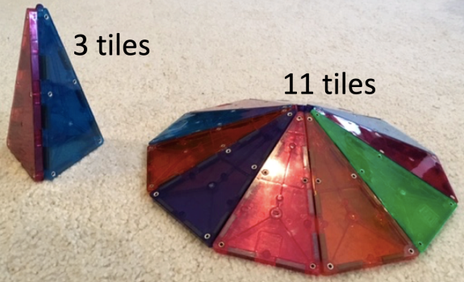

% The Riddler: A Curated Selection
% Curated by R. G. Cronce
% 2020-March-27

# Overview

Selected problems from the fivethirtyeight columns: The Riddler.

From the start (2015-12-11) there was one puzzle per column.  This was just
called the Riddler.  Starting in Fall 2016 (2016-09-16 Count Von Count) a
second puzzle was added to each column (Riddler Express) and the original
puzzle was retained and retitled as Riddler Classic.  The new puzzle is
intended to be a "quick" solve compared to the deeper Classic puzzles.

[Main Riddler Website](https://fivethirtyeight.com/tag/the-riddler/)

Last Update on 2020-03-27: reverse chronological

    From    2020-03-20
    Through 2015-12-11 (The Inaugural Puzzle)

[Riddler Contents](https://fivethirtyeight.com/tag/the-riddler/page/1/)

# Problems from 2020

## 2020-02-21 Temperature Palindromes

[Problem](https://fivethirtyeight.com/features/can-you-flip-your-way-to-victory/)

    Riddler Express

    From Nick Harper comes a question of tempered
    temperatures: On a warm, sunny day, Nick
    glanced at a thermometer, and noticed
    something quite interesting. When he toggled
    between the Fahrenheit and Celsius scales,
    the digits of the temperature - when rounded
    to the nearest degree - had switched. For
    example, this works for a temperature of 61
    degrees Fahrenheit, which corresponds to a
    temperature of 16 degrees Celsius.

    However, the temperature that day was not 61
    degrees Fahrenheit. What was the temperature?

[Solution](https://fivethirtyeight.com/features/can-you-get-a-haircut-already/)

## 2020-02-21 Coin Flip Optimization

[Problem](https://fivethirtyeight.com/features/can-you-flip-your-way-to-victory/)

    Riddler Classic

    From Abijith Krishnan comes a game of coin
    flipping madness:

    You have two fair coins, labeled A and B.
    When you flip coin A, you get 1 point if it
    comes up heads, but you lose 1 point if it
    comes up tails. Coin B is worth twice as much
    - when you flip coin B, you get 2 points if
    it comes up heads, but you lose 2 points if
    it comes up tails.

    To play the game, you make a total of 100
    flips. For each flip, you can choose either
    coin, and you know the outcomes of all the
    previous flips. In order to win, you must
    finish with a positive total score. In your
    eyes, finishing with 2 points is just as good
    as finishing with 200 points - any positive
    score is a win. (By the same token, finishing
    with 0 or -2 points is just as bad as
    finishing with -200 points.)

    If you optimize your strategy, what
    percentage of games will you win? (Remember,
    one game consists of 100 coin flips.)

    Extra credit: What if coin A isn't fair (but
    coin B is still fair)? That is, if coin A
    comes up heads with probability p and you
    optimize your strategy, what percentage of
    games will you win?

[Solution](https://fivethirtyeight.com/features/can-you-get-a-haircut-already/)

## 2020-02-07 Palindromic Dates

[Problem](https://fivethirtyeight.com/features/how-many-more-palindrome-dates-will-you-see/)

    Riddler Express

    From James Anderson comes a palindromic
    puzzle of calendars:

    This past Sunday was Groundhog Day. Also,
    there was a football game. But to top it all
    off, the date, 02/02/2020, was palindromic,
    meaning it reads the same forwards and
    backwards (if you ignore the slashes).

    If we write out dates in the American format
    of MM/DD/YYYY (i.e., the two digits of the
    month, followed by the two digits of the day,
    followed by the four digits of the year), how
    many more palindromic dates will there be
    this century?

[Solution](https://fivethirtyeight.com/features/can-you-solve-this-rather-pedestrian-puzzle/)

## 2020-01-31 Magnetic Pyramid

[Problem](https://fivethirtyeight.com/features/can-you-roll-the-perfect-bowl/)

    From Robert Berger comes a question of
    maximizing magnetic volume:

    Robert's daughter has a set of Magna-Tiles,
    which, as their name implies, are tiles with
    magnets on the edges that can be used to
    build various polygons and polyhedra. Some of
    the tiles are identical isosceles triangles
    with one 30 degree angle and two 75 degree
    angles. If you were to arrange 12 of these
    tiles with their 30 degree angles in the
    center, they would lay flat and form a
    regular dodecagon. If you were to put fewer
    (between three and 11) of those tiles
    together in a similar way, they would form a
    pyramid whose base is a regular polygon.
    Robert has graciously provided a photo of the
    resulting pyramids when three and 11 tiles
    are used:

    If Robert wanted to maximize the volume
    contained within the resulting pyramid
    (presumably to store as much candy for his
    daughter as possible), how many tiles should
    he use?

[Solution](https://fivethirtyeight.com/features/how-many-more-palindrome-dates-will-you-see/)

## 2020-01-24 Hall of Fame Ballot

[Problem](https://fivethirtyeight.com/features/how-many-pennies-should-you-pinch/)

    Riddler Express

    From Stephanie Thompson comes a question of
    ballot optimization:

    Derek Jeter and Larry Walker were just
    elected to the Baseball Hall of Fame! That
    got Stephanie thinking. Suppose there are 20
    players on the ballot and 400 voters in a
    given year. Each voter can select up to 10
    players for induction without voting for any
    given player more than once. To gain entry, a
    player must have been selected on at least 75
    percent of the ballots.

    Under these circumstances, what is the
    maximum number of players that can be
    inducted into the Hall of Fame?

[Solution](https://fivethirtyeight.com/features/can-you-roll-the-perfect-bowl/)

## 2020-01-17 Extra Point Strategy

[Problem](https://fivethirtyeight.com/features/can-you-track-the-delirious-ducks/)

    Riddler Express

    The Riddler Football League (RFL) playoffs
    are upon us! As the coach, you've devised a
    new strategy for scoring after a touchdown.
    Your team will line up 2 yards away from the
    goal line in such a way that it could attempt
    either a 1-point conversion or a 2-point
    conversion. (Unlike other football leagues,
    the distance is the same for both types of
    conversion, and you need not announce which
    you'll be attempting.) Your opponent can only
    properly defend against one of those two
    possibilities, so they'll have to guess.

    If you attempt a 1-point conversion and the
    other team defends against it properly,
    you'll score 90 percent of the time. If they
    don't defend it properly, you'll score 100
    percent of the time.

    If you instead attempt a 2-point conversion
    and the other team defends against it
    properly, you'll score 40 percent of the
    time. If they don't defend it properly,
    you'll score 60 percent of the time.

    To tell your team which they should attempt,
    your team's offensive coordinator will
    communicate to your team's captain the
    probability with which they should attempt
    each. For example, the coordinator might say:
    "Go for 1 with a 51 percent chance, and go
    for 2 with a 49 percent chance." Using a
    random number generator, the captain will
    then ultimately decide to go for 1 point or 2
    points. (Naturally, every athlete in the RFL
    has a random number generator handy.)

    However, given all the spying that occurs in
    the RFL these days, you can assume that the
    offensive coordinator's message will also be
    heard by your opponent - that means the
    defense knows the exact probability with
    which you'll attempt either conversion. Your
    opponent also knows the probability of you
    scoring in each of the four scenarios listed
    above.

    With all that said, what strategy will
    maximize the average number of points you'll
    score (i.e., how often should your team go
    for 1 or 2)? What should your opponent's
    defensive strategy be? How many points will
    you score, on average, after each touchdown?

[Solution](https://fivethirtyeight.com/features/how-many-pennies-should-you-pinch/)

## 2020-01-17 Ducks on Rocks

[Problem](https://fivethirtyeight.com/features/can-you-track-the-delirious-ducks/)

    Riddler Classic

    After a long night of frivolous quackery, two
    delirious ducks are having a difficult time
    finding each other in their pond. The pond
    happens to contain a 3x3 grid of rocks.

    Every minute, each duck randomly swims,
    independently of the other duck, from one
    rock to a neighboring rock in the 3x3 grid --
    up, down, left or right, but not diagonally.
    So if a duck is at the middle rock, it will
    next swim to one of the four side rocks with
    probability 1/4. From a side rock, it will
    swim to one of the two adjacent corner rocks
    or back to the middle rock, each with
    probability 1/3. And from a corner rock, it
    will swim to one of the two adjacent side
    rocks with probability 1/2.

    If the ducks both start at the middle rock,
    then on average, how long will it take until
    they're at the same rock again? (Of course,
    there's a 1/4 chance that they'll swim in the
    same direction after the first minute, in
    which case it would only take one minute for
    them to be at the same rock again. But it
    could take much longer, if they happen to
    keep missing each other.)

    Extra credit: What if there are three or more
    ducks? If they all start in the middle rock,
    on average, how long will it take until they
    are all at the same rock again?

[Solution](https://fivethirtyeight.com/features/how-many-pennies-should-you-pinch/)

## 2020-01-03 Word-Puzzle

[Problem](https://fivethirtyeight.com/features/can-you-solve-the-vexing-vexillology/)

    Riddler Classic

    The New York Times recently launched some new
    word puzzles, one of which is Spelling Bee.
    In this game, seven letters are arranged in a
    honeycomb lattice, with one letter in the
    center. Here's the lattice from December 24,
    2019:

            A
         L     P
            G
         E     X
            M

    The goal is to identify as many words that
    meet the following criteria:

    1. The word must be at least four letters long.
    2. The word must include the central letter.
    3. The word cannot include any letter beyond the
       seven given letters.

    Note that letters can be repeated. For
    example, the words GAME and AMALGAM are both
    acceptable words.  Four-letter words are
    worth 1 point each, while five-letter words
    are worth 5 points, six-letter words are
    worth 6 points, seven-letter words are worth
    7 points, etc.  Words that use all of the
    seven letters in the honeycomb are known as
    "pangrams" and earn 7 bonus points (in
    addition to the points for the length of the
    word). So in the above example, MEGAPLEX is
    worth 15 points.

    Which seven-letter honeycomb results in the
    highest possible game score? To be a valid
    choice of seven letters, no letter can be
    repeated, it must not contain the letter S
    (that would be too easy) and there must be at
    least one pangram.

    For consistency, please use this word list to
    check your game score.2

[word list](https://norvig.com/ngrams/enable1.txt)

[Solution](https://fivethirtyeight.com/features/can-you-find-a-number-worth-its-weight-in-letters/)

# Problems from 2019

## 2019-12-20 Matching Socks

[Problem](https://fivethirtyeight.com/features/can-you-find-a-matching-pair-of-socks/)

    Riddler Classic

    From Kathy Bischoping comes a question we've
    all asked ourselves at one time or another:

    I have 10 pairs of socks in a drawer. Each
    pair is distinct from another and consists of
    two matching socks. Alas, I'm negligent when
    it comes to folding my laundry, and so the
    socks are not folded into pairs. This
    morning, fumbling around in the dark, I pull
    the socks out of the drawer, randomly and one
    at a time, until I have a matching pair of
    socks among the ones I've removed from the
    drawer.

    On average, how many socks will I pull out of
    the drawer in order to get my first matching
    pair?

    (Note: This is different from asking how many
    socks I must pull out of the drawer to
    guarantee that I have a matching pair. The
    answer to that question, by the pigeonhole
    principle, is 11 socks. This question is
    instead asking about the average.)

    Extra credit: Instead of 10 pairs of socks,
    what if I have some large number N pairs of
    socks?

[Solution](https://fivethirtyeight.com/features/can-you-solve-the-vexing-vexillology/)

## 2019-12-13 Chess Battle

[Problem](https://fivethirtyeight.com/features/can-you-solve-a-particularly-prismatic-puzzle/)

    Riddler Express

    From Anna Engelsone comes a riddle about a
    historic chess battle:

    The infamous 1984 World Chess Championship
    match between the reigning world champion
    Anatoly Karpov and 21-year-old Garry Kasparov
    was supposed to have been played until either
    player had won six games. Instead, it went on
    for 48 games: Karpov won five, Kasparov won
    3, and the other 40 games each ended in a
    draw. Alas, the match was controversially
    terminated without a winner.

    We can deduce from the games Karpov and
    Kasparov played that, independently of other
    games, Karpov's chances of winning each game
    were 5/48, Kasparov's chances were 3/48, and
    the chances of a draw were 40/48. Had the
    match been allowed to continue indefinitely,
    what would have been Kasparov's chances of
    eventually winning the match?

[Solution](https://fivethirtyeight.com/features/can-you-find-a-matching-pair-of-socks/)

## 2019-12-06 Remarkable Coincidence for BB-8

[Problem](https://fivethirtyeight.com/features/how-fast-can-you-skip-to-your-favorite-song/)

    Riddler Express

    For this week's Express, I present an
    apparent coincidence that has bothered me
    since 2015:

    After being ambushed by the forces of the
    First Order on the planet Jakku, the droid
    BB-8 narrowly escaped and requires immediate
    help. Fortunately, there is one person (named
    Rey) on the planet who can help BB-8, but
    they've never met and BB-8 has no idea where
    Rey is located.

    Even if BB-8 did know where Rey was, what's
    the probability that BB-8 could reach her
    within 24 hours? Assume Jakku has a radius of
    4,000 miles (similar to Earth) and that BB-8
    rolls along at a speed of 3 miles per hour.

    (Note: FiveThirtyEight is owned by Disney,
    which also owns BB-8, Jakku and whatever
    ramshackle hut Rey is hiding out in.)

[Solution](https://fivethirtyeight.com/features/can-you-solve-a-particularly-prismatic-puzzle/)

## 2019-12-06 Finding Favorite Song

[Problem](https://fivethirtyeight.com/features/how-fast-can-you-skip-to-your-favorite-song/)

    Riddler Classic

    From Austin Chen comes a riddle of
    efficiently finding a song:

    You have a playlist with exactly 100 tracks
    (i.e., songs), numbered 1 to 100. To go to
    another track, there are two buttons you can
    press: (1) "Next," which will take you to the
    next track in the list or back to song 1 if
    you are currently on track 100, and (2)
    "Random," which will take you to a track
    chosen uniformly from among the 100 tracks.
    Pressing "Random" can restart the track
    you're already listening to -- this will
    happen 1 percent of the time you press the
    "Random" button.

    For example, if you started on track 73, and
    you pressed the buttons in the sequence
    "Random, Next, Random, Random, Next, Next,
    Random, Next," you might get the following
    sequence of track numbers: 73, 30, 31, 67,
    12, 13, 14, 89, 90. You always know the
    number of the track you're currently
    listening to.

    Your goal is to get to your favorite song (on
    track 42, of course) with as few button
    presses as possible. What should your general
    strategy be? Assuming you start on a random
    track, what is the average number of button
    presses you would need to make to reach your
    favorite song?

[Solution](https://fivethirtyeight.com/features/can-you-solve-a-particularly-prismatic-puzzle/)

## 2019-11-22 World Series Odds

[Problem](https://fivethirtyeight.com/features/can-you-decode-the-riddler-lottery/)

    Riddler Express

    From Dave Moran comes a question about
    baseball's unusual 2019 World Series:

    In the World Series, one team hosts Games 1,
    2, 6 and 7, while the other team hosts Games
    3, 4 and 5. When the Nationals beat the
    Astros last month, it marked the first time
    in World Series history that the home team
    lost all seven games. On average, the home
    team actually wins about 54 percent of the
    time in baseball. Running the numbers, you'll
    quickly see that seven home losses is a
    once-in-a-lifetime event.

    But putting seven aside for a moment, what's
    the probability that the home team will lose
    at least six consecutive games?

    Extra credit: What's the probability the home
    team will lose at least five consecutive
    games? Four consecutive games?

[Solution](https://fivethirtyeight.com/features/how-fast-can-you-skip-to-your-favorite-song/)

## 2019-11-22 Lottery Odds

[Problem](https://fivethirtyeight.com/features/can-you-decode-the-riddler-lottery/)

    Riddler Classic

    From Charlie Cordova comes a puzzle that
    brings logic and number theory to the
    lottery:

    Five friends with a lot in common are playing
    the Riddler Lottery, in which each must
    choose exactly five numbers from 1 to 70.
    After they all picked their numbers, the
    first friend notices that no number was
    selected by two or more friends. Unimpressed,
    the second friend observes that all 25
    selected numbers are composite (i.e., not
    prime). Not to be outdone, the third friend
    points out that each selected number has at
    least two distinct prime factors. After some
    more thinking, the fourth friend excitedly
    remarks that the product of selected numbers
    on each ticket is exactly the same. At this
    point, the fifth friend is left speechless.
    (You can tell why all these people are
    friends.)

    What is the product of the selected numbers
    on each ticket?

    Extra credit: How many different ways could
    the friends have selected five numbers each
    so that all their statements are true?

[Solution](https://fivethirtyeight.com/features/how-fast-can-you-skip-to-your-favorite-song/)

## 2019-11-15 Geometric Conundrum

[Problem](https://fivethirtyeight.com/features/how-low-can-you-roll/)

    Riddler Express

    Inspired by Catriona Shearer (if you don't
    know who she is, seriously, check out her
    puzzles), this week's Riddler Express is a
    geometric conundrum:

    Upside-down semicircle inscribed inside a
    right side-up semicircle. The smaller
    semicircle is dark gray, while the larger one
    is light gray.  The picture above shows two
    semicircles. The lighter region (inside the
    larger semicircle but outside the smaller
    one) has an area of 7. What's the area of the
    darker region?

[Solution](https://fivethirtyeight.com/features/can-you-decode-the-riddler-lottery/)

## 2019-11-15 A Dice Game

[Problem](https://fivethirtyeight.com/features/how-low-can-you-roll/)

    Riddler Classic

    From Ricky Jacobson comes a puzzle of seeing
    how low you can roll:

    You are given a fair, unweighted 10-sided die
    with sides labeled 0 to 9 and a sheet of
    paper to record your score. (If the very
    notion of a fair 10-sided die bothers you,
    and you need to know what sort of
    three-dimensional solid it is, then forget it
    -- you have a random number generator that
    gives you an integer value from 0 to 9 with
    equal probability. Your loss -- the die was a
    collector's item.)

    To start the game, you roll the die. Your
    current "score" is the number shown, divided
    by 10. For example, if you were to roll a 7,
    then your score would be 0.7. Then, you keep
    rolling the die over and over again. Each
    time you roll, if the digit shown by the die
    is less than or equal to the last digit of
    your score, then that roll becomes the new
    last digit of your score. Otherwise you just
    go ahead and roll again. The game ends when
    you roll a zero.

    For example, suppose you roll the following:
    6, 2, 5, 1, 8, 1, 0. After your first roll,
    your score would be 0.6, After the second,
    it's 0.62. You ignore the third roll, since 5
    is greater than the current last digit, 2.
    After the fourth roll, your score is 0.621.
    You ignore the fifth roll, since 8 is greater
    than the current last digit, 1. After the
    sixth roll, your score is 0.6211. And after
    the seventh roll, the game is over -- 0.6211
    is your final score.

    What will be your average final score in this
    game?

[Solution](https://fivethirtyeight.com/features/can-you-decode-the-riddler-lottery/)

## 2019-10-18 Riddler Currency

[Problem](https://fivethirtyeight.com/features/can-you-break-the-riddler-bank/)

    Riddler Classic

    From Michael Branicky, a challenge of
    currency conversion:

    Riddler Nation has two coins: the Dio, worth
    $538, and the Phantus, worth $19. When
    visiting on vacation, Riddler National Bank
    will gladly convert your dollars into Dios
    and Phanti. For example, if you were to give
    a bank teller $614, they'd return to you one
    Dio and four Phanti, since 614 = 1 x 538 + 4
    x 19. But if you tried to exchange one dollar
    more (i.e., $615), then alas, there is no
    combination of Dios and Phanti the teller
    could give you, and you won't get your
    money's worth in local currency.

    To make the bank teller's job (and your
    vacation) as miserable as possible, you
    decide to bring the largest dollar amount
    that cannot be converted into Riddler
    currency. How much money are we talking here?
    That is, what's the largest whole number that
    cannot be expressed as a sum of 19s and 538s?

    Extra Credit: Word is that Riddler Nation is
    considering minting a third currency, worth
    $101. If they do, then what would be the
    largest dollar amount that cannot be
    converted into Riddler currency?

[Solution](https://fivethirtyeight.com/features/can-you-carve-the-perfect-pumpkin/)

## 2019-10-11 Auditorium Seats

[Problem](https://fivethirtyeight.com/features/can-you-escape-the-enemy-submarines/)

    Riddler Express

    This week's Riddler Express was related to me
    by Sunil Singh, who heard it from Sam
    Vandervelde, who heard it from ... well, let's
    just say this puzzle has been circulating for
    a while and is ready for prime time!

    An auditorium with 200 seats, numbered from 1
    to 200, is filled to capacity. A speaker, who
    happens to be a mathematician, steps up to
    the podium overlooking the audience and
    pauses for a moment. "You know," she says,
    "I'm thinking of a rather large whole number.
    Every seat number in this auditorium evenly
    divides my number, except for two of them -- 
    and those two seats happen to be next to each
    other."

    As you'd expect, adjacent seats in the
    auditorium have consecutive numbers. Which
    two numbers was the speaker referring to?

[Solution](https://fivethirtyeight.com/features/can-you-break-the-riddler-bank/)

## 2019-10-11 Submarine Warfare

[Problem](https://fivethirtyeight.com/features/can-you-escape-the-enemy-submarines/)

    Riddler Classic

    Last year, Riddler Nation tackled a puzzle
    from Mike Donner about wartime navigation. An
    enemy submarine determined to sink your ship
    was exactly halfway between you and your home
    port. Your ship had no further information
    about the submarine's subsequent movement.
    The sub had to be directly underneath your
    ship to sink it, but the sub could track your
    moves with precision and respond efficiently.
    How much faster than the sub did your ship
    have to be to guarantee you could avoid the
    sub and get home?

    It turned out your ship needed to be about
    2.33 times faster than the sub. This is
    demonstrated by the animation below: The
    expanding pink circle is the region where the
    sub could be located after a given amount of
    time, and the blue curve represents your
    ship's course around it.

    See Riddler problem for the animation.

    This week, aware of your mathematical
    prowess, the enemy has deployed two
    submarines so that your ship, the submarines
    and the harbor you seek are evenly spaced
    along a straight line.

    If both subs travel at the same speed, how
    much faster than the subs does your ship have
    to be to guarantee that you can avoid them
    and reach the harbor?

    Extra Credit: Suppose there are N submarines
    evenly spaced between your ship and the
    harbor. How much faster than the subs must
    your ship be?

[Solution](https://fivethirtyeight.com/features/can-you-break-the-riddler-bank/)

## 2019-10-04 Riddler Millionaire

[Problem](https://fivethirtyeight.com/features/who-wants-to-be-a-riddler-millionaire/)

    Riddler Express

    From Thomas Sneller comes a puzzle that
    brings us back to the game show to end all
    game shows, "Who Wants to Be a Riddler
    Millionaire?" As you'll remember, for each
    question you must pick the correct option
    from four choices.

    You've made it to the $1 million question,
    but it's a tough one. Out of the four
    choices, A, B, C and D, you're 70 percent
    sure the answer is B, and none of the
    remaining choices looks more plausible than
    another. You decide to use your final
    lifeline, the 50:50, which leaves you with
    two possible answers, one of them correct. Lo
    and behold, B remains an option! How
    confident are you now that B is the correct
    answer?

[Solution](https://fivethirtyeight.com/features/can-you-escape-the-enemy-submarines/)

## 2019-10-04 Three Birthday Problem

[Problem](https://fivethirtyeight.com/features/who-wants-to-be-a-riddler-millionaire/)

    Riddler Classic

    From Joel Lewis, this week's Riddler Classic
    is a birthday puzzle for the ages:

    The classic birthday problem asks about how
    many people need to be in a room together
    before you have better-than-even odds that at
    least two of them have the same birthday.
    Ignoring leap years, the answer is,
    paradoxically, only 23 people -- fewer than
    you might intuitively think.

    But Joel noticed something interesting about
    a well-known group of 100 people: In the U.S.
    Senate, three senators happen to share the
    same birthday of October 20: Kamala Harris,
    Brian Schatz and Sheldon Whitehouse.

    And so Joel has thrown a new wrinkle into the
    classic birthday problem. How many people do
    you need to have better-than-even odds that
    at least three of them have the same
    birthday? (Again, ignore leap years.)

[Solution](https://fivethirtyeight.com/features/can-you-escape-the-enemy-submarines/)

## 2019-09-27 Baseball Odds

[Problem](https://fivethirtyeight.com/features/which-baseball-team-will-win-the-riddler-fall-classic/)

    Riddler Nation's Jibriel Taha, an avid
    baseball fan, saw the following tweet from
    the Milwaukee Brewers' beat writer Adam
    McCalvy:

        The Brewers are...

            5-5 last 10g
        10-10 last 20g
        15-15 last 30g
        20-20 last 40g
        25-25 last 50g
        30-30 last 60g

    Inspired by the Brewers' apparent mediocrity
    (they've since gone on a roll to clinch a
    playoff spot) Jibriel asks the following:

    If a baseball team is truly .500, meaning it
    has a 50 percent chance of winning each game,
    what's the probability that it has won two of
    its last four games and four of its last
    eight games?

[Solution](https://fivethirtyeight.com/features/who-wants-to-be-a-riddler-millionaire/)

## 2019-09-27 Riddler Baseball

[Problem](https://fivethirtyeight.com/features/which-baseball-team-will-win-the-riddler-fall-classic/)

    Riddler Classic

    Riddler League Baseball, also known as the
    RLB, consists of three teams: the Mississippi
    Moonwalkers, the Delaware Doubloons and the
    Tennessee Taters.

    Each time a batter for the Moonwalkers comes
    to the plate, they have a 40 percent chance
    of getting a walk and a 60 percent chance of
    striking out. Each batter for the Doubloons,
    meanwhile, hits a double 20 percent percent
    of the time, driving in any teammates who are
    on base, and strikes out the remaining 80
    percent of the time. Finally, each batter for
    the Taters has a 10 percent chance of hitting
    a home run and a 90 percent chance of
    striking out.

    During the RLB season, each team plays an
    equal number of games against each opponent.
    Games are nine innings long and can go into
    extra innings just like in other baseball
    leagues. Which of the three teams is most
    likely to have the best record at the end of
    the season?

[Solution](https://fivethirtyeight.com/features/who-wants-to-be-a-riddler-millionaire/)

## 2019-09-20 Credit Card Logo

[Problem](https://fivethirtyeight.com/features/can-you-win-the-tour-de-fivethirtyeight/)

    Riddler Express

    This week, Riddler Nation needs your help
    designing its new credit card, appropriately
    named Riddler Express -- don't solve puzzles
    without it!

    The logo consists of two overlapping circles
    with radius 1 inch, creating three distinct
    regions: one region that's shared between the
    two circles, and two regions that are part of
    one circle, but not the other.

    Because the Riddler Express card is for the
    mathematically inclined, its parent company
    has issued a corporate mandate regarding
    symmetry. In particular, the areas of all
    three regions must be exactly the same. If
    that's the case, how far apart must the
    centers of the two circles be?

    Extra Credit: If you symmetrically arrange
    three circles of radius 1, you have seven
    distinct regions. How far apart should the
    centers of the circles be such that the areas
    of the largest and smallest of the seven
    regions are as close to equivalent as
    possible?

[Solution](https://fivethirtyeight.com/features/which-baseball-team-will-win-the-riddler-fall-classic/)

## 2019-09-06 Lookaway Game

[Problem](https://fivethirtyeight.com/features/what-are-your-chances-of-winning-the-u-s-open/)

    Riddler Express

    You and your friend are playing a game of
    "Acchi, Muite, Hoi" (or what some on Twitter
    have been calling the "lookaway challenge").
    In the first round, you point in one of four
    directions: up, down, left or right. At the
    exact same time, your friend also looks in
    one of those four directions. If your friend
    looks in the same direction you're pointing,
    you win! Otherwise, you switch roles as the
    game continues to the next round -- now your
    friend points in a direction and you try to
    look away. As long as no one wins, you keep
    switching off who points and who looks.

    It seems like your chances of winning should
    be 50 percent, since there are exactly two
    players. But surely it's not that simple. If
    both you and your friend choose your
    directions randomly in each round, what are
    your chances of winning?

[Solution](https://fivethirtyeight.com/features/can-you-help-dakota-jones-raid-the-lost-arc/)

## 2019-09-06 Tennis Odds

[Problem](https://fivethirtyeight.com/features/what-are-your-chances-of-winning-the-u-s-open/)

    Riddler Classic

    The U.S. Open is upon us! Dave Moran and
    Erich Friedman each submitted a tennis-themed
    puzzle that asked what it really takes to
    succeed in the tournament.

    Suppose you're playing a match at the U.S.
    Open, and you're slightly better than the
    competition: your chances of winning any
    given point are exactly 55 percent. (Yes,
    most players are more likely to win the
    points they serve, but we're simplifying
    things a bit.) What are your chances of
    winning a three-set match, as played by the
    women, or a five-set match, as played by the
    men? And what are your chances of winning the
    whole tournament (seven consecutive matches)?

    If you're not familiar with the scoring
    system in tennis, you can read more about it
    here. In short, the first to 4 points wins a
    game (as long as they've won 2 more points
    than their opponent), the first to six games
    wins a set (as long as they've won two more
    games), and the first to two sets (for women)
    or three sets (for men) wins the match. If at
    any point a set is tied at six games apiece,
    that set is decided by a tiebreaker, in which
    the first to 7 points wins (with the same
    2-point margin rule applying here).

    You know, I thought tennis scoring was pretty
    straightforward until I had to write it down.

[Solution](https://fivethirtyeight.com/features/can-you-help-dakota-jones-raid-the-lost-arc/)

## 2019_08_23 Counterfeit Bills

[Problem](https://fivethirtyeight.com/features/can-you-fool-the-bank-with-your-counterfeit-bills/)

    Riddler Express

    You are an expert counterfeiter, and you
    specialize in forging one of the most
    ubiquitous notes in global circulation, the
    U.S. $100 bill. You've been able to fool the
    authorities with your carefully crafted
    C-notes for some time, but you've learned
    that new security features will make it
    impossible for you to continue to avoid
    detection. As a result, you decide to deposit
    as many fake notes as you dare before the
    security features are implemented and then
    retire from your life of crime.

    You know from experience that the bank can
    only spot your fakes 25 percent of the time,
    and trying to deposit only counterfeit bills
    would be a ticket to jail. However, if you
    combine fake and real notes, there's a chance
    the bank will accept your money. You have
    $2,500 in bona fide hundreds, plus a
    virtually unlimited supply of counterfeits.
    The bank scrutinizes cash deposits carefully:
    They randomly select 5 percent of the notes
    they receive, rounded up to the nearest whole
    number, for close examination. If they
    identify any note in a deposit as fake, they
    will confiscate the entire sum, leaving you
    only enough time to flee.

    How many fake notes should you add to the
    $2,500 in order to maximize the expected
    value of your bank account? How much free
    money are you likely to make from your
    strategy?

[Solution](https://fivethirtyeight.com/features/a-peaceful-but-not-peaceful-transition-of-power-in-riddler-nation/)

## 2019-08-09 Circular Pond

[Problem](https://fivethirtyeight.com/features/organize-some-debates-maximize-the-shade/)

    Riddler Classic

    From Erich Friedman, a board exam:

    You are the proud owner of a circular pond
    with a radius of 1 yard. you are also the
    proud owner of a large collection of thin
    boards that are each exactly 1 yard long. by
    placing these boards one by one, so that the
    ends of each lie on either the banks of the
    pond or on another previously placed board,
    how many boards are necessary to cover the
    center point of the pond with a board?

    For example, the solutions for smaller ponds
    with radii 1/2 yard, 5/8 yard and slightly
    more than 7/10 yard are shown below:

[Solution](https://fivethirtyeight.com/features/which-billiard-ball-is-rigged/)

## 2019-05-10 Dimaggio Streak

[Problem](https://fivethirtyeight.com/features/can-the-riddler-bros-beat-joe-dimaggios-hitting-streak/)

    Riddler Classic

    From Steven Pratt, where have you gone, Joe
    DiMaggio? To Riddler Nation, perhaps:

    Five brothers join the Riddler Baseball
    Independent Society, or RBIs. Each of them
    enjoys a lengthy career of 20 seasons, with
    160 games per season and four plate
    appearances per game. (To make this simple,
    assume each plate appearance results in a hit
    or an out, so there are no sac flies or walks
    to complicate this math.)

    Given that their batting averages are .200,
    .250, .300, .350 and .400, what are each
    brother's chances of beating DiMaggio's
    56-game hitting streak at some point in his
    career? (Streaks can span across seasons.)

    By the way, their cousin has a .500 average,
    but he will get tossed from the league after
    his 10th season when he tests positive for
    performance enhancers. What are his chances
    of beating the streak?

[Solution](https://fivethirtyeight.com/features/how-many-soldiers-do-you-need-to-beat-the-night-king/)

## 2019-04-12 Bad Clock

[Problem](https://fivethirtyeight.com/features/how-many-times-a-day-is-a-broken-clock-right/)

    Riddler Express

    From Keith Wynroe, what time is it? Puzzle
    time!

    You purchase a new clock but are dismayed to
    realize that both of its hands are identical.
    At first, it seems it's going to be
    impossible to tell the time because you don't
    know which hand is for the minutes and which
    is for the hours.

    However, you realize you don't need to know
    which is which for every time -- for example,
    when it's 12:30, the minute hand will be
    exactly on the 6 and the hour hand will be
    halfway between the 12 and the 1. It can't be
    the other way around because if the hour hand
    were exactly on 6, the minute hand would have
    to exactly on 12, which it's not. So you know
    what time it is.

    How many times during the day will you not be
    able to tell the time?

[Solution](https://fivethirtyeight.com/features/what-comes-after-840-the-answer-may-surprise-you/)

## 2019-04-05 Coffee Card

[Problem](https://fivethirtyeight.com/features/does-your-gift-card-still-have-free-drinks-on-it/)

    Riddler Classic

    From Michael Branicky, your card has been
    declined:

    Lucky you! You've won two gift cards, each
    loaded with 50 free drinks from your favorite
    coffee shop, Riddler Caffei-Nation. The cards
    look identical, and because you're not one
    for record-keeping, you randomly pick one of
    the cards to pay with each time you get a
    drink. One day, the clerk tells you that he
    can't accept the card you presented to him
    because it doesn't have any drink credits
    left on it.

    What is the probability that the other card
    still has free drinks on it? How many free
    drinks can you expect are still available?

[Solution](https://fivethirtyeight.com/features/how-many-times-a-day-is-a-broken-clock-right/)

## 2019-03-29 Spelling Bee

[Problem](https://fivethirtyeight.com/features/can-you-win-a-spelling-bee-if-you-know-99-percent-of-the-words/)

    Riddler Classic

    From Steven Pratt, ordinal bee probability:

    You are competing in a spelling bee alongside
    nine other contestants. You can each spell
    words perfectly from a certain portion of the
    dictionary but will misspell any word not in
    that portion of the book. Specifically, you
    have 99 percent of the dictionary down cold,
    and your opponents have 98 percent, 97
    percent, 96 percent, and so on down to 90
    percent memorized. The bee's rules are
    simple: The contestants take turns spelling
    in some fixed order, which then restarts with
    the first surviving speller at the end of a
    round. Miss a word and you're out, and the
    last speller standing wins. The bee words are
    chosen randomly from the dictionary.

    First, say the contestants go in decreasing
    order of their knowledge, so that you go
    first. What are your chances of winning the
    spelling bee? Second, say the contestants go
    in increasing order of knowledge, so that you
    go last. What are your chances of winning
    now?

[Solution](https://fivethirtyeight.com/features/does-your-gift-card-still-have-free-drinks-on-it/)

# Problems from 2018

## 2018-12-21 Santa's Reindeer

[Problem](https://fivethirtyeight.com/features/santa-needs-some-help-with-math/)

    Riddler Express

    From Taylor Firman, dash away, dash away,
    dash away all:

    Santa Claus is getting up there in age, and
    his memory has begun to falter. (After all,
    why do you think he keeps a list?) It's
    gotten so bad that this year Santa forgot
    what order to put the reindeer in. Obviously,
    he remembers that Rudolph goes first because
    of the red organic light bulb in the middle
    of his face, but big guy just can't remember
    what to do with the other eight.

    If he doesn't get the right order, the
    aerodynamics of his sleigh will be all wrong
    and he won't be able to get all of his
    deliveries done in time. Yes, Santa has
    Moneyballed Christmas Eve. Luckily, the
    reindeer know where they should each be, but
    since they're just animals they can only
    grunt in approval if they are put in the
    right spot.

    Determined to get it right, Santa first
    creates a list of the reindeer in some random
    order. He then goes to the first position and
    harnesses each reindeer one by one, starting
    at the top of his list. When a reindeer
    grunts, Santa leaves it in that correct
    position, moves onto the next position, and
    works down that same list once again.

    If harnessing a reindeer into any spot takes
    one minute, how long on average would it take
    Santa to get the correct reindeer placement?

    Extra credit: Is there a strategy that Santa
    could use that does better?

[Solution](https://fivethirtyeight.com/features/what-the-heck-are-these-dang-bits/)

## 2018-12-21 Santa's Playlist

[Problem](https://fivethirtyeight.com/features/santa-needs-some-help-with-math/)

    Riddler Classic

    From Steven Pratt, the best way to spread
    Christmas cheer is singing loud for all to
    hear:

    In Santa's workshop, elves make toys during a
    shift each day. On the overhead radio,
    Christmas music plays, with a program
    randomly selecting songs from a large
    playlist.

    During any given shift, the elves hear 100
    songs. A cranky elf named Cranky has taken to
    throwing snowballs at everyone if he hears
    the same song twice. This has happened during
    about half of the shifts. One day, a
    mathematically inclined elf named Mathy tires
    of Cranky's sodden outbursts. So Mathy
    decides to use what he knows to figure out
    how large Santa's playlist actually is.

    Help Mathy out: How large is Santa's
    playlist?

[Solution](https://fivethirtyeight.com/features/what-the-heck-are-these-dang-bits/)

## 2018-12-07 Rain and Umbrellas

[Problem](https://fivethirtyeight.com/features/the-little-mathematically-determined-house-on-the-prairie/)

    Riddler Express

    From Josh Vandenham, precipitation
    permutations:

    Louie walks to and from work every day. In
    his city, there is a 50 percent chance of
    rain each morning and an independent 40
    percent chance each evening. His habit is to
    bring (and use) an umbrella if it's raining
    when he leaves the house or office, but to
    leave them all behind if not. Louie owns
    three umbrellas.

    On Sunday night, two are with him at home and
    one is at his office. Assuming it never
    starts raining during his walk to his home or
    office, what is the probability that he makes
    it through the work week without getting wet?

[Solution](https://fivethirtyeight.com/features/can-you-win-tic-tac-toe-blindfolded/)

## 2018-12-07 Little Houses on the Prarie

[Problem](https://fivethirtyeight.com/features/the-little-mathematically-determined-house-on-the-prairie/)

    Riddler Classic

    From Randi Goldman and Zach Wissner-Gross,
    little misanthropic houses on the prairie:

    Antisocial settlers are building houses on a
    prairie that's a perfect circle with a radius
    of 1 mile. Each settler wants to live as far
    apart from his or her nearest neighbor as
    possible. To accomplish that, the settlers
    will overcome their antisocial behavior and
    work together so that the average distance
    between each settler and his or her nearest
    neighbor is as large as possible.

    At first, there were slated to be seven
    settlers. Arranging that was easy enough: One
    will build his house in the center of the
    circle, while the other six will form a
    regular hexagon along its circumference.
    Every settler will be exactly 1 mile from his
    nearest neighbor, so the average distance is
    1 mile.

    However, at the last minute, one settler
    cancels his move to the prairie altogether
    (he's really antisocial). That leaves six
    settlers. Does that mean the settlers can
    live further away from each other than they
    would have if there were seven settlers?
    Where will the six settlers ultimately build
    their houses, and what's the maximum average
    distance between nearest neighbors?

[Solution](https://fivethirtyeight.com/features/can-you-win-tic-tac-toe-blindfolded/)

## 2018-11-30 Road Race

[Problem](https://fivethirtyeight.com/features/alice-and-bob-fall-in-love/)

    Riddler Express

    From Graydon Snider, road race intimidation
    tactics:

    Two runners, Alice and Bob, are participating
    in a footrace. The route is a straight line
    out some distance and the same straight line
    back - the starting point and the finish line
    are the same. As the starting gun is about to
    go off, Alice hatches a race plan: Her legs
    feel good and she wants to run fast enough
    compared to Bob that after the U-turn, they
    are staring face-to-face for as long as
    possible. How much faster than Bob should
    Alice run to spend the maximum amount of time
    facing Bob before they pass each other going
    in opposite directions? Assume that, on the
    advice of their coaches, they've each
    committed to running at a constant speed the
    whole time, and that the turn-around time at
    the halfway point is negligible.

[Solution](https://fivethirtyeight.com/features/the-little-mathematically-determined-house-on-the-prairie/)

## 2018-11-30 Alice and Bob in Love

[Problem](https://fivethirtyeight.com/features/alice-and-bob-fall-in-love/)

    Riddler Classic

    From Dan Johnston, in which Alice and Bob
    then fall in love:

    After their Riddler Express footrace, Alice
    and Bob fell in love and got married. Now
    they want lots of kids. However, as you may
    know, having one child, let alone many, is a
    lot of work. But Alice and Bob realized
    children require less of their parents' time
    as they grow older. Alice and Bob, romantics
    that they are, decided to calculate how this
    relationship worked. They figured out that
    the work involved in having a child equals
    one divided by the age of the child in years.
    (Yes, that means the work is infinite for a
    child right after they are born. That may be
    true.)

    Anyhow, since having a new child is a lot of
    work, Alice and Bob don't want to have
    another child until the total work required
    by all their other children is 1 or less.
    Suppose they have their first child at time
    T=0. When T=1, their only child is turns 1,
    so the work involved is 1, and so they have
    their second child. After roughly another
    1.61 years, their children are roughly 1.61
    and 2.61, the work required has dropped back
    down to 1, and so they have their third
    child. And so on.

    (Feel free to ignore twins, deaths, the
    real-world inability to decide exactly when
    you have a child, and so on.)

    Five questions: Does it make sense for Alice
    and Bob to have an infinite number of
    children? Does the time between kids increase
    as they have more and more kids? What can we
    say about when they have their Nth child --
    can we predict it with a formula? Does the
    size of their brood over time show asymptotic
    behavior? If so, what are its bounds?

[Solution](https://fivethirtyeight.com/features/the-little-mathematically-determined-house-on-the-prairie/)

## 2018-11-18 Chess Odds

[Problem](https://fivethirtyeight.com/features/the-riddler-just-had-to-go-and-reinvent-beer-pong/)

    Riddler Express

    From Jordan Pujol, a chess match problem:

    The World Chess Championship is underway. It
    is a 12-game match between the world's top
    two grandmasters. Many chess fans feel that
    12 games is far too short for a biennial
    world championship match, allowing too much
    variance.

    Say one of the players is better than his
    opponent to the degree that he wins 20
    percent of all games, loses 15 percent of
    games and that 65 percent of games are drawn.
    Wins at this match are worth 1 point, draws a
    half-point for each player, and losses 0
    points. In a 12-game match, the first player
    to 6.5 points wins.

    What are the chances the better player wins a
    12-game match? How many games would a match
    have to be in order to give the better player
    a 75 chance of winning the match outright? A
    90 percent chance? A 99 percent chance?

[Solution](https://fivethirtyeight.com/features/alice-and-bob-fall-in-love/)

## 2018-11-18 Cups and Balls

[Problem](https://fivethirtyeight.com/features/the-riddler-just-had-to-go-and-reinvent-beer-pong/)

    Riddler Classic

    From Steven Brown, some balls, some cups and
    some questions about them:

    You're going to play a game. Like many
    probability games, this one involves an
    infinite supply of ping-pong balls. No, this
    game is not quite beer pong.

    The balls are numbered 1 through N. There is
    also a group of N cups, labeled 1 through N,
    each of which can hold an unlimited number of
    ping-pong balls. The game is played in
    rounds. A round is composed of two phases:
    throwing and pruning.

    * During the throwing phase, the player takes
      balls randomly, one at a time, from the
      infinite supply and tosses them at the cups.
      The throwing phase is over when every cup
      contains at least one ping-pong ball.

    * Next comes the pruning phase. During this
      phase the player goes through all the balls
      in each cup and removes any ball whose number
      does not match the containing cup.

    Every ball drawn has a uniformly random
    number, every ball lands in a uniformly
    random cup, and every throw lands in some
    cup. The game is over when, after a round is
    completed, there are no empty cups.

    How many rounds would you expect to need to
    play to finish this game? How many balls
    would you expect to need to draw and throw to
    finish this game?

    Extra credit: It's been quite a while, so
    it's time to offer up a "Coolest Riddler
    Extension Award". What if the game weren't
    so simple? What if you could aim? What if you
    could miss? The most interesting twist on
    this game earns a shiny emoji trophy.

[Solution](https://fivethirtyeight.com/features/alice-and-bob-fall-in-love/)

## 2018-11-09 Scrambled Phone Numbers

[Problem](https://fivethirtyeight.com/features/what-are-the-odds-youd-already-have-my-number/)

    Riddler Express

    From Dave Moran and family, a telephonic
    coincidence:

    My daughter recently noticed that the 10
    digits of our old landline phone number are
    the same digits as those in my wife's cell
    phone. The first three digits match exactly
    because we are in the same area code as
    before. And the last seven digits of my
    wife's cell phone are an exact scrambled
    version of the last seven digits of the old
    landline. By "exact scramble," I mean a
    string of numbers that is different than the
    original string of numbers but contains all
    of the same digits with the exact same number
    of repetitions (so, for example, if "4"
    appears exactly three times in the landline
    number, it also appears exactly three times
    in my wife's cell number).

    My daughter asked, "What are the odds of
    that?"

    To make this concrete, assume that landlines
    and cell numbers in my area code are assigned
    randomly, such that a person is equally
    likely to get any of the 10,000,000 numbers
    between and including 000-0000 to 999-9999.
    Given that assumption, what is the
    probability that the last seven digits of the
    cell number are an exact scramble of the last
    seven digits of our landline?

[Solution](https://fivethirtyeight.com/features/the-riddler-just-had-to-go-and-reinvent-beer-pong/)

## 2018-10-12 Another Birthday Problem

[Problem](https://fivethirtyeight.com/features/so-you-want-to-tether-your-goat-now-what/)

    Riddler Express

    From Luke Robinson, a serenading stumper:

    My daughter really likes to hear me sing "The
    Unbirthday Song" from "Alice in Wonderland"
    to her. She also likes to sing it to other
    people. Obviously, the odds of my being able
    to sing it to her on any random day2 are 364
    in 365, because I cannot sing it on her
    birthday. The question is, though, how many
    random people would she expect to be able to
    sing it to on any given day before it became
    more likely than not that she would encounter
    someone whose birthday it is? In other words,
    what is the expected length of her singing
    streak?

[Solution](https://fivethirtyeight.com/features/so-your-archipelago-is-exploding-how-doomed-is-your-island/)

## 2018-10-12 Goat Tethered in Circular Field

[Problem](https://fivethirtyeight.com/features/so-you-want-to-tether-your-goat-now-what/)

    Riddler Classic

    From Moritz Hesse, some grazing geometry:

    A farmer owns a circular field with radius R.
    If he ties up his goat to the fence that runs
    along the edge of the field, how long does
    the goat's tether need to be so that the goat
    can graze on exactly half of the field, by
    area?

    (The great thing about this puzzle, Moritz
    notes, is that if you get sick of math, you
    can find the answer through trial and error
    with your own circular field and your
    favorite goat, horse, cow, kangaroo, sheep,
    unicorn, centaur or sphinx.)

[Solution](https://fivethirtyeight.com/features/so-your-archipelago-is-exploding-how-doomed-is-your-island/)

## 2018-09-14 Colored Dice

[Problem](https://fivethirtyeight.com/features/to-solve-the-eccentric-billionaires-puzzle-you-must-first-defeat-the-banker/)

    Riddler Express

    From Adam Moses, a colorful competition:

    Abby and Beatrix are playing a game with two
    six-sided dice. Rather than having numbers on
    the sides like normal dice, however, the
    sides of these dice are either red or blue.
    In the game they're playing, Abby wins if the
    two dice land with the same color on top.
    Beatrix wins if the colors are not the same.
    One of the dice has five blue sides and one
    red side.

    If Abby and Beatrix have equal chances of
    winning the game, how many red and blue sides
    does the other die have?

[Solution](https://fivethirtyeight.com/features/two-paths-diverged-in-a-city-and-i-i-took-the-block-less-traveled-by/)

## 2018-09-07 Riddler Millionaire

[Problem](https://fivethirtyeight.com/features/id-like-to-use-my-riddler-lifeline/)

    Riddler Express

    From Tom Hanrahan, some big-money game show
    strategizing:

    You are a contestant on "Who Wants to Be a
    Riddler Millionaire." You have already made
    it to a late round: You could walk away right
    now with $250,000. But there are two
    potential questions still to go that you can
    try to answer. You could earn $500,000 if you
    get one right and then walk away, or $1
    million if you nail them both. If you attempt
    any answer and miss, you go home with
    $10,000.

    Luckily, you still have two of your
    lifelines:

    * The 50/50: The host reduces the four possible
      answers to two; one of them is the correct
      one and the other is randomly chosen from
      among the other three answers.

    * Ask the Audience: The studio audience submits
      their own guesses. You know historically that
      the correct answer will be chosen by the
      plurality 50 percent of the time; while 30
      percent of the time the right answer finishes
      second; 15 percent third; and 5 percent last.
      Additionally, if there are only two answers
      available to the audience, they pick the
      correct one more often 65 percent of the
      time.

    The problem: You're burned out. All the
    pressure and questions you've already
    answered have made you a babbling mess. You
    assess that you would have no clue on the
    last two questions, so you'll be guessing
    randomly.

    What is your best strategy to play, or stop,
    or use your lifelines to maximize your
    expected winnings?

[Solution](https://fivethirtyeight.com/features/to-solve-the-eccentric-billionaires-puzzle-you-must-first-defeat-the-banker/)

## 2018-09-07 Card Collector

[Problem](https://fivethirtyeight.com/features/id-like-to-use-my-riddler-lifeline/)

    Riddler Classic

    From Jerry Meyers, a conundrum timed to kick
    off the football season!

    My son recently started collecting Riddler
    League football cards and informed me that he
    planned on acquiring every card in the set.
    It made me wonder, naturally, how much of his
    allowance he would have to spend in order to
    achieve his goal. His favorite set of cards
    is Riddler Silver; a set consisting of 100
    cards, numbered 1 to 100. The cards are only
    sold in packs containing 10 random cards,
    without duplicates, with every card number
    having an equal chance of being in a pack.

    Each pack can be purchased for $1. If his
    allowance is $10 a week, how long would we
    expect it to take before he has the entire
    set?

    What if he decides to collect the more
    expansive Riddler Gold set, which has 300
    different cards?

[Solution](https://fivethirtyeight.com/features/to-solve-the-eccentric-billionaires-puzzle-you-must-first-defeat-the-banker/)

## 2018-08-31 Competitive Coin Flipping

[Problem](https://fivethirtyeight.com/features/the-new-national-pastime-competitive-coin-flipping/)

    Riddler Express

    From Daniel Kunigan, the sports sensation
    sweeping Riddler Nation:

    Riddler Nation recently legalized sports
    betting, and of course everyone is excited to
    risk some cash on the national pastime:
    competitive coin flipping.

    Every coin-flipping match is a faceoff
    between two teams. Each team selects a
    sequence of heads and/or tails to look for,
    and they simultaneously flip their own coin
    over and over until one team finds its
    sequence. If both teams find their sequences
    at the same time, they start over and flip
    until only team finds it. First to be the
    only team to have found its sequence wins.

    You decide to get in on the action and go to
    one of these events. When you arrive, you see
    that the Red Team has chosen the sequence
    "heads-tails," while the Blue Team has chosen
    "heads-heads." You can get even odds on
    either team. Which team should you put your
    money on?

[Solution](https://fivethirtyeight.com/features/id-like-to-use-my-riddler-lifeline/)

## 2018-08-10 Random Rugs

[Problem](https://fivethirtyeight.com/features/where-on-earth-is-the-riddler/)

    Riddler Classic

    Jerry Meyers welcomes you to the rug game,
    kid:

    A manufacturer, Riddler Rugs, produces a
    random-pattern rug by sewing 1-inch-square
    pieces of fabric together. The final rugs are
    100 inches by 100 inches, and the 1-inch
    pieces come in three colors: midnight green,
    silver, and white. The machine randomly picks
    a 1-inch fabric color for each piece of a
    rug. Because the manufacturer wants the rugs
    to look random, it rejects any rug that has a
    4-by-4 block of squares that are all the same
    color. (Its customers don't have a great
    sense of the law of large numbers, or of
    large rugs, for that matter.)

    What percentage of rugs would we expect
    Riddler Rugs to reject? How many colors
    should it use in the rug if it wants to
    manufacture a million rugs without rejecting
    any of them?

[Solution](https://fivethirtyeight.com/features/step-1-game-theory-step-2-step-3-profit/)

## 2018-08-03 Apricot Weights

[Problem](https://fivethirtyeight.com/features/the-eternal-question-how-much-do-these-apricots-weigh/)

    Riddler Express

    From Steve Gaukrodger, a small fruity puzzle:

    You loaded a drying shed containing 1,000
    kilograms of apricots. They were 99 percent
    water. After a day in the shed, they are now
    98 percent water. How much do the apricots
    weigh now?

[Solution](https://fivethirtyeight.com/features/where-on-earth-is-the-riddler/)

## 2018-08-03 Coin Flips

[Problem](https://fivethirtyeight.com/features/the-eternal-question-how-much-do-these-apricots-weigh/)

    Riddler Classic

    From Michael Wales, flip and flip and flip
    some more:

    I flip a coin. If it's heads, I've won the
    game. If it's tails, then I have to flip
    again, now needing to get two heads in a row
    to win. If, on my second toss, I get another
    tails instead of a heads, then I now need
    three heads in a row to win. If, instead, I
    get a heads on my second toss (having flipped
    a tails on the first toss) then I still need
    to get a second heads to have two heads in a
    row and win, but if my next toss is a tails
    (having thus tossed tails-heads-tails), I now
    need to flip three heads in a row to win, and
    so on. The more tails you've tossed, the more
    heads in a row you'll need to win this game.

    I may flip a potentially infinite number of
    times, always needing to flip a series of N
    heads in a row to win, where N is T + 1 and T
    is the number of cumulative tails tossed. I
    win when I flip the required number of heads
    in a row.

    What are my chances of winning this game? (A
    computer program could calculate the
    probability to any degree of precision, but
    is there a more elegant mathematical
    expression for the probability of winning?)

[Solution](https://fivethirtyeight.com/features/where-on-earth-is-the-riddler/)

## 2018-07-27 Centrifuge Balance

[Problem](https://fivethirtyeight.com/features/the-perfect-doodle-puzzle-to-keep-you-busy-during-boring-meetings/)

    Riddler Express

    From Daniel Jepson, put on your lab coat and
    step into Riddler Laboratories:

    A centrifuge needs to be perfectly balanced
    along every axis before being run; otherwise,
    the torque will damage the internal rotor. If
    a centrifuge has N equally spaced buckets,
    some of which you'd like to fill with K
    samples, and all samples are of equal weight,
    for what values of K can all the samples be
    spun in the centrifuge safely?

    Hint: You can run seven samples in a
    12-bucket centrifuge. But you cannot run 10
    samples in a 21-bucket centrifuge.

[Solution](https://fivethirtyeight.com/features/the-eternal-question-how-much-do-these-apricots-weigh/)

## 2018-07-20 Submarine Spiral of Archimedes

[Problem](https://fivethirtyeight.com/features/damn-the-torpedoes-two-puzzles-ahead/)

    Riddler Classic

    From Mike Donner, a puzzling piece of wartime
    naval navigation:

    An enemy submarine determined to sink your
    ship is sitting, torpedoes armed, exactly
    halfway between you and your home port. The
    submarine submerges to some fixed depth, and
    your ship now has no further information
    about its position. The enemy sub has to be
    directly underneath your ship to sink it -
    but the sub can track your moves with
    precision and respond efficiently. If your
    ship is fast enough, though, you will be able
    to set a wide course around the sub and reach
    port safely.

    How much faster than the sub does your ship
    have to be to guarantee you can avoid the sub
    and get home?

[Solution](https://fivethirtyeight.com/features/the-perfect-doodle-puzzle-to-keep-you-busy-during-boring-meetings/)

## 2018-07-06 Predator-Prey

[Problem](https://fivethirtyeight.com/features/how-fast-can-you-deliver-pbjs-how-many-meerkats-can-survive/)

    Riddler Classic

    From Samuel Oppenheim, welcome to the desert:

    You know the following things about the
    delicate ecology of scorpions and meerkats:

    1. If there were no meerkats, the population
       of the scorpions would double every month.
    2. If there were no scorpions, the population
       of the meerkats would halve every month.
    3. If you had exactly 20 scorpions and five
       meerkats, both populations would not change
       at all.

    What is the number of meerkats when the
    desert has as many scorpions as possible?

    What is the number of meerkats and the number
    of scorpions when the meerkat population is
    increasing by four meerkats per month and the
    scorpion population is decreasing by two
    scorpions per month?

    These questions rely on the Lotka-Volterra
    model of predators and prey. That model makes
    certain assumptions, including that the prey
    (the scorpions here) always find ample food,
    the predators (the meerkats) have limitless
    appetite, and the rate of change of a
    population is proportional to its size.

    Extra credit: If you start with 100 scorpions
    and 10 meerkats, what is the maximum number
    of meerkats you can have and how long would
    it take for both populations to return to
    their starting states?

[Solution](https://fivethirtyeight.com/features/can-you-slice-this-in-half/)

## 2018-06-22 Moving Walkway

[Problem](https://fivethirtyeight.com/features/the-riddlers-inaugural-rock-paper-scissors-tournament/)

    Riddler Express

    From dave moran, this is the final boarding
    call for flight RDLR 100:

    Michelle decided to get some extra exercise
    at the airport by walking toward her
    departure gate at her normal pace, but on a
    lengthy moving walkway ... going the wrong way.
    gotta get those steps in.

    After going 100 meters (that is, getting 100
    meters closer to her departure gate),
    Michelle dropped her boarding pass onto the
    walkway. but she didn't notice at first and
    continued walking toward her gate. after
    walking another 90 seconds, she finally
    realized that she had dropped her boarding
    pass. she then immediately turned around and
    jogged in the direction of the walkway's
    movement. Michelle's jogging pace is exactly
    twice as fast as her walking pace. she caught
    up with her boarding pass 10 meters from the
    start of the moving walkway.

    how fast does the walkway move?

[Solution](https://fivethirtyeight.com/features/what-are-the-odds-world-cup-teams-play-each-other-twice/)

## 2018-06-15 Concentration

[Problem](https://fivethirtyeight.com/features/how-many-phones-do-you-need-to-win-hq-trivia/)

    Riddler Classic

    From Kate Seely, a gaming problem to which
    she would very much like to know the answer:

    I have a matching game app for my 4-year-old
    daughter. There are 10 different pairs of
    cards, each pair depicting the same animal.
    That makes 20 cards total, all arrayed face
    down. The goal is to match all the pairs.
    When you flip two cards up, if they match,
    they stay up, decreasing the number of
    unmatched cards and rewarding you with the
    corresponding animal sound. If they don't
    match, they both flip back down. (Essentially
    like Concentration.) However, my 1-year-old
    son also likes to play the game, exclusively
    for its animal sounds. He has no ability to
    match cards intentionally - it's all random.

    If he flips a pair of cards every second and
    it takes another second for them to either
    flip back over or to make the "matching"
    sound, how long should my daughter expect to
    have to wait before he finishes the game and
    it's her turn again?

[Solution](https://fivethirtyeight.com/features/the-riddlers-inaugural-rock-paper-scissors-tournament/)

## 2018-04-20 Circle of Circles

[Problem](https://fivethirtyeight.com/features/how-to-cross-the-street/)

    Riddler Express

    From Ian Rhile, a riddle regarding a ring of
    rings:

    Suppose you have N circles, all of which are
    joined so that their centers lie on a larger
    circle. For example, if N happened to equal
    12, you'd have a figure like this: 

    What is the ratio of the diameter of the
    larger circle to the diameter of the smaller
    circles?

[Solution](https://fivethirtyeight.com/features/how-fast-can-you-type-a-million-letters/)

## 2018-04-13 Gambling: Shut the Box

[Problem](https://fivethirtyeight.com/features/can-you-find-the-perfect-poker-hand-can-you-shut-this-infernal-box/)

    Riddler Classic

    From Zack Segel, we'll stay at the gambling
    table for a dice-rolling probability puzzle:

    Shut the Box is a traditional pub game played
    with dice and a special box. The rules are as
    follows: The game's box features nine tiles
    bearing the numbers 1 through 9. Those tiles
    rest on flippable levers, all of which begin
    the game "open." To start the game, you roll
    two standard dice. You can then "shut" any
    combination of number tiles that add up to
    the total of your dice. For example, if you
    roll 8, you could shut the 8; or the 1 and 7;
    or the 1, 3 and 4; and so on. Once a number
    is shut, it stays shut. After you've shut
    your chosen numbers, you roll again and
    repeat the process. (During the game, once
    the 7, 8 and 9 are shut, you may choose
    whether to roll one die or two dice. If any
    of those numbers are still open, you must
    roll two dice.)

    You win if you close all of the numbers
    before you run out of legal moves - that is,
    if you can't shut numbers that add up to your
    dice count. If you play perfectly, what are
    your odds of successfully "shutting the box"?

[Solution](https://fivethirtyeight.com/features/how-to-cross-the-street/)

## 2018-03-09 Yahtzee 1

[Problem](https://fivethirtyeight.com/features/are-you-the-perfect-yahtzee-player/)

    Riddler Express

    Let's warm up with a bit of Yahtzee gameplay
    calculation:

    Suppose that you're playing a one-turn game
    of Yahtzee, in which your only consideration
    is maximizing your score on this single turn.
    (In Yahtzee, a player has up to three rolls
    of five dice to get various combinations of
    numbers, which earn the player different
    numbers of points.) After your second of
    three rolls, your five dice show 4, 4, 4, 5
    and 5. You could keep all of your dice and
    score 25 points for a full house. Or you
    could reroll your 5s and try for the 50-point
    Yahtzee (which is when all five dice show the
    same number) - but then you'd run the risk of
    scoring a lowly three- or four-of-a-kind
    instead, which are worth the sum of your five
    dice.

    What's the best strategy for maximizing your
    expected score?

[Solution](https://fivethirtyeight.com/features/can-you-do-math-with-shapes/)

## 2018-03-09 Yahtzee 2

[Problem](https://fivethirtyeight.com/features/are-you-the-perfect-yahtzee-player/)

    Riddler Classic

    From Zeke Steve, a puzzle inspired by a
    familial dispute over proper game night
    strategy:

    It's your final turn in a heated game of
    Yahtzee, and the only combination of dice you
    still need to score is a large straight (when
    all five dice show numbers in sequential
    order): You want your five dice to eventually
    show 1, 2, 3, 4 and 5 or 2, 3, 4, 5 and 6. On
    the first of your three possible rolls during
    your final turn, you roll 1, 2, 4, 5 and X
    (where X is not a 3). You could reroll the X
    in hopes of getting a 3. Or you could reroll
    the 1 and the X in hopes that they eventually
    land in some combination of 3 and 6. Or
    perhaps something completely different!

    What's the best strategy for hitting a large
    straight and winning the game?

[Solution](https://fivethirtyeight.com/features/can-you-do-math-with-shapes/)

## 2018-03-02 Speed Limit

[Problem](https://fivethirtyeight.com/features/how-long-will-you-shuffle-this-damn-deck-of-cards/)

    Riddler Express

    From Dave Moran, a vexing vehicular puzzle:

    Andrea and Barry both exercise every day on
    their lunch hour on a path that runs
    alongside a parkway. Andrea walks north on
    the path at a steady 3 mph, while Barry bikes
    south on the path at a consistent 15 mph, and
    each travels in their original direction the
    whole time - they never turn around and go
    back the other way. The speed limit on the
    parkway is the same in both directions and
    vehicle traffic flows smoothly in both
    directions exactly at the speed limit.2 In
    order to pass the time while they exercise,
    both Andrea and Barry count the number of
    cars that go past them in both directions and
    keep daily statistics. After several months
    of keeping such stats, they compare notes.

    Andrea says: "The ratio of the number of cars
    that passed me driving south on the parkway
    to the number of cars that passed me driving
    north was 35-to-19."

    Barry retorts: "I think you're way off. The
    ratio for me was 1-to-1 - the number of cars
    that passed me going south was the same as
    the number that passed me going north."

    Assuming Andrea and Barry are both very good
    at stats, what is the speed limit on the
    parkway?

[Solution](https://fivethirtyeight.com/features/are-you-the-perfect-yahtzee-player/)

## 2018-02-23 Tokens

[Problem](https://fivethirtyeight.com/features/can-you-rescue-the-paratroopers/)

    Riddler Express

    From Keith Wynroe, a battle for the tokens:

    You have one token, and I have two tokens.
    Naturally, we both crave more tokens, so we
    play a game of skill that unfolds over a
    number of rounds in which the winner of each
    round gets to steal one token from the loser.
    The game itself ends when one of us is out of
    tokens - that person loses. Suppose that
    you're better than me at this game and that
    you win each round two-thirds of the time and
    lose one-third of the time.

    What is your probability of winning the game?

[Solution](https://fivethirtyeight.com/features/how-long-will-you-shuffle-this-damn-deck-of-cards/)

## 2018-02-02 Gummy Vitamins

[Problem](https://fivethirtyeight.com/features/will-the-grasshopper-land-in-your-yard/)

    Riddler Express

    From Diarmuid Early, a daily dose puzzle:

    You and your spouse each take two gummy
    vitamins every day. You share a single bottle
    of 60 vitamins, which come in two flavors.
    You each prefer a different flavor, but it
    seems childish to fish out two of each type
    (but not to take gummy vitamins). So you just
    take the first four that fall out and then
    divide them up according to your preferences.
    For example, if there are two of each flavor,
    you and your spouse get the vitamins you
    prefer, but if three of your preferred flavor
    come out, you get two of the ones you like
    and your spouse will get one of each.

    The question is, on average, what percentage
    of the vitamins you take are the flavor you
    prefer? (Assume that the bottle starts out
    with a 50-50 split between flavors, and that
    the four selected each day are selected
    uniformly at random.)

[Solution](https://fivethirtyeight.com/features/will-your-picture-frame-come-crashing-to-the-floor/)

## 2018-02-02 Grasshopper in the Yard

[Problem](https://fivethirtyeight.com/features/will-the-grasshopper-land-in-your-yard/)

    Riddler Classic

    From Dan Schauer, inspired by a recent
    physics paper and a blog post by Sabine
    Hossenfelder, a difficult problem of insects
    and landscaping:

    A grasshopper lands somewhere randomly on
    your lawn, which has an area of 1 square
    meter. As soon as it lands, it jumps 30
    centimeters. What shape should your lawn be
    to maximize the chances that the grasshopper
    will still be on the lawn after the
    30-centimeter jump? (Hint: It's not a
    circle.) This is a visual problem, so
    submitting a link to your shape may be best,
    although descriptions are also fine.

    Extra credit: What if the grasshopper jumps X
    centimeters instead?

[Solution](https://fivethirtyeight.com/features/will-your-picture-frame-come-crashing-to-the-floor/)

## 2018-01-12 Circles and Triangles

[Problem](https://fivethirtyeight.com/features/draw-a-circle-then-draw-a-triangle-now-solve-a-riddle/)

    Riddler Express

    Choose three points on a circle at random and
    connect them to form a triangle. What is the
    probability that the center of the circle is
    contained in that triangle?

[Solution](https://fivethirtyeight.com/features/can-you-stay-awake-for-50-hours-and-solve-150-puzzles/)

## 2018-01-05 Inscribed Shapes

[Problem](https://fivethirtyeight.com/features/where-will-the-seven-dwarfs-sleep-tonight/)

    Riddler Express

    From Al Zimmermann, two shapely puzzles:

    A kite shape is inscribed in a circle, as
    shown below.2 What is the kite's area?

    RGC: Using the law of cosines and the fact
    that the internal angle for the r-r-5
    triangle (alpha) and the internal angle for
    the r-r-8 triangle (beta) sum to 180 degrees
    I get an ugly expression that numerically
    simplifies to 40.

    This should be able to be solved by inspection.
    
    Apparently, slicing the kite vertically means
    that there is a triangle inscribed in a
    semi-circle which automatically means that
    this is a right triangle (aka Thales
    Theorem).  In this case each half-kite has
    area 1/2*8*5=20 so the total area is 40.

[Thales Theorem](https://en.wikipedia.org/wiki/Thales%27s_theorem)

    A rectangle is drawn inside a quarter circle,
    as shown below.3 What is the rectangle's
    area?

    RGC: Seems too easy - 5x12 = 60 by inspection.
    We know 5+8=13 is a radius=hypotenuse the triangle
    (half of the rectangle) is 5-12-13 right triangle.

[Solution](https://fivethirtyeight.com/features/draw-a-circle-then-draw-a-triangle-now-solve-a-riddle/)

# Problems from 2017

## 2017-12-22 Left-Right-Center Game

[Problem](https://fivethirtyeight.com/features/hark-two-holiday-puzzles/)

    Riddler Classic

    From Bob Nasuti, grab your wallet and take a
    seat:

    Consider a game of chance called Left, Right,
    Center. Everyone sits in a circle and begins
    with some $1 bills. Taking turns, each person
    rolls three dice. For each die, if you roll a
    1 or 2 you give a dollar to the person on
    your left, if you roll a 3 or 4 you give a
    dollar to the person on your right, and if
    you roll a 5 or 6 you put a dollar in the
    middle. The moment only a single person has
    any money left, the game ends and that person
    gets all the money in the center.

    How long is the game expected to last for six
    players each starting with three $1 bills?
    For X players each starting with Y $1 bills?

[Solution](https://fivethirtyeight.com/features/where-will-the-seven-dwarfs-sleep-tonight/)

## 2017-12-08 Throwing Darts

[Problem](https://fivethirtyeight.com/features/how-quickly-can-you-throw-the-perfect-game-of-darts/)

    Riddler Classic

    From Mahalingam Vaidhyanathan, a
    probabilistic pub game:

    You are throwing darts at a dartboard that
    has a radius of 1 foot. Due to a gift of
    miraculous marksmanship, your darts always
    fall on the board and never outside. (Darts
    can land on the very edge of the circular
    board, and if they do they're considered as
    landing inside the scoring area.)
    Furthermore, your chances of hitting any area
    on the board are exactly proportional to the
    area of the patch - your darts land according
    to a uniform probability distribution.

    You keep throwing darts until your nth dart
    hits a location that is less than 1 foot from
    some other dart. You are then "out," and n-1
    is your final score. Here are three questions
    of increasing difficulty about this game:

    1. What is the maximum possible score?

    2. What is the probability of getting a
    score greater than 1 (i.e., that the second
    dart falls more than 1 foot away from the
    first)?

    3. What is the expected value of your score?

[Solution](https://fivethirtyeight.com/features/please-help-me-i-have-a-number-problem/)

## 2017-12-01 3D Line Segments

[Problem](https://fivethirtyeight.com/features/are-you-a-master-safecracker/)

    Riddler Express

    From Pierre Bierre, think inside the box:

    Given the cube shown below,2 with its two
    black diagonals, your job is to locate the
    shortest line segment - shown in orange -
    that bridges the gap between the diagonals.
    Solve for the coordinates of its two
    endpoints, ep1 and ep2.

## 2012-11-10 Hexagon Region

[Problem](https://fivethirtyeight.com/features/help-us-find-these-missing-pieces/)

    Riddler Express

    From Jim Nugent, a piece of a hexagon:

    The regular hexagon below has an area of 1.
    What is the area of the shaded region?

[Solution](https://fivethirtyeight.com/features/for-our-100th-riddler-can-you-outthink-the-students-of-riddler-nation/)

## 2012-11-10 Snaking Circle

[Problem](https://fivethirtyeight.com/features/help-us-find-these-missing-pieces/)

    Riddler Classic

    From Tyler Barron, a snaking circle, via a
    problem-solving course at Boston University:

    The largest circle below has a radius of 10,
    the medium circle has a radius of 5 and the
    small, orange circle has a radius of 2. The
    orange circle crawls counterclockwise along
    the edge of the largest circle until it meets
    the medium circle, at which point it crawls
    up along the edge of the medium circle until
    it reaches the crest. What is the area of the
    shaded orange region in the right image?

[Solution](https://fivethirtyeight.com/features/for-our-100th-riddler-can-you-outthink-the-students-of-riddler-nation/)

## 2017-10-27 The Price is Right

[Problem](https://fivethirtyeight.com/features/can-you-play-the-price-is-right-perfectly/)

    Riddler Classic

    From Jason Margiotta, a puzzle about spinning
    the big wheel:

    On the brilliant and ageless game show "The
    Price Is Right," there is an important
    segment called the Showcase Showdown. Three
    players step up, one at a time, to spin an
    enormous, sparkling wheel. The wheel has 20
    segments at which it can stop, labeled from 5
    cents up to $1, in increments of 5 cents.
    Each player can spin the wheel either one or
    two times.  The goal is for the sum of one's
    spins to get closer to $1 than the other
    players, without going over.  (Any sum over
    $1 loses. Ties are broken by a single spin of
    the wheel, where the highest number
    triumphs.)

    For what amounts should the first spinner
    stop after just one spin, assuming the other
    two players will play optimally?

[Solution](https://fivethirtyeight.com/features/can-you-pick-up-sticks-can-you-help-a-frogger-out/)

## 2017-10-13 This is Jeopardy!

[Problem](https://fivethirtyeight.com/features/how-much-is-a-perfect-game-of-jeopardy-worth/)

    Riddler Express

    From Dean Arvidson, I'll take a math problem
    for $200, Alex:

    Austin Rodgers is having quite a run on the
    game show "Jeopardy!" As The Riddler goes to
    press, he's won $411,000 over 12 days. What's
    the maximum amount of money that can possibly
    be won by one contestant in a single game of
    "Jeopardy!"?

[Solution](https://fivethirtyeight.com/features/can-you-please-the-oracle-can-you-escape-the-prison/)

## 2017-10-13 Coin Football

[Problem](https://fivethirtyeight.com/features/how-much-is-a-perfect-game-of-jeopardy-worth/)

    Riddler Classic

    From Guy Moore, a miniature version of
    "football" you can play on the couch while
    still eating nachos:

    Coinball is a contest where two players take
    turns trying to call a fair coin toss. The
    game lasts for 100 total tosses, 50 tosses
    for each player. On each toss, the player
    calling it announces either "heads" or
    "tails" and either "rush" or "pass." If he
    says "rush," he gets one point if he calls
    the toss correctly, and his opponent gets one
    point if the call is incorrect. Saying "pass"
    means the toss is worth two points to the
    caller if he calls the toss correctly and two
    points to his opponent if he does not. At the
    end, the player with the most points wins.
    (The margin of victory is irrelevant; in
    Coinball, league rankings are based only on
    wins, with a draw counting as half a win.)

    * If you know your opponent always calls "rush"
    and you follow the optimal strategy given
    that knowledge, what are your chances of
    winning?

    * What if you know your opponent always calls "pass"?

    * If you and your opponent both play optimally,
    is it better to go first? Or to go second and
    therefore get the last call?

    Extra credit: Put your Monte-Carlo
    simulations away and try to determine the win
    probabilities to 10 digits of precision.

[Solution](https://fivethirtyeight.com/features/can-you-please-the-oracle-can-you-escape-the-prison/)

## 2017-10-06 An Optimal Fence

[Problem](https://fivethirtyeight.com/features/can-you-beat-the-game-show/)

    Riddler Express

    From Dan Calistrate, a geometric puzzle of
    agricultural inheritance:

    A farmer has three daughters. He is getting
    old and decides to split his 1-mile-by-1-mile
    farm equally among his daughters using
    fencing. What is the shortest length of fence
    he needs to divide his square farm into three
    sections of equal area?

[Solution](https://fivethirtyeight.com/features/how-much-is-a-perfect-game-of-jeopardy-worth/)

## 2017-09-29 Unfair Coin Detection

[Problem](https://fivethirtyeight.com/features/rock-paper-scissors-double-scissors/)

    Riddler Classic

    Speaking of ways to randomly settle scores,
    how about some coin flipping? From James
    Nugent, a numismatic detective problem:

    On the table in front of you are two coins.
    They look and feel identical, but you know
    one of them has been doctored. The fair coin
    comes up heads half the time while the
    doctored coin comes up heads 60 percent of
    the time. How many flips - you must flip both
    coins at once, one with each hand - would you
    need to give yourself a 95 percent chance of
    correctly identifying the doctored coin?

    Extra credit: What if, instead of 60 percent,
    the doctored coin came up heads some P
    percent of the time? How does that affect the
    speed with which you can correctly detect it?

[Solution](https://fivethirtyeight.com/features/can-you-beat-the-game-show/)

## 2017-09-15 Random Triangles

[Problem](https://fivethirtyeight.com/features/will-you-be-a-ghostbuster-or-a-world-destroyer/)

    Riddler Classic

    This week's Classic, from Spreck Rosekrans,
    continues our camping theme. Here are four
    questions of increasing difficulty about
    finding sticks in the woods, breaking them
    and making shapes:

    1. If you break a stick in two places at
    random, forming three pieces, what is the
    probability of being able to form a triangle
    with the pieces?

    2. If you select three sticks, each of random
    length (between 0 and 1), what is the
    probability of being able to form a triangle
    with them?

    3. If you break a stick in two places at
    random, what is the probability of being able
    to form an acute triangle - where each angle
    is less than 90 degrees - with the pieces?

    4. If you select three sticks, each of random
    length (between 0 and 1), what is the
    probability of being able to form an acute
    triangle with the sticks?

[Solution](https://fivethirtyeight.com/features/how-do-you-like-these-rectangles/)

## 2017-09-01 Freethrow Percentages

[Problem](https://fivethirtyeight.com/features/is-your-friend-full-of-it/)

    Riddler Express

    From Shaun Raviv, a tall tale on the
    basketball court:

    You're hanging out with some friends,
    shooting the breeze and talking sports. One
    of them brags to the group that he once made
    17 free throws in a row after years of not
    having touched a basketball. You think the
    claim sounds unlikely, but plausible. Another
    friend scoffs, thinking it completely
    impossible. Let's give your bragging friend
    the benefit of the doubt and say he's a
    70-percent free-throw shooter.

    So, who's right? What is the number of free
    throws that a 70-percent shooter would be
    expected to take before having a streak of 17
    makes in a row? And what if his accuracy was
    a bit worse?

[Solution](https://fivethirtyeight.com/features/riddler-nation-goes-to-war/)

## 2017-08-25 Pill Splitter

[Problem](https://fivethirtyeight.com/features/work-a-shift-in-the-riddler-gift-shop/)

    Riddler Express

    From Alex Vornsand, a puzzle for your daily
    routine:

    You take half of a vitamin every morning. The
    vitamins are sold in a bottle of 100 (whole)
    tablets, so at first you have to cut the
    tablets in half. Every day you randomly pull
    one thing from the bottle - if it's a whole
    tablet, you cut it in half and put the
    leftover half back in the bottle. If it's a
    half-tablet, you take the vitamin. You just
    bought a fresh bottle. How many days, on
    average, will it be before you pull a
    half-tablet out of the bottle?

    Extra credit: What if the halves are less
    likely to come up than the full tablets? They
    are smaller, after all.

[Solution](https://fivethirtyeight.com/features/is-your-friend-full-of-it/)

## 2017-08-25 Tetrahedral Packaging of Spheres

[Problem](https://fivethirtyeight.com/features/work-a-shift-in-the-riddler-gift-shop/)

    Riddler Classic

    From Mikael Rittri, a mathematical souvenir
    problem:

    In the Riddler gift shop, we sell interesting
    geometric shapes of all sizes - Platonic
    solids, Archimedean solids, Klein bottles,
    Gabriel's horns, you name it - at very fair
    prices. We want to create a new gift for
    fall, and we have a lot of spheres, of radius
    1, left over from last year's fidget sphere
    craze, and we'd like to sell them in sets of
    four. We also have a lot of extra tetrahedral
    packaging from last month's Pyramid Fest.
    What's the smallest tetrahedron into which we
    can pack four spheres?

[Solution](https://fivethirtyeight.com/features/is-your-friend-full-of-it/)

## 2017-08-11 Tetrahedral Dice

[Problem](https://fivethirtyeight.com/features/can-you-plug-the-white-house-leak/)

    Riddler Classic

    From Dan Waterbury, a tricky table-top
    geometry problem:

    Fans of Dungeons & Dragons will have fond
    feelings for four-sided dice, which are
    shaped like regular tetrahedrons. Some might
    have noticed, in those long hours of fantasy
    battle, that if you touch five of these
    pyramids face-to-face-to-face, they come
    agonizingly close to forming a closed
    pentagon. Alas, there remains a tiny angle of
    empty space left between two of the pyramids.

[Solution](https://fivethirtyeight.com/features/can-you-unravel-these-number-strings/)

## 2017-08-04 Bathroom is Occupied

[Problem](https://fivethirtyeight.com/features/is-this-bathroom-occupied/)

    Riddler Classic

    From Dave Moran, a puzzle perfect for your
    next work break:

    There is a bathroom in your office building
    that has only one toilet. There is a small
    sign stuck to the outside of the door that
    you can slide from "Vacant" to "Occupied" so
    that no one else will try the door handle
    (theoretically) when you are inside.
    Unfortunately, people often forget to slide
    the sign to "Occupied" when entering, and
    they often forget to slide it to "Vacant"
    when exiting.

    Assume that 1/3 of bathroom users don't
    notice the sign upon entering or exiting.
    Therefore, whatever the sign reads before
    their visit, it still reads the same thing
    during and after their visit. Another 1/3 of
    the users notice the sign upon entering and
    make sure that it says "Occupied" as they
    enter. However, they forget to slide it to
    "Vacant" when they exit. The remaining 1/3 of
    the users are very conscientious: They make
    sure the sign reads "Occupied" when they
    enter, and then they slide it to "Vacant"
    when they exit. Finally, assume that the
    bathroom is occupied exactly half of the
    time, all day, every day.

    Two questions about this workplace situation:

    1. If you go to the bathroom and see that the
    sign on the door reads "Occupied," what is
    the probability that the bathroom is actually
    occupied?

    2. If the sign reads "Vacant," what is the
    probability that the bathroom actually is
    vacant?

    Extra credit: What happens as the percentage
    of conscientious bathroom users changes?

[Solution](https://fivethirtyeight.com/features/can-you-plug-the-white-house-leak/)

## 2017-07-28 Number Chain

[Problem](https://fivethirtyeight.com/features/pick-a-number-any-number/)

    Riddler Classic

    From Itay Bavly, a chain-link number problem:

    You start with the integers from one to 100,
    inclusive, and you want to organize them into
    a chain. The only rules for building this
    chain are that you can only use each number
    once and that each number must be adjacent in
    the chain to one of its factors or multiples.
    For example, you might build the chain:

    4, 12, 24, 6, 60, 30, 10, 100, 25, 5, 1, 97

    You have no numbers left to place after 97,
    leaving you with a finished chain of length
    12.

    What is the longest chain you can build?

    Extra credit: What if you started with more
    numbers, e.g., one through 1,000?

[Solution](https://fivethirtyeight.com/features/is-this-bathroom-occupied/)

## 2017-07-14 Pizza Cutting

[Problem](https://fivethirtyeight.com/features/can-you-eat-more-pizza-than-your-siblings/)

    Riddler Express

    From Dan Waterbury, a pizza problem:

    You and your two older siblings are sharing
    two extra-large pizzas and decide to cut them
    in an unusual way. You overlap the pizzas so
    that the crust of one touches the center of
    the other (and vice versa since they are the
    same size). You then slice both pizzas around
    the area of overlap. Two of you will each get
    one of the crescent-shaped pieces, and the
    third will get both of the football-shaped
    cutouts.

    Which should you choose to get more pizza:
    one crescent or two footballs?

[Solution](https://fivethirtyeight.com/features/how-much-is-a-spy-worth-in-a-warring-riddler-nation/)

## 2017-07-07 Swimmer Geometry

[Problem](https://fivethirtyeight.com/features/how-many-critics-does-it-take-to-rank-all-the-movies/)

    Riddler Express

    From Scott Cardell, a beach puzzle for your
    summer enjoyment:

    Two long-distance swimmers are standing on a
    beach, right on the water's edge. They begin
    100 yards away from one another on the shore,
    which is a straight line of sand. Both
    swimmers swim at exactly the same speed.
    Swimmer A heads straight out to sea, directly
    perpendicular to the shore. At the same time,
    Swimmer B also heads out, swimming exactly in
    the direction of Swimmer A at all times. Over
    time, Swimmer B will approach a position
    directly in Swimmer A's wake, where he will
    follow her at a fixed distance.

    What is that distance?

    (Hint: There is a neat and tidy method to
    finding the solution that is basically
    geometric.)

[Solution](https://fivethirtyeight.com/features/can-you-eat-more-pizza-than-your-siblings/)

## 2017-06-30 Speed Demon

[Problem](https://fivethirtyeight.com/features/who-steals-the-most-in-a-town-full-of-thieves/)

    Riddler Express

    From Frank Lynch, a speedy brain teaser:

    You're driving a car down a two-mile track.
    For the first mile, you drive 30 miles per
    hour. How fast do you have to go for the
    second mile in order to average 60 miles per
    hour for the whole track?

[Solution](https://fivethirtyeight.com/features/how-many-critics-does-it-take-to-rank-all-the-movies/)

## 2017-06-30 Town Full of Thieves

[Problem](https://fivethirtyeight.com/features/who-steals-the-most-in-a-town-full-of-thieves/)

    Riddler Classic

    From Max Weinreich, a purge puzzle:

    A town of 1,000 households has a strange law
    intended to prevent wealth-hoarding. On
    January 1 of every year, each household robs
    one other household, selected at random,
    moving all of that house's money into their
    own house. The order in which the robberies
    take place is also random and is determined
    by a lottery. (Note that if House A robs
    House B first, and then C robs A, the houses
    of A and B would each be empty and C would
    have acquired the resources of both A and B.)

    Two questions about this fateful day:

    1. What is the probability that a house is
    not robbed over the course of the day?

    2. Suppose that every house has the same
    amount of cash to begin with - say $100.
    Which position in the lottery has the most
    expected cash at the end of the day, and what
    is that amount?

[Solution](https://fivethirtyeight.com/features/how-many-critics-does-it-take-to-rank-all-the-movies/)

## 2017-06-16 More Birthday Questions

[Problem](https://fivethirtyeight.com/features/how-long-will-chaos-reign-in-this-game-of-tag/)

    Riddler Express

    From Raye Keslensky, a quirky calendar
    puzzle:

    In Raye's family, there have been some funny
    coincidences. Many of you are likely familiar
    with the "birthday problem" - it says that
    even among a pretty small group, the odds
    that two people share a birthday are
    surprisingly high. Specifically, in a group
    of 23, the odds are 50-50. But in Raye's
    case, among an extended family of 23 people,
    three pairs of people share birthdays. What
    are the odds of that? Moreover, all these
    pairs are on one side of the family, a group
    of only 14 people. What are the odds of that?

[Solution](https://fivethirtyeight.com/features/can-you-drink-more-coffee-than-your-coworkers/)

## 2017-06-09 Random Prize Strategy

[Problem](https://fivethirtyeight.com/features/can-you-crack-this-squares-hidden-code/)

    Riddler Classic

    From Dave Moran, a tricky take on a classic
    cash money problem:

    You're on a game show, and you're asked to
    sit down at a table covered with sealed
    envelopes. You are told that each envelope
    contains a check for an amount of money, each
    amount different from all the others, but you
    are given no other information about the
    distribution of amounts. (As far as you know,
    the biggest check on the table could be $1.06
    or it could be $98,765,432,100.00.) You may
    pick an envelope, open it and read the amount
    of the check. You can then either keep that
    check, ending the game, or toss it away
    permanently and open another envelope. You
    can then keep that second check or toss it
    away and open a third envelope. And then you
    can keep the third check or throw it away and
    pick a fourth envelope. But that's it - if
    you open a fourth envelope, you have to keep
    that check, no matter how paltry it is.

    What strategy should you follow to maximize
    your chances of getting a nice payday?

[Solution](https://fivethirtyeight.com/features/how-long-will-chaos-reign-in-this-game-of-tag/)

## 2017-06-02 Art Auction

[Problem](https://fivethirtyeight.com/features/how-much-should-you-bid-for-that-painting/)

    Riddler Classic

    You just took your plush seat in the
    elegantly appointed salesroom of a posh
    auction house uptown. You'd like to buy a
    fancy painting to decorate your new mansion,
    and it just so happens the house is
    auctioning off exactly one fancy painting.
    Across the aisle from you, however, is
    another bidder. Turns out it's your arch
    nemesis, who is also interested in the
    painting for her new mansion. You nearly spit
    out your Champagne at the sight of this
    competition. It's a tough life, but you
    soldier on.

    Each of you two puts a different dollar
    valuation on the painting, based on your
    haute tastes and assessment, drawn uniformly
    randomly between $0 and $100,000,000. (That
    these are the rules of the game is common
    knowledge to you both.) You know precisely
    how much you value the painting but not how
    much the other bidder does.

    You submit a sealed envelope containing your
    bid to the auctioneer, as does your rival.
    Whoever submits the higher bid wins, and must
    pay whatever that bid was. Suppose your
    specific valuation of the fancy painting is
    $X. How much should you bid? (In other words:
    What's the Nash equilibrium of this auction?)

    Extra credit: What happens if other rival
    collectors with other new mansions also
    showed up? That is, what if there were N
    bidders in the room? What should you bid
    then?

    Extra extra credit: What if all the N art
    lovers had to pay whatever amount they wrote
    down and sealed in the envelope, regardless
    of whether or not they won the painting? How
    much does everyone bid in this so-called
    all-pay auction?

[Solution](https://fivethirtyeight.com/features/can-you-crack-this-squares-hidden-code/)

## 2017-05-19 LeadFoot CarPoolers

[Problem](https://fivethirtyeight.com/features/the-battle-for-riddler-nation-round-2/)

    Riddler Express

    From Jerry Meyers, a careening commute
    problem:

    Four co-workers carpool to work each day. A
    driver is selected randomly for the drive to
    work and again randomly for the drive home.
    Each of the drivers has a lead foot, and each
    has a chance of being ticketed for speeding.
    Driver A has a 10 percent chance of getting a
    ticket each time he drives, Driver B a 15
    percent chance, Driver C a 20 percent chance,
    and Driver D a 25 percent chance. The state
    will immediately revoke the license of a
    driver after his or her third ticket, and a
    driver will stop driving in the carpool once
    his license is revoked. Since there is only
    one police officer on the carpool route, a
    maximum of one ticket will be issued per
    morning and a max of one per evening.

    Assuming that all four drivers start with no
    tickets, how many days can we expect the
    carpool to last until all the drivers have
    lost their licenses?

[Solution](https://fivethirtyeight.com/features/how-much-should-you-bid-for-that-painting/)

## 2017-04-28 Paint My Balls

[Problem](https://fivethirtyeight.com/features/can-you-solve-these-colorful-puzzles/)

    Riddler Classic

    From Dan Waterbury, a painting puzzle:

    You play a game with four balls: One ball is
    red, one is blue, one is green and one is
    yellow. They are placed in a box. You draw a
    ball out of the box at random and note its
    color. Without replacing the first ball, you
    draw a second ball and then paint it to match
    the color of the first. Replace both balls,
    and repeat the process. The game ends when
    all four balls have become the same color.
    What is the expected number of turns to
    finish the game?

    Extra credit: What if there are more balls
    and more colors?

[Solution](https://fivethirtyeight.com/features/who-will-win-the-lucky-derby/)

## 2017-04-21 Pick the Best Hand

[Problem](https://fivethirtyeight.com/features/pick-a-card-any-card/)

    Riddler Classic

    From Mont Chris Hubbard, a prediction puzzle
    inspired by his habit of trying to identify
    the funniest name as early as possible in a
    movie's scrolling end credits:

    From a shuffled deck of 100 cards that are
    numbered 1 to 100, you are dealt 10 cards
    face down. You turn the cards over one by
    one. After each card, you must decide whether
    to end the game. If you end the game on the
    highest card in the hand you were dealt, you
    win; otherwise, you lose.

    What is the strategy that optimizes your
    chances of winning? How does the strategy
    change as the sizes of the deck and the hand
    are changed?

[Solution](https://fivethirtyeight.com/features/can-you-solve-these-colorful-puzzles/)

## 2017-04-14 Bingo Cards

[Problem](https://fivethirtyeight.com/features/how-many-bingo-cards-are-there-in-the-world/)

    Riddler Express

    In standard American bingo, a card is a
    five-by-five grid of squares. The columns are
    labeled B, I, N, G and O, in that order. The
    five squares in the B column can be filled
    with the numbers 1 through 15, those in the I
    column with the numbers 16 through 30, those
    in the N column 31 through 45, and so on. The
    square in the very center of the grid is a
    "free space" on every card.

    How many different possible bingo cards are
    there?

[Solution](https://fivethirtyeight.com/features/pick-a-card-any-card/)

## 2017-03-31 A Random Planned Meeting

[Problem](https://fivethirtyeight.com/features/what-are-the-chances-well-meet-for-lunch/)

    Riddler Express

    A sunny al fresco puzzle:

    On a lovely spring day, you and I agree to
    meet for a lunch picnic at the fountain in
    the center of our favorite park. We agree
    that we'll each arrive sometime from noon and
    1 p.m., and that whoever arrives first will
    wait up to 15 minutes for the other. If the
    other person doesn't show by then, the first
    person will abandon the plans and spend the
    day with a more punctual friend. If we both
    arrive at the fountain at an independently
    random time between noon and 1, what are the
    chances our picnic actually happens?

[Solution](https://fivethirtyeight.com/features/can-you-outsmart-our-elementary-school-math-problems/)

## 2017-02-10 Running Lifeguard

[Problem](https://fivethirtyeight.com/features/can-you-save-the-drowning-swimmer/)

    Riddler Express

    From Humberto Barreto, a seaside problem:

    You're a lifeguard standing on the beach,
    right at the edge of the water, and gazing
    out over the ocean. You see someone drowning
    100 meters to the right of you and 100 meters
    away from shore. You can run 100 meters in 15
    seconds and swim 100 meters in 75 seconds.
    (The beach drops off steeply, meaning that
    you can't run in the water.) What's the
    fastest you can get to the victim?

[Solution](https://fivethirtyeight.com/features/a-riddle-how-many-crooked-politicians-are-there/)

## 2017-01-20 The Traffic Light Paradox

[Problem](https://fivethirtyeight.com/features/can-you-time-the-stoplight-just-right/)

    From Sebastian de la Torre, an open road
    puzzle:

    You are driving your car on a perfectly flat,
    straight road. You are the only one on the
    road and you can see anything ahead of you
    perfectly. At time t=0, you are at Point A,
    cruising along at a speed of 100 kilometers
    per hour, which is the speed limit for the
    whole road. You want to reach Point C,
    exactly 4 kilometers ahead, in the shortest
    time possible. But, at Point B, 2 kilometers
    ahead of you, there is a traffic light.

    At time t=0, the light is green, but you
    don't know how long it has been green. You do
    know that at the beginning of each second,
    there is a 1 percent chance that the light
    will turn yellow. Once it turns yellow, it
    remains yellow for 5 seconds and then turns
    red for 20 seconds. Your car can accelerate
    or decelerate at a maximum rate of 2 meters
    per second-squared. You must always drive at
    or below the speed limit. You can pass
    through the intersection when the traffic
    light is yellow, but not when it is red.

    What is the best strategy to reach your
    destination as soon as possible?

[Solution](https://fivethirtyeight.com/features/can-you-win-at-tetris-can-you-save-a-species/)

## 2017-01-13 Birthday Candle Blowout

[Problem](https://fivethirtyeight.com/features/how-long-will-it-take-to-blow-out-the-birthday-candles/)

    Riddler Express

    From Conor McMeel, a birthday party puzzle:

    It's your 30th birthday (congrats, by the
    way), and your friends bought you a cake with
    30 candles on it. You make a wish and try to
    blow them out. Every time you blow, you blow
    out a random number of candles between one
    and the number that remain, including one and
    that other number. How many times do you blow
    before all the candles are extinguished, on
    average?

[Solution](https://fivethirtyeight.com/features/can-you-time-the-stoplight-just-right/)

## 2017-01-13 A 100-sided Die

[Problem](https://fivethirtyeight.com/features/how-long-will-it-take-to-blow-out-the-birthday-candles/)

    Riddler Classic

    Also from Conor, an impromptu gambling
    problem:

    You and I stumble across a 100-sided die in
    our local game shop. We know we need to have
    this die - there is no question about it -
    but we're not quite sure what to do with it.
    So we devise a simple game: We keep rolling
    our new purchase until one roll shows a
    number smaller than the one before. Suppose I
    give you a dollar every time you roll. How
    much money do you expect to win?

    Extra credit: What happens to the amount of
    money as the number of sides increases?

[Solution](https://fivethirtyeight.com/features/can-you-time-the-stoplight-just-right/)

# Problems from 2016

## 2016-12-30 Card Deck Coincidence

[Problem](https://fivethirtyeight.com/features/can-you-deal-with-these-card-game-puzzles/)

    Riddler Express

    From Seth Cohen, a lonely card game puzzle:

    On snowy afternoons, you like to play a
    solitaire "game" with a standard, randomly
    shuffled deck of 52 cards. You start dealing
    cards face up, one at a time, into a pile. As
    you deal each card, you also speak aloud, in
    order, the 13 card faces in a standard deck:
    ace, two, three, etc. (When you get to king,
    you start over at ace.) You keep doing this
    until the rank of the card you deal matches
    the rank you speak aloud, in which case you
    lose. You win if you reach the end of the
    deck without any matches.

    What is the probability that you win?

[Solution](https://fivethirtyeight.com/features/dont-throw-out-that-calendar/)

## 2016-12-30 Baby Poker

[Problem](https://fivethirtyeight.com/features/can-you-deal-with-these-card-game-puzzles/)

    Riddler Classic

    From Dan Calistrate, a game-theory-focused
    poker problem:

    Baby poker is played by two players, each
    holding a single die in a cup. The game
    starts with each player anteing $1. Then both
    shake their die, roll it, and look at their
    own die only. Player A can then either
    "call," in which case both dice are shown and
    the player with the higher number wins the $2
    on the table, or Player A can "raise,"
    betting one more dollar. If A raises, then B
    has the option to either "call" by matching
    A's second dollar, after which the higher
    number wins the $4 on the table, or B can
    "fold," in which case A wins but B is out
    only his original $1. No other plays are
    made, and if the dice match, a called pot is
    split equally.

    What is the optimal strategy for each player?
    Under those strategies, how much is a game of
    baby poker worth to Player A? In other words,
    how much should A pay B beforehand to make it
    a fair game?

[Solution](https://fivethirtyeight.com/features/dont-throw-out-that-calendar/)

## 2016-12-23 Death Star Size Limits

[Problem](https://fivethirtyeight.com/features/build-your-own-death-star-and-defeat-the-stormtroopers/)

    Riddler Express

    From Po-Shen Loh, a math professor at
    Carnegie Mellon and the founder of education
    site Expii, a Star Wars engineering puzzle:

    With "Rogue One" out, perhaps you've been
    inspired to build your own Death Star.2 Let's
    say the fictional Death Star, a spherical
    galactic superweapon that can destroy planets
    with its laser, has a diameter of about 150
    kilometers, with a two-meter-wide exhaust
    port at the bottom. Its design is incredibly
    energy efficient, because nearly all of the
    energy generated by the reactor is converted
    into the superlaser's light, and only a tiny
    fraction is released as exhaust heat.

    After some research, you learn that it is
    possible to build a Death Star replica 50
    meters in diameter, with a one-meter-wide
    exhaust port. But you don't want to stop at
    50 meters: you want to take the blueprint and
    scale it as large as possible (e.g., to
    hundreds of kilometers). There is a
    significant hitch, though: Power output
    scales with the volume, while surface area
    scales only with the radius squared. If you
    tried to scale the 50-meter replica up, using
    the same rate of exhaust surface area per
    unit power, at what radius would the entire
    surface of the sphere be required for
    exhaust? (This would become a theoretical
    upper limit on the radius, and therefore on
    power output.)

[Solution](https://fivethirtyeight.com/features/can-you-deal-with-these-card-game-puzzles/)

## 2016-12-23 Storm Trooper Marksmanship

[Problem](https://fivethirtyeight.com/features/build-your-own-death-star-and-defeat-the-stormtroopers/)

    Riddler Classic

    Also from Po, a Star Wars blaster battle
    puzzle:

    In Star Wars battles, sometimes a severely
    outnumbered force emerges victorious through
    superior skill. You panic when you see a
    group of nine stormtroopers coming at you
    from very far away in the distance.
    Fortunately, they are notoriously inaccurate
    with their blaster fire, with only a 0.1
    percent chance of hitting you with each of
    their shots. You and each stormtrooper fire
    blasters at the same rate, but you are K
    times as likely to hit your target with each
    shot. Furthermore, the stormtroopers walk in
    a tight formation, and can therefore create a
    larger target area. Specifically, if there
    are N stormtroopers left, your chance of
    hitting one of them is `K*sqrt(N)/1000`.
    Each shot has an independent probability of
    hitting and immediately taking out its
    target. For approximately what value of K is
    this a fair match between you and the
    stormtroopers (where you have 50 percent
    chance of blasting all of them)?

[Solution](https://fivethirtyeight.com/features/can-you-deal-with-these-card-game-puzzles/)

## 2016-12-16 Rock Solid Probability

[Problem](https://fivethirtyeight.com/features/everythings-mixed-up-can-you-sort-it-all-out/)

    Riddler Express

    From Larry Peranich, a rock-solid probability
    problem:

    A geology museum in California has six
    different rocks sitting in a row on a shelf,
    with labels on the shelf telling what type of
    rock each is. An earthquake hits and the
    rocks all fall off the shelf. A janitor comes
    in and, wanting to clean the floor, puts the
    rocks back on the shelf in random order. The
    probability that the janitor put all six
    rocks behind their correct labels is 1/6!, or
    1/720. But what are the chances that exactly
    five rocks are in the correct place, exactly
    four rocks are in the correct place, exactly
    three rocks are in the correct place, exactly
    two rocks are in the correct place, exactly
    one rock is in the correct place, and none of
    the rocks are in the correct place?

[Solution](https://fivethirtyeight.com/features/build-your-own-death-star-and-defeat-the-stormtroopers/)

## 2016-12-16 A Wired Tower

[Problem](https://fivethirtyeight.com/features/everythings-mixed-up-can-you-sort-it-all-out/)

    Riddler Classic

    A classic and twisted wire puzzle from Markus
    Ziegler:

    There are N wires leading from the top of a
    bell tower down to the ground floor. But as
    wires tend to do, these have become
    hopelessly tangled. Good thing the wires on
    the top floor are all labeled, from 1 to N.
    The wires on the bottom, however, are not.
    (In retrospect, somebody probably should have
    anticipated a tangle or two.)

    You need to figure out which ground-floor
    wire's end corresponds to which top-floor
    wire's end. (The bulk of the wiring is hidden
    behind a wall, so you can't simply untangle
    them.) On the ground floor, you can tie two
    wire ends together, and you can tie as many
    of these pairs as you like. You can then walk
    to the top floor and use a circuit detector
    to check whether any two of the wires at the
    top of the tower are connected or not. Tying
    two wire ends together and using the circuit
    detector are both very quick and easy, but
    this is an old tower and there is no
    elevator. So, bring your pedometer.

    What is the smallest number of trips to the
    top of the tower you need to take in order to
    correctly label all the wires on the bottom?

[Solution](https://fivethirtyeight.com/features/build-your-own-death-star-and-defeat-the-stormtroopers/)

## 2016-12-02 Baseball Championship Droughts

[Problem](https://fivethirtyeight.com/features/can-you-unmask-the-secret-santas/)

    Riddler Express

    From Jim Ferry, a puzzle that brings back
    fond memories:

    The Cubs ended their famous 108-year World
    Series championship drought one month ago.
    But is 108 years really a long time? Suppose
    there were a league of 30 teams with a winner
    chosen uniformly at random every year. Each
    time the team that hasn't won in the longest
    time does win, the length of that drought
    makes the headlines. (You can assume when the
    league starts that each team has a zero-year
    drought.) What are the lengths of these
    headline-making droughts, on average?

[Solution](https://fivethirtyeight.com/features/how-much-gold-would-push-you-into-a-war/)

## 2016-11-18 A Dinner Party

[Problem](https://fivethirtyeight.com/features/the-puzzle-of-the-lonesome-king/)

    Riddler Express

    Like last week's, this week's Riddler
    Express, from Brian Leary, stems from the
    world's most puzzling dinner party:

    Five couples attend a party. They've hugged
    each other and said their goodbyes, but
    before they leave, the 10 people arrange
    themselves in a straight line at random to
    take a photograph. (All possible lineups are
    equally likely.) What is the probability that
    no person in the line is standing next to his
    or her partner?

[Solution](https://fivethirtyeight.com/features/can-you-unmask-the-secret-santas/)

## 2016-11-18 The Childless King

[Problem](https://fivethirtyeight.com/features/the-puzzle-of-the-lonesome-king/)

    Riddler Classic

    A coronation probability puzzle from Charles
    Steinhardt:

    The childless King of Solitaria lives alone
    in his castle. Overly lonely, the king one
    day offers one lucky subject the chance to be
    prince or princess for a day. The loyal
    subjects leap at the opportunity, having
    heard tales of the opulent castle and
    decadent meals that will be lavished upon
    them. The subjects assemble on the village
    green, hoping to be chosen.

    The winner is chosen through the following
    game. In the first round, every subject
    simultaneously chooses a random other subject
    on the green. (It's possible, of course, that
    some subjects will be chosen by more than one
    other subject.) Everybody chosen is
    eliminated. (Not killed or anything, just
    sent back to their hovels.) In each
    successive round, the subjects who are still
    in contention simultaneously choose a random
    remaining subject, and again everybody chosen
    is eliminated. If there is eventually exactly
    one subject remaining at the end of a round,
    he or she wins and heads straight to the
    castle for feting. However, it's also
    possible that everybody could be eliminated
    in the last round, in which case nobody wins
    and the king remains alone. If the kingdom
    has a population of 56,000 (not including the
    king), is it more likely that a prince or
    princess will be crowned or that nobody will
    win?

    Extra credit: How does the answer change for
    a kingdom of arbitrary size?

[Solution](https://fivethirtyeight.com/features/can-you-unmask-the-secret-santas/)

## 2016-11-04 A Bridge Crossing

[Problem](https://fivethirtyeight.com/features/a-puzzle-will-you-yes-you-decide-the-election/)

    Riddler Express

    First, for Riddler Express, a very scary
    bridge puzzle, from Brent Edwards.

    Four people have to cross an old, rickety
    bridge over deep, cold water infested with
    sharks, alligators, crocodiles and shrieking
    eels. The bridge is so old that it can hold
    no more than two people at any given time.
    It's the middle of the night, so on every
    trip across the bridge, the person crossing
    needs to use the group's only flashlight to
    cross safely. The four people who need to
    cross all walk at different speeds. One of
    them takes one minute to cross, one takes two
    minutes, one takes five minutes and one takes
    10 minutes. If two people cross together,
    they need to stay together to share the
    flashlight, so they cross at the speed of the
    slower person. For example, the one-minute
    person can cross with the 10-minute person,
    and that trip would take 10 minutes.

    How quickly can all four people get across
    the bridge?

[Solution](https://fivethirtyeight.com/features/allison-bob-and-the-technicolor-dream-map/)

## 2016-11-04 Does Your Vote Count?

[Problem](https://fivethirtyeight.com/features/a-puzzle-will-you-yes-you-decide-the-election/)

    Riddler Classic

    Apparently there is an election or something
    coming up soon, so this week's Riddler
    Classic is a voting problem from Andrew
    Spann, with a hat tip to his colleague Daniel
    Kane:

    You are the only sane voter in a state with
    two candidates running for Senate. There are
    N other people in the state, and each of them
    votes completely randomly! Those voters all
    act independently and have a 50-50 chance of
    voting for either candidate. What are the
    odds that your vote changes the outcome of
    the election toward your preferred candidate?

    More importantly, how do these odds scale
    with the number of people in the state? For
    example, if twice as many people lived in the
    state, how much would your chances of
    swinging the election change?

[Solution](https://fivethirtyeight.com/features/allison-bob-and-the-technicolor-dream-map/)

## 2016-10-21 Longest Scrabble Word

[Problem](https://fivethirtyeight.com/features/this-challenge-will-boggle-your-mind/)

    Riddler Express

    First, for Riddler Express, a Scrabble
    problem:

    What is the longest word you can build in a
    game of Scrabble one letter at a time? That
    is, starting with a valid two-letter word,
    how long a word can you build by playing one
    letter at a time on either side to form a
    valid three-letter word, then a valid
    four-letter word, and so on? (For example, HE
    could become THE, then THEM, then THEME, then
    THEMES, for a six-letter result.)

    (You can look up Scrabble words here.)

[Link to Hasbro](http://scrabble.hasbro.com/en-us/tools)

[Solution](https://fivethirtyeight.com/features/rig-the-election-with-math/)

## 2016-10-21 Highest Boggle Score

[Problem](https://fivethirtyeight.com/features/this-challenge-will-boggle-your-mind/)

    Riddler Classic

    Second, for Riddler Classic, a computational
    Boggle challenge:

    What arrangement of any letters on a Boggle
    board has the most points attainable? Boggle
    is played with a 4-by-4 grid of letters.
    Points are scored by finding strings of
    letters - connected in any direction,
    horizontally, vertically or diagonally - that
    form valid words at least three letters long.
    Words 3, 4, 5, 6, 7 or 8 or more letters long
    score 1, 1, 2, 3, 5 and 11 points,
    respectively. (You can find the full official
    rules here.)

    Extra credit: What if you limit the
    hypothetical configurations to only those
    that are possible using the actual letter
    cubes included with the game?

    (If you need a word list to aid in your
    quest, feel free to use the public-domain
    ENABLE list - a modified version of which is
    used in Words With Friends.)

[Official Boggle Rules](http://www.hasbro.com/common/instruct/boggle.pdf)

[Actual Boggle Cube Letters](http://www.bananagrammer.com/2013/10/the-boggle-cube-redesign-and-its-effect.html)

[Enable Word List](https://storage.googleapis.com/google-code-archive-downloads/v2/code.google.com/dotnetperls-controls/enable1.txt)

[Solution](https://fivethirtyeight.com/features/rig-the-election-with-math/)

## 2016-10-14 Coin Flipping

[Problem](https://fivethirtyeight.com/features/can-you-survive-this-deadly-board-game/)

    Riddler Express

    First up, this week's Riddler Express, a coin
    puzzle from Keith Wynroe.

    You place 100 coins heads up in a row and
    number them by position, with the coin all
    the way on the left No. 1 and the one on the
    rightmost edge No. 100. Next, for every
    number N, from 1 to 100, you flip over every
    coin whose position is a multiple of N. For
    example, first you'll flip over all the
    coins, because every number is a multiple of
    1. Then you'll flip over all the
    even-numbered coins, because they're
    multiples of 2. Then you'll flip coins No. 3,
    6, 9, 12 ... And so on.

    What do the coins look like when you're done?
    Specifically, which coins are heads down?

[Solution](https://fivethirtyeight.com/features/this-challenge-will-boggle-your-mind/)

## 2016-10-14 Coin Based Court System

[Problem](https://fivethirtyeight.com/features/can-you-survive-this-deadly-board-game/)

    Riddler Classic

    And now, for Riddler Classic, more coins in
    this deadly board game puzzle from James
    Kushner of Sarasota, Florida:

    While traveling in the Kingdom of Arbitraria,
    you are accused of a heinous crime.
    Arbitraria decides who's guilty or innocent
    not through a court system, but a board game.
    It's played on a simple board: a track with
    sequential spaces numbered from 0 to 1,000.
    The zero space is marked "start," and your
    token is placed on it. You are handed a fair
    six-sided die and three coins. You are
    allowed to place the coins on three different
    (nonzero) spaces. Once placed, the coins may
    not be moved.

    After placing the three coins, you roll the
    die and move your token forward the
    appropriate number of spaces. If, after
    moving the token, it lands on a space with a
    coin on it, you are freed. If not, you roll
    again and continue moving forward. If your
    token passes all three coins without landing
    on one, you are executed. On which three
    spaces should you place the coins to maximize
    your chances of survival?

    Extra credit: Suppose there's an additional
    rule that you cannot place the coins on
    adjacent spaces. What is the ideal placement
    now? What about the worst squares - where
    should you place your coins if you're making
    a play for martyrdom?

[Solution](https://fivethirtyeight.com/features/this-challenge-will-boggle-your-mind/)

## 2016-09-23 Circular Table from Rectangle

[Problem](https://fivethirtyeight.com/features/how-big-a-table-can-the-carpenter-build/)

    Riddler Classic

    And now, for Riddler Classic, a handy puzzle
    from Eric Valpey:

    You're on a DIY kick and want to build a
    circular dining table which can be split in
    half so leaves can be added when entertaining
    guests. As luck would have it, on your last
    trip to the lumber yard, you came across the
    most pristine piece of exotic wood that would
    be perfect for the circular table top.
    Trouble is, the piece is rectangular. You are
    happy to have the leaves fashioned from one
    of the slightly-less-than-perfect pieces
    underneath it, but there's still the issue of
    the main circle. You devise a plan: cut two
    congruent semicircles from the perfect
    4-by-8-foot piece and reassemble them to form
    the circular top of your table. What is the
    radius of the largest possible circular table
    you can make?

    Extra credit: What is the largest circular
    table that can be made from N congruent
    pieces?

[Solution](https://fivethirtyeight.com/features/cubs-world-series-puzzles-for-fun-and-profit/)

## 2016-09-16 Count Von Count

[Problem](https://fivethirtyeight.com/features/how-high-can-count-von-count-count/)

    Riddler Express (The Very First One!)

    But first, the inaugural Riddler Express!
    This one comes from Kevin Huigens:

    Count Von Count, the counting count on
    "Sesame Street," counts aloud on Twitter. If
    he counts up by one with each tweet - "One!"
    "Two!" "Three!" ... "Five hundred thirty
    eight!" etc. - how high can he go before
    hitting the 140-character limit? Note: The
    count is enthusiastic and must end all of his
    tweets with an exclamation point.

[Solution](https://fivethirtyeight.com/features/how-big-a-table-can-the-carpenter-build/)

## 2016-08-26 Cake Under Cone

[Problem](https://fivethirtyeight.com/features/can-you-bake-the-optimal-cake/)

    Riddler

    A mathematician who has a birthday coming up
    asks his students to make him a cake. He is
    very particular (he is a constructive set
    theorist, which explains a lot) and asks his
    students to make him a three-layer cake that
    fits under a hollow glass cone he has on his
    desk. (The cone was given to him as a prize
    for proving an obscure theorem long ago.) He
    requires that the cake fill up the maximum
    amount of volume under the cone as possible
    and that the layers of the cake have straight
    vertical sides. (Again, the guy's
    particular.) What are the thicknesses of the
    three layers of the cake in terms of the
    height of the glass cone? What percentage of
    the cone's volume does the cake fill?

    Here's an example of what the cake could look
    like:

    Extra credit: What if he had asked for an
    N-layer cake?

[Solution](https://fivethirtyeight.com/features/how-many-bananas-does-it-take-to-lead-a-camel-to-market/)

## 2016-08-05 The Grizzly Bear and the Salmon

[Problem](https://fivethirtyeight.com/features/should-the-grizzly-bear-eat-the-salmon/)

    Riddler

    A grizzly bear stands in the shallows of a
    river during salmon spawning season.
    Precisely once every hour, a fish swims
    within its reach. The bear can either catch
    the fish and eat it, or let it swim past to
    safety. This grizzly is, as many grizzlies
    are, persnickety. It'll only eat fish that
    are at least as big as every fish it ate
    before.

    Each fish weighs some amount, randomly and
    uniformly distributed between 0 and 1
    kilogram. (Each fish's weight is independent
    of the others, and the skilled bear can tell
    how much each weighs just by looking at it.)
    The bear wants to maximize its intake of
    salmon, as measured in kilograms. Suppose the
    bear's fishing expedition is two hours long.
    Under what circumstances should it eat the
    first fish within its reach? What if the
    expedition is three hours long?

    Extra credit: It's been a while, so let's
    offer up a ?? Coolest Riddler Extension Award
    ??. Lengthen the expedition, change the
    bear's preferences, alter the fish
    population, or something even more creative.
    Submit your extension and its solution via
    the form below. The winner gets a shiny emoji
    trophy next week.

[Solution](https://fivethirtyeight.com/features/can-you-solve-the-puzzle-of-pokemon-go-efficiency/)

## 2016-07-22 The Guardian of the Sphere

[Problem](https://fivethirtyeight.com/features/solve-the-puzzle-stop-the-alien-invasion/)

    Riddler

    A guardian constantly patrols a spherical
    planet, protecting it from alien invaders
    that threaten its very existence. One fateful
    day, the sirens blare: A pair of hostile
    aliens have landed at two random locations on
    the surface of the planet. Each has one piece
    of a weapon that, if combined with the other
    piece, will destroy the planet instantly. The
    two aliens race to meet each other at their
    midpoint on the surface to assemble the
    weapon. The guardian, who begins at another
    random location on the surface, detects the
    landing positions of both intruders. If she
    reaches them before they meet, she can stop
    the attack.

    The aliens move at the same speed as one
    another. What is the probability that the
    guardian saves the planet if her linear speed
    is 20 times that of the aliens'?

[Solution](https://fivethirtyeight.com/features/can-you-sniff-out-the-traitorous-generals/)

[Probability Distribution of points on Sphere](http://mathworld.wolfram.com/SpherePointPicking.html)

## 2016-07-15 Random Walk on a Bar

[Problem](https://fivethirtyeight.com/features/how-long-will-you-be-stuck-playing-this-bar-game/)

    Riddler

    Consider a hot new bar game. It's played with
    a coin, between you and a friend, on a number
    line stretching from negative infinity to
    positive infinity. (It's a very, very long
    bar.) You are assigned a winning number, the
    negative integer -X, and your friend is
    assigned his own winning number, a positive
    integer, +Y. A marker is placed at zero on
    the number line. Then the coin is repeatedly
    flipped. Every time the coin lands heads, the
    marker is moved one integer in a positive
    direction. Every time the coin lands tails,
    the marker moves one integer in a negative
    direction. You win if the coin reaches -X
    first, while your friend wins if the coin
    reaches +Y first. (Winner keeps the coin.)

    How long can you expect to sit, flipping a
    coin, at the bar? Put another way, what is
    the expected number of coin flips in a
    complete game?

[Solution](https://fivethirtyeight.com/features/solve-the-puzzle-stop-the-alien-invasion/)

## 2016-07-08 Laser Slicing a Pentagon

[Problem](https://fivethirtyeight.com/features/can-you-save-riddler-headquarters-from-laser-larry-please/)

    Riddler

    The archvillain Laser Larry threatens to
    imminently zap Riddler Headquarters (which,
    seen from above, is shaped like a regular
    pentagon with no courtyard or other funny
    business). He plans to do it with a
    high-powered, vertical planar ray that will
    slice the building exactly in half by area,
    as seen from above. The building is quickly
    evacuated, but not before in-house
    mathematicians move the most sensitive
    riddling equipment out of the places in the
    building that have an extra high risk of
    getting zapped.

    Where are those places, and how much riskier
    are they than the safest spots? (It's fine to
    describe those places qualitatively.)

    Extra credit: Get quantitative! Seen from
    above, how many high-risk points are there?
    If there are infinitely many, what is their
    total area?

[Solution](https://fivethirtyeight.com/features/how-long-will-you-be-stuck-playing-this-bar-game/)

## 2016-06-17 Crust Hating Sandwich Eater

[Problem](https://fivethirtyeight.com/features/can-you-solve-the-puzzle-of-the-picky-eater/)

    Riddler

    Every morning, before heading to work, you
    make a sandwich for lunch using perfectly
    square bread. But you hate the crust. You
    hate the crust so much that you'll only eat
    the portion of the sandwich that is closer to
    its center than to its edges so that you
    don't run the risk of accidentally biting
    down on that charred, stiff perimeter. How
    much of the sandwich will you eat?

    Extra credit: What if the bread were another
    shape - triangular, hexagonal, octagonal,
    etc.? What's the most efficient bread shape
    for a crust-hater like you?

[Solution](https://fivethirtyeight.com/features/what-if-robots-cut-your-pizza/)

## 2016-05-27 Baseball Expected Win Total

[Problem](https://fivethirtyeight.com/features/can-you-solve-the-puzzle-of-the-baseball-division-champs/)

    Riddler

    Assume you have a sport (let's call it
    "baseball") in which each team plays 162
    games in a season. Assume you have a division
    of five teams (call it the "AL East") where
    each team is of exact equal ability.
    Specifically, each team has a 50 percent
    chance of winning each game. What is the
    expected value of the number of wins for the
    team that finishes in first place?

[Solution](https://fivethirtyeight.com/features/can-you-solve-the-puzzle-of-the-pirate-booty/)

## 2016-05-20 Monster Slayer and His Gems

[Problem](https://fivethirtyeight.com/features/can-you-slay-the-puzzle-of-the-monsters-gems/)

    Riddler

    A video game requires you to slay monsters to
    collect gems. Every time you slay a monster,
    it drops one of three types of gems: a common
    gem, an uncommon gem or a rare gem. The
    probabilities of these gems being dropped are
    in the ratio of 3:2:1 - three common gems for
    every two uncommon gems for every one rare
    gem, on average. If you slay monsters until
    you have at least one of each of the three
    types of gems, how many of the most common
    gems will you end up with, on average?

[Solution](https://fivethirtyeight.com/features/can-you-solve-the-puzzle-of-the-baseball-division-champs/)

## 2016-05-06 Elevator Buttons

[Problem](https://fivethirtyeight.com/features/can-you-solve-this-elevator-button-puzzle/)

    Riddler

    In a building's lobby, some number (N) of
    people get on an elevator that goes to some
    number (M) of floors. There may be more
    people than floors, or more floors than
    people. Each person is equally likely to
    choose any floor, independently of one
    another. When a floor button is pushed, it
    will light up.

    What is the expected number of lit buttons
    when the elevator begins its ascent?

[Solution](https://fivethirtyeight.com/features/can-you-solve-the-puzzle-of-the-overflowing-martini-glass/)

## 2016-03-24 Random Number Game Show

[Problem](https://fivethirtyeight.com/features/can-you-win-this-hot-new-game-show/)

    Riddler

    Two players go on a hot new game show called
    "Higher Number Wins." The two go into
    separate booths, and each presses a button,
    and a random number between zero and one
    appears on a screen. (At this point, neither
    knows the other's number, but they do know
    the numbers are chosen from a standard
    uniform distribution.) They can choose to
    keep that first number, or to press the
    button again to discard the first number and
    get a second random number, which they must
    keep. Then, they come out of their booths and
    see the final number for each player on the
    wall. The lavish grand prize - a case full of
    gold bullion - is awarded to the player who
    kept the higher number. Which number is the
    optimal cutoff for players to discard their
    first number and choose another? Put another
    way, within which range should they choose to
    keep the first number, and within which range
    should they reject it and try their luck with
    a second number?

[Solution](https://fivethirtyeight.com/features/should-you-shoot-free-throws-underhand/)

## 2016-02-12 The Dog Chasing the Duck

[Problem](https://fivethirtyeight.com/features/will-the-dog-catch-the-duck/)

    Riddler

    There is a duck paddling in a perfectly
    circular pond, and a Nova Scotia duck tolling
    retriever prowling on the pond's banks. The
    retriever very much wants to catch the duck.
    The dog can't swim, and this particular duck
    can't take flight from water. But the duck
    does want to fly away, which means it very
    much wants to make it safely to land without
    meeting the dog there. Assume the dog and the
    duck are both very smart and capable of
    acting perfectly in their best interests -
    they're both expert strategists and
    tacticians. Say the duck starts in the center
    of the pond, and the dog somewhere right on
    the pond's edge. To ensure that the duck
    could never escape safely, how many times
    faster would the dog have to be able to run
    relative to how fast the duck can swim?
    (Assume the dog is a good boy, yes he is, and
    thus very patient. The duck can't simply wait
    him out. Also assume both animals can change
    direction without losing speed, and that the
    duck can take flight safely immediately after
    reaching shore if the dog isn't there.)

[Solution](https://fivethirtyeight.com/features/will-someone-be-sitting-in-your-seat-on-the-plane/)

## 2016-02-05 Traffic Jams

[Problem](https://fivethirtyeight.com/features/how-many-cars-will-get-stuck-in-traffic/)

    Riddler

    There is a very long, straight highway with
    some number of cars (N) placed somewhere
    along it, randomly. The highway is only one
    lane, so the cars can't pass each other. Each
    car is going in the same direction, and each
    driver has a distinct positive speed at which
    she prefers to travel. Each preferred speed
    is chosen at random. Each driver travels at
    her preferred speed unless she gets stuck
    behind a slower car, in which case she
    remains stuck behind the slower car. On
    average, how many groups of cars will
    eventually form? (A group is one or more cars
    travelling at the same speed.)

    For example, if the car in the very front
    happens to be slowest, there will be exactly
    one group - everybody will eventually pile up
    behind the slowpoke. If the cars happen to
    end up in order, fastest to slowest, there
    will be N groups - no car ever gets stuck
    behind a slower car.

[Solution](https://fivethirtyeight.com/features/will-the-dog-catch-the-duck/)

## 2016-01-15 Neurotic Basketball Player

[Problem](https://fivethirtyeight.com/features/will-the-neurotic-basketball-player-make-his-next-free-throw/)

    Riddler

    A basketball player is in the gym practicing
    free throws. He makes his first shot, then
    misses his second. This player tends to get
    inside his own head a little bit, so this
    isn't good news. Specifically, the
    probability he hits any subsequent shot is
    equal to the overall percentage of shots that
    he's made thus far. (His neuroses are very
    exacting.) His coach, who knows his
    psychological tendency and saw the first two
    shots, leaves the gym and doesn't see the
    next 96 shots. The coach returns, and sees
    the player make shot No. 99. What is the
    probability, from the coach's point of view,
    that he makes shot No. 100?

[Solution](https://fivethirtyeight.com/features/night-falls-a-storm-rolls-in-can-you-cross-the-river/)

## 2016-01-08 The Swindling Car Salesman

[Problem](https://fivethirtyeight.com/features/how-badly-can-a-car-salesman-swindle-you/)

    Riddler

    You go to buy a specific car, whose fair
    price we'll call N. You have absolutely no
    idea what N is and the dealer, sadistic
    capitalist that he is, won't tell you. The
    dealer enjoys a good chase, though, so
    without directly revealing the value of N, he
    takes five index cards and writes down a
    number on each of them: N, N+100, N+200,
    N+300 and N+400. Important: the guy's
    sadistic but not a math major. The numbers on
    the cards are numbers, not algebra equations.

    He presents the cards to you, one at a time,
    in random order. (For example, if the price
    on the second card is $100 more than the
    first, you can't be sure if those are the two
    smallest prices, the two largest, or
    somewhere in between.) Each time he shows you
    a card, you must either pay the price on that
    card, or ask to see the next card. You cannot
    go back to previous cards. If you make it to
    the fifth and final card, then that is what
    you must pay. If you play the dealer's game
    optimally, how much should you expect to pay
    on average above the fair price N?

[Solution](https://fivethirtyeight.com/features/will-the-neurotic-basketball-player-make-his-next-free-throw/)

# Problems from 2015

## 2015-12-22 Smartphone Distractions

[Problem](https://fivethirtyeight.com/features/how-long-will-your-smartphone-distract-you-from-family-dinner/)

    Riddler

    You've just finished unwrapping your holiday
    presents. You and your sister got brand-new
    smartphones, opening them at the same moment.
    You immediately both start doing important
    tasks on the Internet, and each task you do
    takes one to five minutes. (All tasks take
    exactly one, two, three, four or five
    minutes, with an equal probability of each).
    After each task, you have a brief moment of
    clarity. During these, you remember that you
    and your sister are supposed to join the rest
    of the family for dinner and that you
    promised each other you'd arrive together.
    You ask if your sister is ready to eat, but
    if she is still in the middle of a task, she
    asks for time to finish it. In that case, you
    now have time to kill, so you start a new
    task (again, it will take one, two, three,
    four or five minutes, exactly, with an equal
    probability of each). If she asks you if it's
    time for dinner while you're still busy, you
    ask for time to finish up and she starts a
    new task and so on. From the moment you first
    open your gifts, how long on average does it
    take for both of you to be between tasks at
    the same time so you can finally eat? (You
    can assume the "moments of clarity" are so
    brief as to take no measurable time at all.)

[Solution](https://fivethirtyeight.com/features/riddler-how-long-before-you-can-use-your-2015-calendar-again-riddler/)

## 2015-12-15 Gushing Geysers

[Problem](https://fivethirtyeight.com/features/which-geyser-gushes-first/)

    Riddler

    You arrive at the beautiful Three Geysers
    National Park. You read a placard explaining
    that the three eponymous geysers - creatively
    named A, B and C - erupt at intervals of
    precisely two hours, four hours and six
    hours, respectively. However, you just got
    there, so you have no idea how the three
    eruptions are staggered. Assuming they each
    started erupting at some independently random
    point in history, what are the probabilities
    that A, B and C, respectively, will be the
    first to erupt after your arrival?

[Solution](https://fivethirtyeight.com/features/how-long-will-your-smartphone-distract-you-from-family-dinner/)

## 2015-12-11 Dropping a Smartphone

[Problem](https://fivethirtyeight.com/features/whats-the-best-way-to-drop-a-smartphone/)

    Riddler (The Very First One)

    You work for a tech firm developing the
    newest smartphone that supposedly can survive
    falls from great heights. Your firm wants to
    advertise the maximum height from which the
    phone can be dropped without breaking.

    You are given two of the smartphones and
    access to a 100-story tower from which you
    can drop either phone from whatever story you
    want. If it doesn't break when it falls, you
    can retrieve it and use it for future drops.
    But if it breaks, you don't get a replacement
    phone.

    Using the two phones, what is the minimum
    number of drops you need to ensure that you
    can determine exactly the highest story from
    which a dropped phone does not break? (Assume
    you know that it breaks when dropped from the
    very top.) What if, instead, the tower were
    1,000 stories high?

[Solution](https://fivethirtyeight.com/features/which-geyser-gushes-first/)

